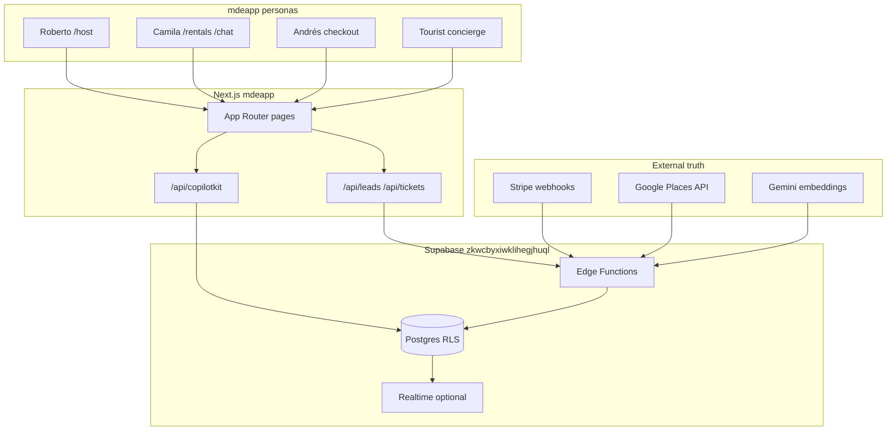
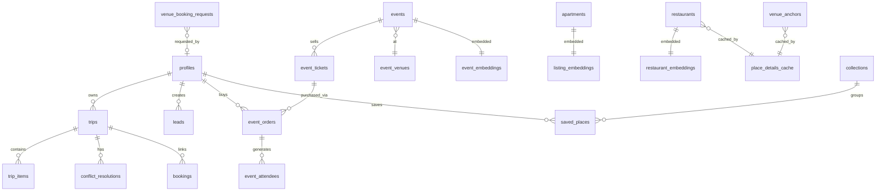
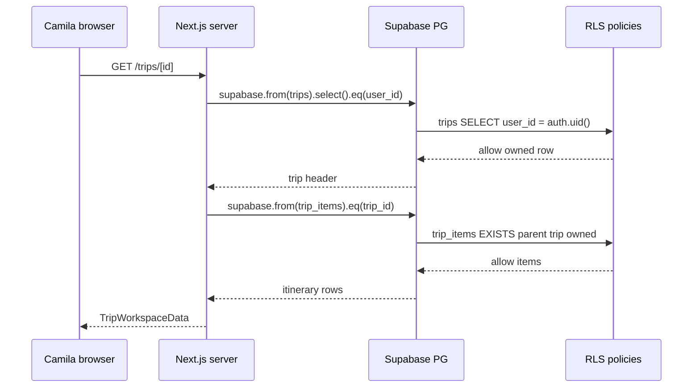
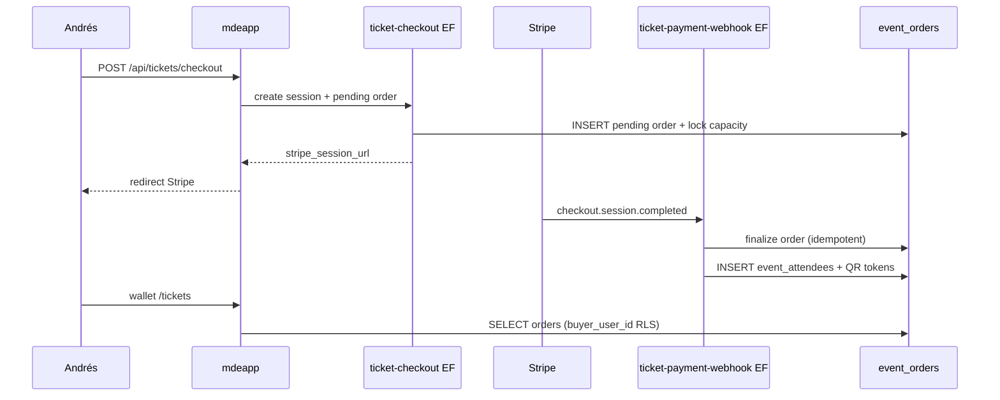
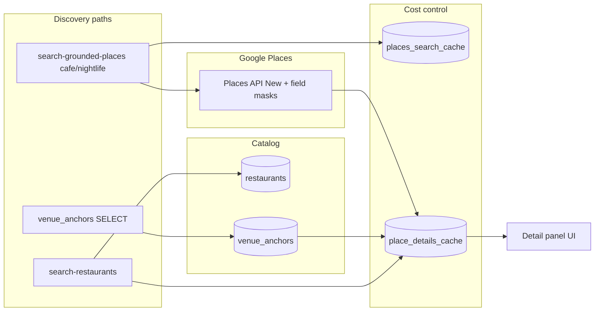
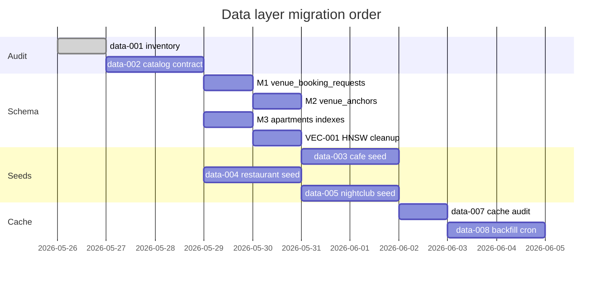

# Supabase plan — data layer (CORE → MVP → ADVANCED)

> **Executive summary.** Reuse the live `medellin` project as-is for events, rentals, trips, and users. Add **3 CORE migrations** for venue data tasks, **1 index pack** for Camila's rental search, and **1 cleanup migration** for duplicate HNSW indexes. Do not open anon writes on `leads`. Sequence work through **data-001 → data-008** before any ADVANCED unified vector table.

**Readiness after plan execution:** 76 → **88/100** (data layer)

---

## Architecture principles

1. **Supabase owns deterministic truth** — Stripe owns money; webhooks finalize orders.
2. **AI proposes only** — Mastra/CopilotKit never direct-write `events`, `event_orders`, `apartments`.
3. **Guest leads** — `chat-lead-capture` edge + `service_role`; no anon `leads` INSERT policy.
4. **Three venue kinds** — restaurants in `restaurants`; cafés/nightclubs in `venue_anchors` + Places cache; nightclubs ≠ ticketed `events`.
5. **Minimum migrations** — seed data over new tables where possible.

---

## System context



---

## Entity relationship — CORE domains



*`venue_anchors` = planned M2. `venue_booking_requests` = planned M1.*

---

## CORE vs MVP vs ADVANCED

| Layer | Scope | Tables / work | When |
|---|---|---|---|
| **CORE** | Deterministic paths already in mdeapp | `events`, `event_orders`, `apartments`, `trips`, `profiles`, `restaurants`, embeddings, places cache | Now — no migration |
| **CORE+** | Data task blockers | M1 `venue_booking_requests`, M2 `venue_anchors`, M3 rental indexes, VEC-001 HNSW cleanup | Week 1 data sprint |
| **MVP** | Seeds + cache ops | data-003/004/005 seeds, data-007/008 cache audit + cron | After data-002 contract |
| **MVP** | Events proof | EVP-003 webhook audit, EVP-001 gates — **no new tables** | Parallel |
| **ADVANCED** | Social, unified vectors, automation | `semantic_embeddings`, `event_qa`, `trip_days`, WhatsApp campaigns, OpenClaw queues | Phase 2+ |

---

## Migration batches

### Batch 0 — No migration (reuse)

| Table cluster | Action |
|---|---|
| Events spine | Reuse — 11 RLS policies on `events` |
| Ticketing | Reuse — `get_anonymous_order` RPC |
| Rentals | Reuse — add indexes only (M3) |
| Trips | Reuse — ownership RLS correct |
| Users | Reuse — `profiles` + `user_roles` |
| Mastra | Reuse — `mastra_*` observability |

---

### Batch 1 — CORE data blockers (ship first)

#### M1 — `venue_booking_requests` (CAF-008 / data-001 AC)

```sql
-- migration: YYYYMMDD_venue_booking_requests.sql
CREATE TABLE public.venue_booking_requests (
  id uuid PRIMARY KEY DEFAULT gen_random_uuid(),
  user_id uuid REFERENCES auth.users(id) ON DELETE SET NULL,
  venue_kind text NOT NULL CHECK (venue_kind IN ('cafe', 'restaurant', 'nightclub')),
  place_id text NOT NULL,
  restaurant_id uuid REFERENCES public.restaurants(id) ON DELETE SET NULL,
  venue_anchor_id uuid, -- FK added after M2
  party_size int CHECK (party_size > 0),
  requested_at timestamptz NOT NULL,
  contact_name text NOT NULL,
  contact_email text NOT NULL,
  contact_phone text,
  notes text,
  status text NOT NULL DEFAULT 'pending'
    CHECK (status IN ('pending', 'confirmed', 'declined', 'cancelled')),
  source text NOT NULL DEFAULT 'web' CHECK (source IN ('web', 'chat', 'whatsapp')),
  idempotency_key text,
  metadata jsonb NOT NULL DEFAULT '{}',
  created_at timestamptz NOT NULL DEFAULT now(),
  updated_at timestamptz NOT NULL DEFAULT now()
);

CREATE UNIQUE INDEX idx_venue_booking_idempotency
  ON public.venue_booking_requests (user_id, idempotency_key)
  WHERE idempotency_key IS NOT NULL;

CREATE INDEX idx_venue_booking_place_id ON public.venue_booking_requests (place_id);
CREATE INDEX idx_venue_booking_status_created ON public.venue_booking_requests (status, created_at DESC);

ALTER TABLE public.venue_booking_requests ENABLE ROW LEVEL SECURITY;

CREATE POLICY venue_booking_select_own ON public.venue_booking_requests
  FOR SELECT TO authenticated
  USING (user_id = (SELECT auth.uid()));

CREATE POLICY venue_booking_insert_own ON public.venue_booking_requests
  FOR INSERT TO authenticated
  WITH CHECK (user_id = (SELECT auth.uid()));

CREATE POLICY venue_booking_service ON public.venue_booking_requests
  FOR ALL TO service_role USING (true) WITH CHECK (true);
```

**Guest path:** anon INSERT via edge function (same pattern as `chat-lead-capture`), not open RLS.

**Verify:** RLS audit query returns 0 gaps; insert as authenticated user on `/chat` booking flow.

---

#### M2 — `venue_anchors` (data-003 café + data-005 nightclub)

```sql
-- migration: YYYYMMDD_venue_anchors.sql
CREATE TABLE public.venue_anchors (
  id uuid PRIMARY KEY DEFAULT gen_random_uuid(),
  kind text NOT NULL CHECK (kind IN ('cafe', 'nightclub')),
  name text NOT NULL,
  google_place_id text NOT NULL,
  neighborhood text,
  city text NOT NULL DEFAULT 'Medellín',
  latitude numeric,
  longitude numeric,
  tags text[] NOT NULL DEFAULT '{}',
  is_active boolean NOT NULL DEFAULT true,
  source text NOT NULL DEFAULT 'curated' CHECK (source IN ('curated', 'places_import')),
  metadata jsonb NOT NULL DEFAULT '{}',
  created_at timestamptz NOT NULL DEFAULT now(),
  updated_at timestamptz NOT NULL DEFAULT now(),
  CONSTRAINT venue_anchors_place_id_kind_key UNIQUE (google_place_id, kind)
);

CREATE INDEX idx_venue_anchors_kind_active ON public.venue_anchors (kind, is_active);
CREATE INDEX idx_venue_anchors_neighborhood ON public.venue_anchors (neighborhood) WHERE is_active;

ALTER TABLE public.venue_anchors ENABLE ROW LEVEL SECURITY;

CREATE POLICY venue_anchors_public_select ON public.venue_anchors
  FOR SELECT TO anon, authenticated
  USING (is_active = true);

CREATE POLICY venue_anchors_service_write ON public.venue_anchors
  FOR ALL TO service_role USING (true) WITH CHECK (true);

-- Link M1 optional FK
ALTER TABLE public.venue_booking_requests
  ADD CONSTRAINT venue_booking_anchor_fk
  FOREIGN KEY (venue_anchor_id) REFERENCES public.venue_anchors(id) ON DELETE SET NULL;
```

**Alternative MVP-min:** skip M2; store café/nightclub seeds only in `place_details_cache` + static JSON in repo. M2 preferred for SQL discoverability and data-006 golden queries.

---

#### M3 — Rental search indexes (Camila / `search-rentals.ts`)

```sql
-- migration: YYYYMMDD_apartments_price_daily_indexes.sql
CREATE INDEX CONCURRENTLY IF NOT EXISTS idx_apartments_price_daily_active
  ON public.apartments (price_daily)
  WHERE status = 'active' AND price_daily IS NOT NULL;

CREATE INDEX CONCURRENTLY IF NOT EXISTS idx_apartments_rental_search_daily
  ON public.apartments (neighborhood, bedrooms, price_daily)
  WHERE status = 'active';
```

**Verify:** `EXPLAIN ANALYZE` on typical Camila query (`neighborhood + bedrooms + price_daily ORDER BY price_daily`) uses index.

---

### Batch 2 — Vector cleanup (VEC-001)

```sql
-- migration: YYYYMMDD_drop_duplicate_hnsw.sql
-- Keep idx_*_hnsw naming; drop legacy *_hnsw duplicates
DROP INDEX CONCURRENTLY IF EXISTS public.listing_embeddings_hnsw;
DROP INDEX CONCURRENTLY IF EXISTS public.event_embeddings_hnsw;
DROP INDEX CONCURRENTLY IF EXISTS public.restaurant_embeddings_hnsw;
```

Optional follow-up: drop duplicate embedding RLS policies (keep `*_public_select` + `*_service_write`).

---

### Batch 3 — MVP seeds (data tasks, not schema)

| Task | Action | Tables touched |
|---|---|---|
| **data-003** | Insert Laureles/Provenza café anchors | `venue_anchors` (kind=cafe) |
| **data-004** | Expand restaurant rows + embeddings | `restaurants`, `restaurant_embeddings` |
| **data-005** | Nightclub/bar anchors | `venue_anchors` (kind=nightclub) |
| **data-006** | Golden query SQL file | read-only |
| **data-007** | Cache hit report | `place_details_cache`, `places_search_cache` |
| **data-008** | Backfill cron edge job | cache tables via service_role |

---

### Batch 4 — ADVANCED (defer)

| Item | Purpose |
|---|---|
| `semantic_embeddings` unified | plan/vector/docs/vector-strategy.md |
| `tourist_destination_embeddings` | Attraction semantic search |
| `collection_items` | Only if `saved_places` polymorphic model insufficient |
| `trip_days` | Normalized day buckets for Mindtrip-style UI |
| `route_cache` | Walking/transit cost control |
| `event_qa`, `event_chat` | Roberto host engagement Phase 2 |

---

## RLS flow — trips (Camila)



---

## Event checkout + webhook (Andrés)



**No new tables** — EVP-003 audits webhook secret isolation only.

---

## Venue cache layer (Tourist)



**data-007** measures `place_id` union coverage. **data-008** cron refreshes expired cache rows.

---

## Index plan — summary

| Table | Index | Priority | Reason |
|---|---|---|---|
| `apartments` | `(price_daily) WHERE active` | P0 | `search-rentals.ts` |
| `apartments` | `(neighborhood, bedrooms, price_daily) WHERE active` | P0 | Composite filter |
| `venue_booking_requests` | `(status, created_at DESC)` | P1 | Ops queue |
| `venue_booking_requests` | `(place_id)` | P1 | Dedup analytics |
| `venue_anchors` | `(kind, is_active)` | P1 | Concierge queries |
| `listing_embeddings` | drop duplicate HNSW | P1 | VEC-001 |
| `events` | existing `idx_events_start_time` + `idx_events_active` | — | Already sufficient |
| `trip_items` | existing `idx_trip_items_trip` | — | OK |
| `leads` | existing pipeline indexes | — | OK |

**Not needed now:** GIST on `restaurants` (lat/lng btree partial exists); PostGIS on events/restaurants unless radius search ships.

---

## Edge function batches (data-relevant)

| Batch | Functions | Action |
|---|---|---|
| **KEEP** | `ticket-checkout`, `ticket-payment-webhook`, `ticket-validate`, `chat-lead-capture` | mdeai paths — verify JWT matrix |
| **ADD MVP** | `places-cache-backfill` (data-008) | Service-role cache refresh cron |
| **FREEZE** | sponsor-*, openclaw-*, postiz-*, vote-cast, fraud-scan | Phase 2+; reduce cron cost |

---

## Realtime channels (optional MVP)

| Channel | Table | Persona | Priority |
|---|---|---|---|
| `event_orders:organizer_id=eq.{id}` | `event_orders` | Roberto host dashboard | P2 |
| `trip_items:trip_id=eq.{id}` | `trip_items` | Camila collaborative trips | ADVANCED |

Phase 1 MVP: polling/refetch sufficient.

---

## pgvector usage

| Phase | Strategy |
|---|---|
| **CORE** | Keep `listing_embeddings`, `event_embeddings`, `restaurant_embeddings` |
| **MVP** | Run hybrid RPCs from Mastra tools; fix duplicate HNSW |
| **ADVANCED** | Migrate to `semantic_embeddings(entity_type, entity_id, model)` |

---

## Implementation order (IMP alignment)



| IMP | Task | Deliverable |
|---|---|---|
| — | data-001 | This audit ✅ |
| — | data-002 | Contract + gap SQL |
| **data-009** | M1–M3 migrations | `venue_booking_requests`, `venue_anchors`, `price_daily` indexes |
| **data-010** | search_path batch | SECURITY DEFINER RPC hardening |
| **data-011** | edge evidence | KEEP/FREEZE matrix + guest-lead audit |
| **VEC-001** | HNSW cleanup | Drop duplicate indexes |
| — | data-003..008 | Seeds + cache ops |

---

## Verification checklist (task-verifier)

| Gate | Command / proof | Expected |
|---|---|---|
| RLS complete | audit SQL §Evidence | Only `spatial_ref_sys` off |
| M1 applied | `\d venue_booking_requests` | Table + 3 policies |
| M2 applied | `SELECT count(*) FROM venue_anchors` | ≥0; public SELECT works |
| M3 applied | `EXPLAIN` rental query | Index scan on `price_daily` |
| HNSW | `pg_indexes` query | 1 HNSW per embedding table |
| Camila path | `npm run dev` + `/rentals` | apartments load |
| Roberto path | `/host/event/new` | draft state (app layer) |
| Andrés path | ticket checkout smoke | pending → paid row |
| Tourist path | concierge restaurant tool | 44 rows + cache |

---

## Linear project mapping

| Outcome project | Data work |
|---|---|
| **Camila Discovery** | M3 indexes, data-004 seeds, leads edge path |
| **Roberto Host** | No schema — EVP tasks |
| **Andrés Commerce** | No schema — EVP-003 |
| **Sofía Platform** | M1, M2, VEC-001, data-008 cron — assignee **sanjiovani** |

---

## Related documents

- Live audit: [`audit-supabase.md`](./audit-supabase.md)
- Audit prompt: [`plan/prompt.md`](./plan/prompt.md)
- Data tasks: [`tasks/`](./tasks/)
- Forensic baseline: [`plan/audit/04-supabase-audit.md`](../../plan/audit/04-supabase-audit.md)

---

*Plan ready for execution — apply migrations via `supabase/migrations/` in mdeai repo after data-002 contract sign-off.*
