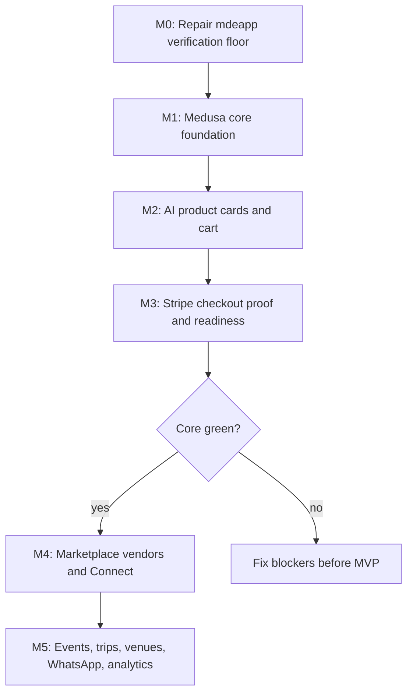

# Commerce Task Index

This folder converts the commerce docs into executable repo tasks. The sequence now includes the audit correction from `02-audit-tasks.md`: repair the existing `mdeapp` verification floor before starting Medusa work.

First milestone:

```text
AI product search -> CopilotKit product card -> Medusa cart -> Stripe test checkout -> Medusa order
```

## Hard Rules

- Do not build a separate ecommerce frontend.
- Do not fork Medusa core.
- Do not duplicate mutable product, cart, order, price, or inventory truth in Supabase.
- Do not add Stripe Connect before single-vendor checkout works.
- Do not add AI stylist, reviews, creator storefronts, fashion graph, or autonomous WhatsApp automation to Core.
- Medusa mutations must use workflows.
- Medusa module migrations require `npx medusa db:generate <moduleName>` followed by `npx medusa db:migrate`.
- Storefront/admin SDK calls must be verified against official docs before implementation.
- Medusa JS SDK must be used for Medusa API calls; do not use raw `fetch()`.
- Medusa prices are display amounts, not cents.
- Supabase migrations for mdeapp live under `mdeapp/supabase/migrations`.

## Milestones

| Milestone | Scope | Exit gate |
|---|---|---|
| M0 - Verification floor | Repair existing mdeapp lint/typecheck/test/build proof floor | `npm run lint`, `npm run typecheck`, `npm test`, and `npm run build` are usable proof commands |
| M1 - Core commerce foundation | ADR, Medusa service, env contract, Stripe test checkout, Cloudinary, demo catalog | Medusa health/API works and 20 products exist |
| M2 - AI product cards and cart | SDK wrapper, embeddings, Mastra tools, ProductCard, cart UI | AI result hydrates live Medusa price/stock and can add to cart |
| M3 - Checkout proof and readiness | End-to-end checkout, ops playbook, readiness gate | Stripe test payment creates a Medusa order |
| M4 - Marketplace vendors and Connect | Vendor module/application/admin/dashboard/Connect/split/payout visibility | Core is green and vendor isolation is proven |
| M5 - Lifestyle commerce integrations | WhatsApp link, event/trip/venue links, analytics, featured pilot | Integrations reuse the proven checkout path |

## Implementation Flow



## Implementation Order

| Order | Task | Linear | Title | Milestone | Priority | Depends |
|---:|---|---|---|---|---|---|
| 1 | [ECOM-C-000](./ECOM-C-000-verification-floor.md) | [SAN-628](https://linear.app/sanjiovani/issue/SAN-628) | Repair mdeapp verification floor before commerce | M0 - Verification floor | P0 | none |
| 2 | [ECOM-C-001](./ECOM-C-001-commerce-adr.md) | [SAN-629](https://linear.app/sanjiovani/issue/SAN-629) | Commerce architecture decision record | M1 - Core commerce foundation | P0 | ECOM-C-000 |
| 3 | [ECOM-C-002](./ECOM-C-002-medusa-service-setup.md) | [SAN-630](https://linear.app/sanjiovani/issue/SAN-630) | Medusa service setup | M1 - Core commerce foundation | P0 | ECOM-C-001 |
| 4 | [ECOM-C-003](./ECOM-C-003-commerce-env-contract.md) | [SAN-631](https://linear.app/sanjiovani/issue/SAN-631) | Commerce environment contract | M1 - Core commerce foundation | P0 | ECOM-C-002 |
| 5 | [ECOM-C-004](./ECOM-C-004-stripe-test-checkout.md) | [SAN-632](https://linear.app/sanjiovani/issue/SAN-632) | Stripe test checkout in Medusa | M1 - Core commerce foundation | P0 | ECOM-C-002, ECOM-C-003 |
| 6 | [ECOM-C-005](./ECOM-C-005-cloudinary-media.md) | [SAN-633](https://linear.app/sanjiovani/issue/SAN-633) | Cloudinary media provider | M1 - Core commerce foundation | P0 | ECOM-C-002, ECOM-C-003 |
| 7 | [ECOM-C-006](./ECOM-C-006-demo-catalog.md) | [SAN-634](https://linear.app/sanjiovani/issue/SAN-634) | Demo catalog seed | M1 - Core commerce foundation | P0 | ECOM-C-004, ECOM-C-005 |
| 8 | [ECOM-C-007](./ECOM-C-007-medusa-client-wrapper.md) | [SAN-635](https://linear.app/sanjiovani/issue/SAN-635) | Medusa client wrapper in mdeapp | M2 - AI product cards and cart | P0 | ECOM-C-006 |
| 9 | [ECOM-C-008](./ECOM-C-008-supabase-commerce-extensions.md) | [SAN-636](https://linear.app/sanjiovani/issue/SAN-636) | Supabase commerce extension tables | M2 - AI product cards and cart | P0 | ECOM-C-001 |
| 10 | [ECOM-C-009](./ECOM-C-009-product-embedding-sync.md) | [SAN-637](https://linear.app/sanjiovani/issue/SAN-637) | Product embedding sync | M2 - AI product cards and cart | P0 | ECOM-C-006, ECOM-C-008 |
| 11 | [ECOM-C-010](./ECOM-C-010-mastra-product-search.md) | [SAN-638](https://linear.app/sanjiovani/issue/SAN-638) | Mastra product_search tool | M2 - AI product cards and cart | P0 | ECOM-C-007, ECOM-C-009 |
| 12 | [ECOM-C-011](./ECOM-C-011-mastra-product-detail.md) | [SAN-639](https://linear.app/sanjiovani/issue/SAN-639) | Mastra product_detail tool | M2 - AI product cards and cart | P0 | ECOM-C-007 |
| 13 | [ECOM-C-012](./ECOM-C-012-mastra-cart-tools.md) | [SAN-640](https://linear.app/sanjiovani/issue/SAN-640) | Mastra cart tools | M2 - AI product cards and cart | P0 | ECOM-C-007 |
| 14 | [ECOM-C-013](./ECOM-C-013-mastra-checkout-link.md) | [SAN-641](https://linear.app/sanjiovani/issue/SAN-641) | Mastra checkout_link tool | M2 - AI product cards and cart | P0 | ECOM-C-004, ECOM-C-012 |
| 15 | [ECOM-C-014](./ECOM-C-014-copilotkit-product-card.md) | [SAN-642](https://linear.app/sanjiovani/issue/SAN-642) | CopilotKit ProductCard render | M2 - AI product cards and cart | P0 | ECOM-C-010, ECOM-C-011, ECOM-C-005 |
| 16 | [ECOM-C-015](./ECOM-C-015-cart-state-ui.md) | [SAN-643](https://linear.app/sanjiovani/issue/SAN-643) | Minimal cart state UI | M2 - AI product cards and cart | P0 | ECOM-C-012, ECOM-C-014 |
| 17 | [ECOM-C-016](./ECOM-C-016-e2e-checkout-proof.md) | [SAN-644](https://linear.app/sanjiovani/issue/SAN-644) | End-to-end checkout proof | M3 - Checkout proof and readiness | P0 | ECOM-C-013, ECOM-C-015 |
| 18 | [ECOM-C-017](./ECOM-C-017-manual-ops-refund-playbook.md) | [SAN-645](https://linear.app/sanjiovani/issue/SAN-645) | Manual ops and refund playbook | M3 - Checkout proof and readiness | P0 | ECOM-C-016 |
| 19 | [ECOM-C-018](./ECOM-C-018-production-readiness.md) | [SAN-646](https://linear.app/sanjiovani/issue/SAN-646) | Commerce production readiness checklist | M3 - Checkout proof and readiness | P0 | ECOM-C-016, ECOM-C-017 |
| 20 | [ECOM-M-001](./ECOM-M-001-marketplace-module.md) | [SAN-647](https://linear.app/sanjiovani/issue/SAN-647) | Marketplace module from official recipe | M4 - Marketplace vendors and Connect | P1 | ECOM-C-018 |
| 21 | [ECOM-M-002](./ECOM-M-002-vendor-application.md) | [SAN-648](https://linear.app/sanjiovani/issue/SAN-648) | Vendor application flow | M4 - Marketplace vendors and Connect | P1 | ECOM-C-018 |
| 22 | [ECOM-M-003](./ECOM-M-003-vendor-admin-invite.md) | [SAN-649](https://linear.app/sanjiovani/issue/SAN-649) | Vendor admin invite | M4 - Marketplace vendors and Connect | P1 | ECOM-M-001, ECOM-M-002 |
| 23 | [ECOM-M-004](./ECOM-M-004-vendor-dashboard-v1.md) | [SAN-650](https://linear.app/sanjiovani/issue/SAN-650) | Vendor dashboard v1 | M4 - Marketplace vendors and Connect | P1 | ECOM-M-001, ECOM-M-003 |
| 24 | [ECOM-M-005](./ECOM-M-005-stripe-connect-express.md) | [SAN-651](https://linear.app/sanjiovani/issue/SAN-651) | Stripe Connect Express onboarding | M4 - Marketplace vendors and Connect | P1 | ECOM-M-001, ECOM-M-003 |
| 25 | [ECOM-M-006](./ECOM-M-006-multi-vendor-order-split.md) | [SAN-652](https://linear.app/sanjiovani/issue/SAN-652) | Multi-vendor cart and order split | M4 - Marketplace vendors and Connect | P1 | ECOM-M-001, ECOM-M-005 |
| 26 | [ECOM-M-007](./ECOM-M-007-vendor-payout-visibility.md) | [SAN-653](https://linear.app/sanjiovani/issue/SAN-653) | Vendor payout visibility | M4 - Marketplace vendors and Connect | P1 | ECOM-M-005, ECOM-M-006 |
| 27 | [ECOM-M-008](./ECOM-M-008-whatsapp-payment-link.md) | [SAN-654](https://linear.app/sanjiovani/issue/SAN-654) | WhatsApp payment link | M5 - Lifestyle commerce integrations | P2 | ECOM-C-016 |
| 28 | [ECOM-M-009](./ECOM-M-009-event-product-links.md) | [SAN-655](https://linear.app/sanjiovani/issue/SAN-655) | Event product links | M5 - Lifestyle commerce integrations | P2 | ECOM-C-018 |
| 29 | [ECOM-M-010](./ECOM-M-010-trip-product-links.md) | [SAN-656](https://linear.app/sanjiovani/issue/SAN-656) | Trip product links | M5 - Lifestyle commerce integrations | P2 | ECOM-C-018 |
| 30 | [ECOM-M-011](./ECOM-M-011-venue-product-links.md) | [SAN-657](https://linear.app/sanjiovani/issue/SAN-657) | Venue product links | M5 - Lifestyle commerce integrations | P2 | ECOM-C-018 |
| 31 | [ECOM-M-012](./ECOM-M-012-basic-commerce-analytics.md) | [SAN-658](https://linear.app/sanjiovani/issue/SAN-658) | Basic commerce analytics | M5 - Lifestyle commerce integrations | P2 | ECOM-C-018 |
| 32 | [ECOM-M-013](./ECOM-M-013-featured-listings-pilot.md) | [SAN-659](https://linear.app/sanjiovani/issue/SAN-659) | Featured listings pilot | M5 - Lifestyle commerce integrations | P2 | ECOM-M-012 |

## Gate

Stop after Core until this proof exists:

- 1 demo/internal seller.
- 20 products in Medusa.
- Product search hydrates from Medusa before display.
- ProductCard add-to-cart works.
- Stripe test payment succeeds.
- Medusa order exists.
- Supabase stores embeddings/links only.
- Manual support/refund playbook exists.
- Existing mdeapp MVP still passes lint, typecheck, test, and build gates.

## Execution Lock

Only [COMM-01 / SAN-628](https://linear.app/sanjiovani/issue/SAN-628) should be `In Progress` until the verification floor is green.

Do not start marketplace, Stripe Connect, multi-vendor, WhatsApp, analytics, or featured listing work until this Core proof exists:

```text
AI search -> product card -> add to cart -> Stripe payment -> Medusa order created
```

### Linear Gates

| Gate | Linear issue | Blocks |
|---|---|---|
| Verification floor green | [SAN-628](https://linear.app/sanjiovani/issue/SAN-628) | All commerce implementation |
| Supabase stores no mutable commerce truth | [SAN-636](https://linear.app/sanjiovani/issue/SAN-636) | [SAN-637](https://linear.app/sanjiovani/issue/SAN-637) embedding sync |
| Medusa live price/stock hydration verified | [SAN-638](https://linear.app/sanjiovani/issue/SAN-638), [SAN-639](https://linear.app/sanjiovani/issue/SAN-639) | [SAN-642](https://linear.app/sanjiovani/issue/SAN-642) ProductCard |
| Single-vendor paid order complete | [SAN-644](https://linear.app/sanjiovani/issue/SAN-644) | Marketplace and WhatsApp payment link |
| Manual refund/support playbook exists | [SAN-645](https://linear.app/sanjiovani/issue/SAN-645) | Public Core readiness |
| Commerce does not break existing mdeai MVP | [SAN-646](https://linear.app/sanjiovani/issue/SAN-646) | M4/M5 marketplace and lifestyle tasks |

M4 and M5 Linear issues are intentionally labeled `FROZEN` and `CORE-GATE` until [SAN-646](https://linear.app/sanjiovani/issue/SAN-646) is done.

## Linear Sync

Create or update the Linear issues in [Commerce Platform](https://linear.app/sanjiovani/project/commerce-platform-902371cd69e8/issues) with label `COMM`, using the implementation order above as the issue title prefix.
