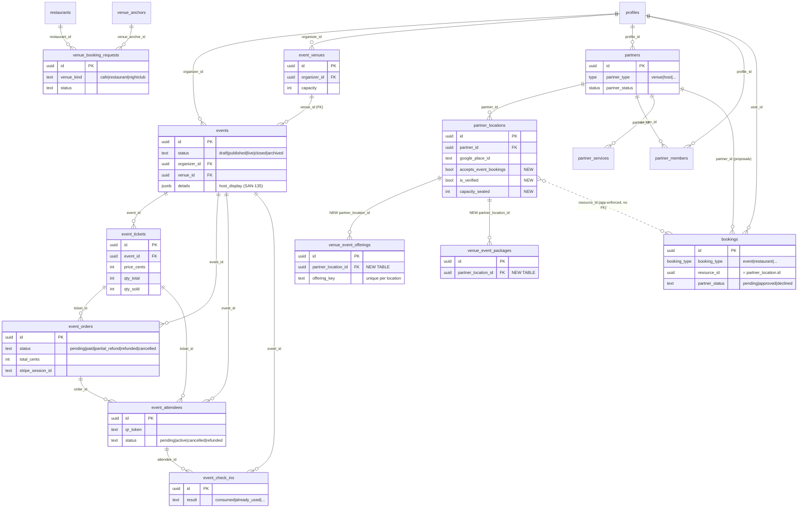

# Events Platform — Complete Data Model

> Every table/column/RLS/FK/enum/row-count below was probed **live** on project `zkwcbyxiwklihegjhuql` on 2026-06-09. Companion: [`VENUE-DATA-MODEL.md`](./VENUE-DATA-MODEL.md) (SAN-492 schema decision + exact SQL Appendix A) · [`audit/05-all-events-data-model-live-audit.md`](../audit/05-all-events-data-model-live-audit.md) · [`audit/04-data-model-audit.md`](../audit/04-data-model-audit.md) · index [`INDEX.md`](./INDEX.md).

## 1. Executive summary

The Events Platform spans **three live subsystems**, all already on disk with RLS:

1. **Event commerce** (Andrés/Tourist) — `events → event_tickets → event_orders → event_attendees → event_check_ins`. **Live with real data** (49 events, 36 orders, 40 attendees, 3 check-ins). Stripe-backed, QR wallet, door scan.
2. **Host publishing** (Roberto) — `events.organizer_id → profiles`, `events.venue_id → event_venues` (formal FK). Host owns events + their physical venue rooms. 7 `event_venues` rows.
3. **Partner venue booking** (Camila/Patricia — the SAN-492 target) — the shipped **partner stack** (`partners`, `partner_locations`, `partner_members`, `partner_services`) + `bookings` for proposals. Tables exist but are **empty** (`partner_locations` 0, `partner_services` 0, `bookings` 0) — ready to seed.

**SAN-492 conclusion:** the partner stack already models a bookable venue (`partners.type='venue'`, `bookings.booking_type='event'`, `bookings.partner_status` CHECK `pending|approved|declined`). SAN-492 only needs **2 new child tables + 4 columns on `partner_locations`** — no new master, no booking table. **Readiness 88/100 → GO for the migration branch; NO-GO for prod apply until human sign-off.**

**Live data-quality gaps (2026-06-09):** 31/49 published events have `organizer_id` NULL (all 31 also have `created_by` NULL — not host-wizard orphans). 18/49 have `details.host_display`. Zero `partners.type='venue'` / zero `partner_locations`. See §13.5 · Linear **SAN-858**.

---

## 2. Current live tables

| Table | Cols | Rows | RLS | Subsystem |
|-------|-----:|-----:|:---:|-----------|
| `events` | 48 | 49 | ✅ | commerce + host |
| `event_venues` | 13 | 7 | ✅ | host (ticketed-event location) |
| `event_tickets` | 18 | 4 | ✅ | commerce |
| `event_orders` | 25 | 36 | ✅ | commerce |
| `event_attendees` | 12 | 40 | ✅ | commerce |
| `event_check_ins` | 10 | 3 | ✅ | commerce |
| `profiles` | 16 | 24 | ✅ | identity (all) |
| `restaurants` | 41 | 44 | ✅ | discovery |
| `venue_anchors` | 14 | 30 | ✅ | discovery / map |
| `partners` | 12 | 2 | ✅ | partner booking |
| `partner_locations` | 12 | **0** | ✅ | partner booking (venue identity) |
| `partner_members` | 4 | 2 | ✅ | partner booking (access) |
| `partner_services` | 8 | **0** | ✅ | partner booking |
| `bookings` | 32 | **0** | ✅ | partner booking (proposal/approval) |
| `venue_booking_requests` | 18 | 1 | ✅ | café/table booking (separate) |

**All 15 have RLS enabled.** Empty tables (`partner_locations`, `partner_services`, `bookings`) are the seed targets for SAN-493.

---

## 3. Table purpose by persona

| Persona | Table(s) | What they do |
|---------|----------|--------------|
| **Roberto** (host) | `events`, `event_venues`, `event_tickets` | Create + publish ticketed events at his own venue room |
| **Andrés / Tourist** (buyer) | `event_orders`, `event_attendees`, `event_check_ins` | Buy ticket → QR wallet → door scan |
| **Camila / Tourist** (venue seeker) | `partners`(type=venue), `partner_locations`, `partner_services` | Discover Mamacita as event-capable, view offerings |
| **Roberto → Patricia** (proposal) | `bookings`(type=event) | Request private-event proposal → partner/Patricia approves |
| **Patricia / partner staff** | `partner_members`, `bookings` (`partner_status`) | Manage venue, approve/decline proposals |
| **Tourist** (dining) | `restaurants`, `venue_anchors`, `venue_booking_requests` | Restaurant discovery + café/table booking |
| **Everyone** | `profiles` (`role` user/moderator/admin/super_admin) | Identity + RBAC |

---

## 4. ERD (live + SAN-492 additions)



---

## 5. Existing relationships (live FKs)

| Child | Column → Parent | On delete |
|-------|-----------------|-----------|
| events | `organizer_id → profiles` | — |
| events | `created_by → auth.users` | SET NULL |
| events | **`venue_id → event_venues`** (`events_venue_fkey`) | — |
| event_venues | `organizer_id → profiles` | — |
| event_tickets | `event_id → events` | CASCADE |
| event_orders | `event_id → events`; `ticket_id → event_tickets`; `buyer_user_id → auth.users`; `payment_id → payments`; `promo_code_id → event_promo_codes`; `trip_id → trips` | mixed |
| event_attendees | `order_id → event_orders` (CASCADE); `ticket_id → event_tickets`; `event_id → events` | mixed |
| event_check_ins | `event_id → events`; `attendee_id → event_attendees`; `scanned_by → auth.users` | — |
| partners | `profile_id → profiles` (RESTRICT); `organization_id → partner_organizations`; `sponsor_organization_id → sponsor.organizations`; `landlord_profile_id → landlord_profiles` | mixed |
| partner_locations | `partner_id → partners` | CASCADE |
| partner_members | `partner_id → partners`; `profile_id → profiles` | CASCADE |
| partner_services | `partner_id → partners` | CASCADE |
| bookings | `user_id → profiles` (CASCADE); `partner_id → partners`; `approved_by → profiles`; `trip_id → trips` | mixed |
| venue_booking_requests | `user_id → auth.users`; `restaurant_id → restaurants`; `venue_anchor_id → venue_anchors` | SET NULL |

> **Correction to audit-04:** `events.venue_id → event_venues` **is a formal FK** (`events_venue_fkey`), not merely a logical link. `bookings.resource_id` has **no** FK (polymorphic by `booking_type`) — event proposals point it at `partner_locations.id`, app-enforced.

---

## 6. RLS status (all enabled)

| Table | Policy shape |
|-------|--------------|
| `events` | service ALL · organizer insert/select/update own · admin/moderator insert/update/delete · **public SELECT where published** |
| `event_venues` | owner ALL (`organizer_id=auth.uid`) · public SELECT via published event |
| `event_tickets` | organizer ALL · **public SELECT** (browse tiers) |
| `event_orders` | organizer SELECT · buyer SELECT (own) — **writes service-role only** (Stripe webhook) |
| `event_attendees` | SELECT via owning order — **writes service-role only** |
| `event_check_ins` | organizer SELECT — **writes service-role only** (scan edge fn) |
| `profiles` | own insert/select/update only |
| `restaurants` | service ALL · anon+authenticated SELECT active · moderator insert/update |
| `venue_anchors` | service ALL · public SELECT |
| `partners` | service ALL · member/owner SELECT · admin/member update |
| `partner_locations` | service ALL · member CRUD (`partner_ids_for_user() OR is_admin()`) — **no public SELECT yet** |
| `partner_members` | service ALL · own/team SELECT · admin/owner update/delete |
| `partner_services` | service ALL · member CRUD |
| `bookings` | service ALL · buyer create/select/update own · **`bookings_select_partner_member` + `bookings_update_partner_member`** (venue approves) |
| `venue_booking_requests` | service ALL · insert/select own only — **no admin/partner read** |

**Helpers in use:** `partner_ids_for_user()`, `is_admin()`, `auth.uid()`. Enums: `user_role`(user/moderator/admin/super_admin), `partner_type`(host/**venue**/…), `partner_status`, `booking_type`(…/**event**/…), `booking_status`, `payment_status`.

---

## 7. Event commerce model (LIVE)

```text
events (status: draft→published→live→closed)
  └─ event_tickets (tiers: price_cents, qty_total, qty_sold, qty_pending)
       └─ event_orders (quantity 1–50, total_cents, stripe_session_id, status pending→paid→refunded)
            └─ event_attendees (1 per ticket; qr_token; status pending|active|cancelled|refunded)
                 └─ event_check_ins (door scan; result: consumed|already_used|wrong_event|…)
  payments ←─ event_orders.payment_id  (+ stripe_payment_intent)
  event_promo_codes ←─ event_orders.promo_code_id
```

- **Integrity guards (live CHECKs):** `qty_sold + qty_pending <= qty_total`; order `quantity 1..50`; non-negative `*_cents`; `price_cents >= 0`; valid sale window.
- **Money is deterministic:** orders/attendees/check-ins are **service-role write only** — Stripe webhook + scan edge fn own state; no AI/user direct writes. Buyers may be **guest** (`buyer_user_id` nullable, `buyer_anon_id`/`access_token`).
- **Status vocab:** orders `pending|paid|partial_refund|refunded|cancelled`; attendees `pending|active|cancelled|refunded`; check-in `result` 9-value enum-by-CHECK.

---

## 8. Host publishing model (LIVE)

```text
profiles (Roberto, role=user)
  └─ events.organizer_id            (his events)
  └─ event_venues.organizer_id      (his physical rooms)  ──< events.venue_id (FK)
events.source: 'host_wizard'  ·  events.details.host_display (denormalized, SAN-135)
events.staff_link_version (door-staff link rotation) · events.total_capacity
```

- Host RLS: `events_organizer_insert/select/update_own` + `event_venues` owner ALL. Publishing runs through the **approval-commit edge function** (writes `events` + `event_tickets`); HITL via CopilotKit.
- `event_venues` (7 rows) = **ticketed-event locations** — KEEP unchanged (SAN-135 depends on it). Distinct from partner booking venues.

---

## 9. Partner venue booking model (SAN-492 target)

```text
partners (type='venue', status='active')            ← SAN-493 CREATES these (live: 2 rows, both type=host/draft)
  ├─ partner_members (owner|staff|billing)           ← who manages (2 rows)
  ├─ partner_locations (label, google_place_id, lat/lng)   ← physical venue (0 rows — seed target)
  │     ├─ venue_event_offerings   (NEW)             ← event types, amenities, min spend
  │     └─ venue_event_packages    (NEW)             ← named packages, price_from, guest range
  └─ partner_services (key/tier/config)              ← generic catalog (0 rows)
bookings (booking_type='event', partner_id, resource_id=partner_location.id)   ← PROPOSAL
  partner_status: pending → approved | declined  (+ approved_by, approved_at)
  RLS: bookings_update_partner_member  → venue/Patricia approve in-place
```

- **Reuse, don't fork:** `partner_type` already has `venue`; `booking_type` already has `event`; `bookings.partner_status` CHECK already = `pending|approved|declined`; approval RLS + `idx_bookings_partner_status` already exist → **zero enum/constraint surgery**.
- **`venue_booking_requests` stays café/table-only** (`venue_kind` CHECK `cafe|restaurant|nightclub`, 1 row) — untouched.

**SAN-494 restaurant CTA bridge (no `restaurants.event_offerings` column):** show Event Venue CTA when a verified event-capable `partner_locations` row exists for the same place:

```sql
restaurants.google_place_id = partner_locations.google_place_id
  AND partner_locations.accepts_event_bookings
  AND partner_locations.is_verified
```

(`restaurants` has no `event_offerings` flag — join via `google_place_id` only.)

---

## 10. Tables to create for SAN-492

| Action | Object | Detail |
|--------|--------|--------|
| **EXTEND** | `partner_locations` | + `accepts_event_bookings bool NOT NULL DEFAULT false`, `is_verified bool NOT NULL DEFAULT false`, `capacity_seated int`, `capacity_standing int` |
| **CREATE** | `venue_event_offerings` | `id`, `partner_location_id → partner_locations`, **`offering_key text`** (unique per location), `event_types text[]`, `amenities text[]`, `minimum_spend numeric`, `price_per_person_from numeric`, timestamps |
| **CREATE** | `venue_event_packages` | `id`, `partner_location_id → partner_locations`, `name`, `description`, `price_from numeric`, `min_guests int`, `max_guests int`, timestamps |
| **ADD RLS** | `partner_locations` public SELECT | `USING (accepts_event_bookings AND is_verified)` |
| **ADD RLS** | offerings/packages | public SELECT via verified parent location; write service/admin |
| **REUSE (no change)** | `bookings` | proposals via `booking_type='event'` + `partner_status` |
| **ADD INDEX** | `partner_locations.google_place_id` (partial unique), `(accepts_event_bookings,is_verified)`; offerings/packages `partner_location_id` |

---

## 11. Tables NOT to create

| Forbidden | Why |
|-----------|-----|
| `partner_venues` | duplicates `partner_locations` (which already models a venue of a `partners` row) |
| `venues` | ambiguous; collides with `event_venues` mental model |
| `event_venue_bookings` | duplicates `bookings` (which has `booking_type='event'` + partner approval) |

`event_venues` and `venue_booking_requests` are **kept unchanged**.

---

## 12. Migration order (branch authoring only)

```text
1. ALTER partner_locations ADD accepts_event_bookings, is_verified, capacity_seated, capacity_standing
   + indexes (google_place_id partial-unique; (accepts_event_bookings,is_verified))
2. CREATE venue_event_offerings  (FK partner_location_id) + RLS + index
3. CREATE venue_event_packages   (FK partner_location_id) + RLS + index
4. ADD public SELECT policy on partner_locations (verified + event-capable)
5. bookings — NO migration (booking_type='event' + partner_status already live)
6. Seed (SAN-493): CREATE partners(type='venue', status='active') + partner_locations(...)
   → venue_event_offerings + venue_event_packages  (Mamacita + 4 — from scratch)
```

**Migration file (AUTHORED — NOT APPLIED):** `mdeapp/supabase/migrations/20260609120000_san492_event_venue_offerings.sql`  
Includes: `partner_locations` extend · `venue_event_offerings`/`packages` CREATE · public SELECT · `bookings_admin_*` · `bookings_event_resource_guard` trigger.

Prereq applied: `20260608202427_san135_backfill_event_host_display`. Latest applied on prod: that migration only (SAN-492 **not** in `list_migrations`).

---

## 13. Risks and blockers

| # | Sev | Item |
|---|-----|------|
| 1 | 🟡 | `partner_locations` has **no public SELECT** today — Camila can't see Mamacita until the new policy ships. Must land in step 4. |
| 2 | 🟡 | `bookings.resource_id` has **no FK** (polymorphic) — event proposals must app-validate `resource_id` is a real `partner_location`. |
| 3 | 🟡 | Patricia admin read of `bookings`: **live** — partner-member policies only. `bookings_admin_select/update` (`is_admin()`) ships in unapplied SAN-492 migration (SAN-502). |
| 4 | 🟡 | Empty `partner_locations`/`partner_services`/`bookings` → all UI must handle empty states; SAN-493 seed is the unblocker. |
| 5 | 🟢 | No 🔴: naming (B1), RLS owner (B2), and `venue_booking_requests` constraints (B3) all resolved by the reuse model. |
| 6 | ⚪ | Human ERD sign-off required before prod apply (per gate). |

### 13.5 Live data-quality gaps (2026-06-09 probe)

| Gap | Live count | Impact | Task |
|-----|------------|--------|------|
| Published events, `organizer_id` NULL | **31 / 49** | Not on Roberto `/host/events`; not host-owned | **SAN-858** — classify, do not blind backfill |
| Same rows, `created_by` NULL | **31 / 31** | `organizer_id = created_by` backfill fixes **0 rows** | Reject naive SQL |
| Published with `details.host_display` | **18 / 49** | SAN-135 host block sparse on catalogue events | Optional enrichment pass |
| `partners.type='venue'` | **0** | No event-capable partner identity | SAN-493 seed |
| `partners.status='active'` (venue) | **0** | Public RLS requires active parent | SAN-493 seed |
| `partner_locations` rows | **0** | No Mamacita / offerings surface | SAN-493 after SAN-492 |
| `restaurants.event_offerings` column | **absent** | VEN-001 spec wrong — use `google_place_id` join (§9) | Patch SAN-494 spec |

**Ownership options (SAN-858):** (A) discovery catalogue — keep NULL · (B) system/admin owner · (C) backfill only with proven owner evidence.

---

## 14. Test plan

| Assert | Method |
|--------|--------|
| `partner_locations` public SELECT returns only `accepts_event_bookings AND is_verified` | SQL as anon |
| Anon **cannot** write `partner_locations`/offerings/packages | negative RLS |
| Venue partner can SELECT + UPDATE own `bookings` (approve) | RLS as `partner_member` |
| Buyer sees only own `bookings`; `partner_status` transitions pending→approved/declined | RLS + CHECK |
| `bookings` event proposal insert (`booking_type='event'`, `start_date`, `resource_id`=location) succeeds | Vitest fixture |
| Commerce untouched: `event_orders`/`event_attendees`/`event_check_ins` still service-role-write; ticket `qty` CHECK holds | regression |
| `event_venues` + SAN-135 detail unchanged | SCREEN-014 |
| `venue_booking_requests` café insert still works (untouched) | Vitest fixture |
| Migration applies clean on staging; `get_advisors` security pass | Supabase MCP |

---

## Corrected ERD · readiness · GO/NO-GO

- **Corrected ERD:** §4 (commerce chain + host link via formal `events_venue_fkey` + partner stack + 2 new child tables off `partner_locations`).
- **Readiness:** **88/100** (model verified live; audit grade **A-** / 90% — see [`05-all-events-data-model-live-audit.md`](../audit/05-all-events-data-model-live-audit.md)).
- **Migration verdict:** 🟢 **GO for the SAN-492 migration *branch*** (author SQL per §12). 🔴 **NO-GO for prod apply** until human ERD sign-off. **No code in SAN-493–496** until applied.

### Probe provenance (2026-06-09, project zkwcbyxiwklihegjhuql)
columns/types/nullability · FK constraints · RLS policy names+cmd · CHECK constraints · enum labels · row counts — all via Supabase MCP `execute_sql`. 15/15 tables verified.
