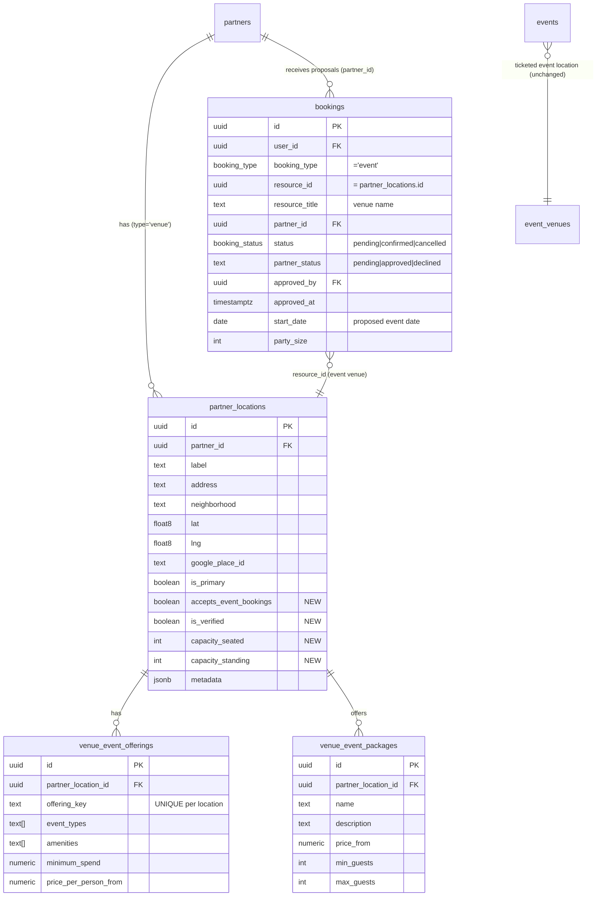

# VENUE-DATA-MODEL — Source of truth (SAN-492 gate)

> **Decision:** reuse the **shipped partner stack**. `partner_locations` is the event-capable venue master; offerings/packages are new child tables; **`bookings`** (not a new table) carries the proposal + approval flow. `event_venues` and `venue_booking_requests` are **untouched**. No `partner_venues`, no `event_venue_bookings`, no `venues`.
> **Readiness 85/100 → GO for the SAN-492 migration *branch*** (author SQL + `partner_is_active` fix). **No prod apply** until human ERD sign-off. **No code in SAN-493–496** until this is signed off.

## Why this revision

The prior draft proposed a new `partner_venues` master. Live Supabase (probed 2026-06-08) shows that **duplicates the partner stack shipped 2026-06-06** (`ptr001–014`): `partners`, `partner_locations`, `partner_services`, `partner_members`, `bookings.{partner_id,approved_by,partner_status}`, `revenue_ledger`. `partners.type` enum already contains **`venue`**; `bookings.booking_type` enum already contains **`event`**; `bookings.partner_status` CHECK is already **`pending|approved|declined`**. So the platform was *designed* to hold bookable venues — a new table would fork identity, RLS, and the approval queue. See [`04-data-model-audit.md`](../audit/04-data-model-audit.md) B1/B2/B3.

---

## Domain split (non-negotiable)

| Concept | Persona | Live table | Action |
|---------|---------|------------|--------|
| **Ticketed event room** | Roberto — where *his* published event happens | `event_venues` (7 rows, `organizer_id`) | **KEEP unchanged** — `events.venue_id` (SAN-135) |
| **Bookable partner venue** | Camila — Mamacita birthday / corporate dinner | **`partner_locations`** (of a `partners` row `type='venue'`) | **EXTEND** |
| **Event proposal + approval** | Roberto → Patricia / venue partner | **`bookings`** (`booking_type='event'`) | **REUSE** (no schema change) |
| **Table/café booking** | Tourist — dinner reservation | `venue_booking_requests` | **KEEP unchanged** (café/table only) |
| **Dining discovery** | Tourist | `restaurants` + `venue_anchors` | unchanged |

---

## Approved model (partner_locations reuse)



---

## Decision matrix (the required analysis)

Three end-to-end options, scored 🟢 good · 🟡 ok · 🔴 poor.

| Criterion | **Opt 1 — partner_locations + bookings** ✅ | Opt 2 — new `partner_venues` + vbr | Opt 3 — partner_locations + `venue_booking_requests` |
|-----------|:--:|:--:|:--:|
| **Complexity** | 🟢 extend 1 + 2 new + reuse bookings | 🔴 new master duplicates partner stack | 🟡 extend 1 + 2 new + relax vbr constraints |
| **Migration risk** | 🟢 additive only; no constraint surgery | 🟡 new table + vbr relaxations | 🟡 must relax 4 vbr NOT-NULL/CHECKs |
| **RLS fit** | 🟢 `partner_ids_for_user()` + `is_admin()` exist | 🔴 no owner col; rebuild helpers | 🟡 partner_locations ok; vbr needs new admin policy |
| **Patricia / partner approval fit** | 🟢 `bookings_update_partner_member` + `idx_bookings_partner_status` + `approved_by/at` | 🔴 no approval path | 🔴 vbr has no partner/admin read or update |
| **SAN-493 seed fit** | 🟡 partner+location+offerings rows (canonical) | 🟡 standalone rows | 🟡 same as Opt 1 |
| **SAN-494 CTA fit** | 🟢 `partner_locations` has `google_place_id`+lat/lng for pin | 🟡 new table needs coords | 🟢 same as Opt 1 |
| **SAN-496 HITL fit** | 🟢 `booking_type='event'` + `partner_status` CHECK exist — **zero enum/constraint change** | 🔴 vbr breaks 4 constraints | 🔴 vbr breaks 4 constraints |
| **Verdict** | **WINNER** | reject (duplicate) | fallback only |

**Rule satisfied:** `partner_locations` *can* serve as the venue master → **do not create `partner_venues`** (per task rule).

---

## Tables — create / extend / reuse

| Table | Action | Notes |
|-------|--------|-------|
| `partner_locations` | **EXTEND** | add `accepts_event_bookings bool NOT NULL DEFAULT false`, `is_verified bool NOT NULL DEFAULT false`, `capacity_seated int`, `capacity_standing int`. Name = `label` (or join `partners`→`profiles`). |
| `venue_event_offerings` | **CREATE** | FK `partner_location_id → partner_locations(id)` |
| `venue_event_packages` | **CREATE** | FK `partner_location_id → partner_locations(id)` |
| `bookings` | **REUSE — no schema change** | proposals: `booking_type='event'`, `resource_id=partner_locations.id`, `partner_id`, `partner_status` |
| `event_venues` | **KEEP unchanged** | Roberto ticketed-event rooms (SAN-135) |
| `venue_booking_requests` | **KEEP unchanged** | café/table only — **B3 dissolved** |
| `partner_venues` / `event_venue_bookings` / `venues` | **DO NOT CREATE** | duplicates |

---

## RLS plan (step 5)

```text
partner_locations (extend existing member/admin policies; ADD one public read)
  EXISTING  service_role ALL · select/insert/update/delete = partner_ids_for_user() OR is_admin()
  ADD       public SELECT: accepts_event_bookings AND is_verified AND partner_is_active(partner_id)
            → helper is SECURITY DEFINER (anon cannot SELECT partners — inline subquery fails)
  WRITE     unchanged → partner_member or admin or service role (NO public write)

venue_event_offerings / venue_event_packages  (new)
  SELECT  USING (location is verified + event-capable + partner_is_active(pl.partner_id))
  WRITE   service role / admin only (no public write)

bookings  (existing — reuse, NO change)
  INSERT  authenticated: auth.uid() = user_id  (Roberto submits own proposal)
  SELECT  own (auth.uid()=user_id)  +  bookings_select_partner_member (venue sees its queue)
  UPDATE  bookings_update_partner_member (venue/Patricia approve)  + service role
  Patricia/admin read → via partner membership or service-role edge fn (existing pattern)
```

No public write to `partner_locations`, offerings, or packages in MVP. Patricia/admin path already exists via `is_admin()` + `partner_ids_for_user()` + service role.

---

## B3 constraint delta — `venue_booking_requests` (documented; **NOT applied** in Opt 1)

Opt 1 leaves `venue_booking_requests` untouched, so **none of these run**. Recorded only to show why Opt 3 scores lower — if vbr were ever chosen for proposals it would require:

| Live constraint (probed) | Blocks event proposals because | Change needed (Opt 3 only) |
|--------------------------|-------------------------------|----------------------------|
| `venue_kind` NOT NULL CHECK∈{cafe,restaurant,nightclub} | no value for a partner/event venue | DROP+re-add CHECK to add `'event'`, or drop NOT NULL |
| `place_id` NOT NULL (text) | partner location may lack a Google place_id | make nullable for `event_proposal` |
| `contact_name` NOT NULL | — | form must require, or relax |
| `contact_email` NOT NULL | — | form must require, or relax |
| `status` CHECK∈{pending,confirmed,declined,cancelled} | no `approved`/`reviewing` | map approve→`confirmed` (do **not** add values) |
| `source` CHECK∈{web,chat,whatsapp} | fine | use `'chat'`/`'web'` |

**Because Opt 1 uses `bookings`, all six are avoided.**

---

## Status mapping (step 4)

**Opt 1 (`bookings`) — uses existing values only, nothing invented:**

| Lifecycle | `bookings.status` (enum) | `bookings.partner_status` (CHECK) | extra |
|-----------|--------------------------|-----------------------------------|-------|
| submitted | `pending` | `pending` | — |
| approved | `pending`→`confirmed` | `approved` | set `approved_by`, `approved_at` |
| declined (rejected) | `pending` | `declined` | — |
| cancelled | `cancelled` | (unchanged) | — |

`partner_status` CHECK `('pending','approved','declined')` is **already live** (ptr011) — `approved`/`declined` are real values, not inventions.

**If Opt 3 (vbr) were used:** `pending`=submitted, `confirmed`=approved, `declined`=rejected, `cancelled`=cancelled. **Do NOT invent `reviewing` or `approved`** for `venue_booking_requests.status`. *(The prior draft wrongly added `reviewing`/`approved` to vbr — that violates the live CHECK and is removed here.)*

---

## Indexes (step 6)

| Index | State | Action |
|-------|-------|--------|
| `partner_locations.partner_id` | ✅ `idx_partner_locations_partner_id` | none |
| `partner_locations.google_place_id` | ❌ missing | **CREATE** partial UNIQUE `(partner_id, google_place_id)` per partner (not global — see audit E4) |
| `partner_locations (accepts_event_bookings, is_verified)` | ❌ | **CREATE** partial `WHERE accepts_event_bookings` (public CTA filter) |
| `venue_event_offerings.partner_location_id` | ❌ (new table) | **CREATE** |
| `venue_event_packages.partner_location_id` | ❌ (new table) | **CREATE** |
| `bookings.partner_status` | ✅ `idx_bookings_partner_status` | none (queue ready) |
| `bookings.booking_type` | ✅ `idx_bookings_type` | none |
| `bookings.resource_id` | ✅ `idx_bookings_resource` | none |
| `venue_booking_requests.booking_kind` / `partner_location_id` | n/a | **not needed** (vbr untouched) |

---

## Migration order (step 7) — branch authoring only, no prod apply

```text
1. ALTER partner_locations ADD accepts_event_bookings, is_verified, capacity_seated, capacity_standing
   + CREATE INDEX google_place_id (partial unique) + partial index (accepts_event_bookings, is_verified)
2. CREATE venue_event_offerings (FK partner_location_id) + RLS + index
3. CREATE venue_event_packages (FK partner_location_id) + RLS + index
4. ADD public SELECT policy on partner_locations (verified + event-capable)
5. bookings — NO migration (booking_type='event' + partner_status already exist)
6. Seed (SAN-493): partners(type='venue', status='active') → partner_locations(accepts_event_bookings=true,is_verified=true)
   → venue_event_offerings + venue_event_packages  (Mamacita + 4)
   → draft/inactive partners invisible to anon and rejected by trigger
```

**Prereq:** SAN-135 migration `20260608202427_san135_backfill_event_host_display` applied ✅.

---

## Rollback rules (step 8)

1. **Do not roll back if any `bookings` rows with `booking_type='event'` exist** (real proposals) — and never delete `bookings` rows.
2. **Café/table path stays intact** — `venue_booking_requests` is untouched in this model, so it cannot regress. Verify a café insert still works post-migration.
3. DOWN order (only if no event data): drop `venue_event_packages` → `venue_event_offerings` → public SELECT policy → the 4 `partner_locations` columns (only if no location has `accepts_event_bookings=true` with dependent offerings).
4. Re-run RLS smoke on `partner_locations` member path + `venue_booking_requests` café path.

---

## Test plan (post-migration)

| Assert | Method |
|--------|--------|
| `partner_locations` public SELECT returns only verified + event-capable | SQL as anon |
| Anon **cannot** write `partner_locations` / offerings / packages | negative RLS |
| Anon can SELECT offerings of a verified location | SQL as anon |
| Venue partner can SELECT + UPDATE own `bookings` (approve) | RLS as partner_member |
| Buyer sees only own `bookings` | negative RLS |
| `bookings` event proposal insert (booking_type='event', start_date, partner_status='pending') succeeds | Vitest fixture |
| `venue_booking_requests` café insert still works (untouched) | Vitest fixture |
| `event_venues` / SAN-135 detail unchanged | SCREEN-014 |

---

## Approval gate (step 9 — readiness re-score)

| Criterion | Before (68) | Now |
|-----------|:----:|:----:|
| Naming/duplication resolved (B1) | 🔴 new table | 🟢 reuse `partner_locations` |
| RLS owner model (B2) | 🔴 no owner col | 🟢 `partner_ids_for_user()`/`is_admin()` + public read |
| `venue_booking_requests` constraints (B3) | 🔴 breaks 4 | 🟢 **dissolved** (bookings used; vbr untouched) |
| Approval/admin path | 🔴 undefined | 🟢 `bookings` partner_member + approved_by/at |
| Status vocabulary | 🔴 invented reviewing/approved | 🟢 existing CHECK values only |
| Indexes | 🟡 partial | 🟢 listed; bookings already indexed |
| Human ERD sign-off | ⬜ | 🟡 **pending** |
| Capacity in real cols vs metadata | — | 🟡 chose real cols (decide at sign-off) |

**Readiness: 85/100 → GO** for SAN-492 migration-branch authoring (≥80 target met). **NO-GO for prod apply** until human sign-off. **No SQL touches SAN-493–496 code.**

---

## Remaining blockers / open items

| # | Item | Severity |
|---|------|----------|
| 1 | Human sign-off on Opt 1 (partner_locations + bookings) | 🟡 gate before apply |
| 2 | Confirm Mamacita modeled as `partners(type='venue')` + a `partner_locations` row (seed convention, SAN-493) | 🟡 |
| 3 | Capacity/verified as **real columns** (chosen) vs `metadata` jsonb — confirm at sign-off | 🟡 |
| 4 | `bookings` admin read for Patricia: partner-membership vs service-role edge fn — pick one for SAN-502 | 🟡 |

No 🔴 remain. The three original blockers (B1/B2/B3) are resolved.

---

## Live schema evidence (probed 2026-06-08, project zkwcbyxiwklihegjhuql)

- `partner_locations`: `id, partner_id, label, address, neighborhood, lat, lng, google_place_id, is_primary, metadata, created_at, updated_at` · RLS member/admin (`partner_ids_for_user() OR is_admin()`) + service role · **no public SELECT yet** · idx on `partner_id`.
- `partner_services`: generic `service_key/tier/config` keyed on `partner_id` (not location) → not used for structured offerings.
- `partners.type` enum = `host, venue, broker, sponsor, agency, vendor, tour, creator` → **`venue` exists**.
- `bookings`: `booking_type` enum has **`event`**; `partner_status` CHECK = **`pending|approved|declined`**; `status` enum = `pending,confirmed,completed,cancelled,no_show`; RLS `bookings_select_partner_member` + `bookings_update_partner_member`; FKs `partner_id→partners`, `user_id→profiles`, `approved_by→profiles`; NOT NULL = `user_id,booking_type,resource_id,resource_title,status,start_date,partner_status`; idx on partner_status/type/resource/status.
- `venue_booking_requests`: untouched — `venue_kind`/`place_id`/`contact_*` NOT NULL, status CHECK `pending|confirmed|declined|cancelled`.
- `event_venues`: unchanged; `events.venue_id → event_venues` **is a formal FK** (`events_venue_fkey`, verified 2026-06-09).

---

## Appendix A — Exact SQL (SAN-492 migration draft) + audit response (2026-06-09)

External audit scored the model **85/100 (B)** — see [`data-model-audit.md`](./data-model-audit.md). **Migration file includes `partner_is_active()` (E0 fix).** Still NO prod apply until human sign-off + post-apply `get_advisors` delta.

### Audit-flag verification

| Flag | Verified? | Resolution |
|------|-----------|------------|
| 🔴 anon public SELECT broken (inline `partners` subquery) | ✅ true | **`partner_is_active()` SECURITY DEFINER** in migration (A.0) |
| 🔴 `bookings.resource_id` has no FK | ✅ true | Strengthened trigger (A.5): verified + active partner + partner_id match |
| 🟡 Patricia admin path | ✅ true | `is_admin()` SELECT/UPDATE on `bookings` (A.3) |
| 🟡 offerings uniqueness | ✅ true | `UNIQUE(partner_location_id, offering_key)` (A.2) |
| 🟡 `partners.status` vs `bookings.partner_status` naming | ✅ noted | enum on `partners.status` ≠ text CHECK on `bookings.partner_status` (E7) |

### A.0 — `partner_is_active()` (required before public policies)

```sql
CREATE OR REPLACE FUNCTION public.partner_is_active(_partner_id uuid)
RETURNS boolean LANGUAGE sql STABLE SECURITY DEFINER SET search_path = public AS $$
  SELECT EXISTS (
    SELECT 1 FROM public.partners p
    WHERE p.id = _partner_id AND p.status = 'active'::partner_status
  );
$$;
```

### A.1 — `partner_locations`: extend + public SELECT (parent-active gated)

```sql
ALTER TABLE public.partner_locations
  ADD COLUMN accepts_event_bookings boolean NOT NULL DEFAULT false,
  ADD COLUMN is_verified            boolean NOT NULL DEFAULT false,
  ADD COLUMN capacity_seated        integer,
  ADD COLUMN capacity_standing      integer,
  ADD CONSTRAINT partner_locations_capacity_seated_check   CHECK (capacity_seated   IS NULL OR capacity_seated   >= 0),
  ADD CONSTRAINT partner_locations_capacity_standing_check CHECK (capacity_standing IS NULL OR capacity_standing >= 0);

CREATE POLICY partner_locations_public_event_select ON public.partner_locations
  FOR SELECT TO anon, authenticated
  USING (
    accepts_event_bookings
    AND is_verified
    AND (SELECT public.partner_is_active(partner_id))
  );

CREATE UNIQUE INDEX partner_locations_partner_place_uniq
  ON public.partner_locations (partner_id, google_place_id) WHERE google_place_id IS NOT NULL;
CREATE INDEX partner_locations_event_capable_idx
  ON public.partner_locations (is_verified) WHERE accepts_event_bookings;
```
*`partner_locations_updated_at` trigger already exists — no new trigger needed here.*

### A.2 — `venue_event_offerings` (+ CHECK, uniqueness, RLS, trigger)

```sql
CREATE TABLE public.venue_event_offerings (
  id                  uuid PRIMARY KEY DEFAULT gen_random_uuid(),
  partner_location_id uuid NOT NULL REFERENCES public.partner_locations(id) ON DELETE CASCADE,
  offering_key        text NOT NULL,                 -- e.g. 'birthday','corporate','rooftop'
  event_types         text[] NOT NULL DEFAULT '{}',
  amenities           text[] NOT NULL DEFAULT '{}',
  minimum_spend          numeric CHECK (minimum_spend          IS NULL OR minimum_spend          >= 0),
  price_per_person_from  numeric CHECK (price_per_person_from  IS NULL OR price_per_person_from  >= 0),
  created_at timestamptz NOT NULL DEFAULT now(),
  updated_at timestamptz NOT NULL DEFAULT now(),
  UNIQUE (partner_location_id, offering_key)
);
CREATE INDEX venue_event_offerings_location_idx ON public.venue_event_offerings (partner_location_id);
CREATE TRIGGER venue_event_offerings_updated_at BEFORE UPDATE ON public.venue_event_offerings
  FOR EACH ROW EXECUTE FUNCTION public.update_updated_at();   -- reuse existing helper

ALTER TABLE public.venue_event_offerings ENABLE ROW LEVEL SECURITY;
CREATE POLICY veo_public_select ON public.venue_event_offerings FOR SELECT TO anon, authenticated
  USING (EXISTS (SELECT 1 FROM public.partner_locations pl
                 WHERE pl.id = partner_location_id AND pl.accepts_event_bookings AND pl.is_verified
                   AND (SELECT public.partner_is_active(pl.partner_id))));
CREATE POLICY veo_service_write ON public.venue_event_offerings FOR ALL TO service_role USING (true) WITH CHECK (true);
CREATE POLICY veo_member_write ON public.venue_event_offerings FOR ALL TO authenticated
  USING (EXISTS (SELECT 1 FROM public.partner_locations pl WHERE pl.id = partner_location_id
                 AND (pl.partner_id IN (SELECT partner_ids_for_user()) OR (SELECT is_admin()))))
  WITH CHECK (EXISTS (SELECT 1 FROM public.partner_locations pl WHERE pl.id = partner_location_id
                 AND (pl.partner_id IN (SELECT partner_ids_for_user()) OR (SELECT is_admin()))));
```

### A.3 — `venue_event_packages` + close the Patricia admin path on `bookings`

```sql
CREATE TABLE public.venue_event_packages (
  id                  uuid PRIMARY KEY DEFAULT gen_random_uuid(),
  partner_location_id uuid NOT NULL REFERENCES public.partner_locations(id) ON DELETE CASCADE,
  name        text NOT NULL,
  description text,
  price_from  numeric NOT NULL CHECK (price_from >= 0),
  min_guests  integer NOT NULL CHECK (min_guests > 0),
  max_guests  integer NOT NULL CHECK (max_guests >= min_guests),
  created_at timestamptz NOT NULL DEFAULT now(),
  updated_at timestamptz NOT NULL DEFAULT now(),
  UNIQUE (partner_location_id, name)
);
CREATE INDEX venue_event_packages_location_idx ON public.venue_event_packages (partner_location_id);
CREATE TRIGGER venue_event_packages_updated_at BEFORE UPDATE ON public.venue_event_packages
  FOR EACH ROW EXECUTE FUNCTION public.update_updated_at();
-- (RLS identical shape to A.2 — vep_public_select uses partner_is_active(pl.partner_id))

CREATE POLICY vep_public_select ON public.venue_event_packages FOR SELECT TO anon, authenticated
  USING (EXISTS (SELECT 1 FROM public.partner_locations pl
                 WHERE pl.id = partner_location_id AND pl.accepts_event_bookings AND pl.is_verified
                   AND (SELECT public.partner_is_active(pl.partner_id))));
CREATE POLICY vep_service_write ON public.venue_event_packages FOR ALL TO service_role USING (true) WITH CHECK (true);
CREATE POLICY vep_member_write ON public.venue_event_packages FOR ALL TO authenticated
  USING (EXISTS (SELECT 1 FROM public.partner_locations pl WHERE pl.id = partner_location_id
                 AND (pl.partner_id IN (SELECT partner_ids_for_user()) OR (SELECT is_admin()))))
  WITH CHECK (EXISTS (SELECT 1 FROM public.partner_locations pl WHERE pl.id = partner_location_id
                 AND (pl.partner_id IN (SELECT partner_ids_for_user()) OR (SELECT is_admin()))));

-- DECISION: Patricia (profiles.role IN admin/super_admin) reads the full proposal queue via is_admin().
CREATE POLICY bookings_admin_select ON public.bookings FOR SELECT TO authenticated
  USING ((SELECT public.is_admin()));
CREATE POLICY bookings_admin_update ON public.bookings FOR UPDATE TO authenticated
  USING ((SELECT public.is_admin())) WITH CHECK ((SELECT public.is_admin()));
```
*Rationale: SAN-502 admin queue uses `is_admin()` (Patricia need not be a `partner_member`); the venue's own staff still approve via the existing `bookings_*_partner_member` policies.*

### A.4 — `bookings` event proposal contract (no schema change)

```sql
-- INSERT shape (SAN-496 edge fn / HITL):
-- booking_type='event', resource_id=<partner_location.id>, resource_title=<venue name>,
-- user_id=auth.uid(), partner_id=<partners.id>, status='pending', partner_status='pending',
-- start_date=<proposed date>, party_size=<headcount>, metadata->>'budget', metadata->>'event_type'
```

### A.5 — `bookings.resource_id` integrity (no FK — polymorphic)

Trigger requires for `booking_type='event'`: non-null `resource_id` + `partner_id`; location must be
**verified**, **event-capable**, parent partner **active**, and `partner_id` must match location's partner.

```sql
CREATE OR REPLACE FUNCTION public.bookings_validate_event_resource()
RETURNS trigger LANGUAGE plpgsql SECURITY DEFINER SET search_path = public AS $$
BEGIN
  IF NEW.booking_type = 'event' THEN
    IF NEW.resource_id IS NULL THEN RAISE EXCEPTION 'event booking requires resource_id'; END IF;
    IF NEW.partner_id IS NULL THEN RAISE EXCEPTION 'event booking requires partner_id'; END IF;
    IF NOT EXISTS (
      SELECT 1 FROM public.partner_locations pl
      JOIN public.partners p ON p.id = pl.partner_id
      WHERE pl.id = NEW.resource_id AND pl.accepts_event_bookings AND pl.is_verified
        AND p.status = 'active' AND p.id = NEW.partner_id
    ) THEN
      RAISE EXCEPTION 'bookings.resource_id % must be a verified event-capable partner_location for active partner %',
        NEW.resource_id, NEW.partner_id;
    END IF;
  END IF;
  RETURN NEW;
END $$;
CREATE TRIGGER bookings_event_resource_guard
  BEFORE INSERT OR UPDATE OF resource_id, booking_type ON public.bookings
  FOR EACH ROW EXECUTE FUNCTION public.bookings_validate_event_resource();
```

### A.6 — Rollback (exact safety gate)

```sql
-- ABORT if real event proposals exist:
SELECT count(*) FROM public.bookings WHERE booking_type = 'event';        -- must be 0
SELECT count(*) FROM public.partner_locations WHERE accepts_event_bookings; -- must be 0
-- then, in order:
DROP TRIGGER IF EXISTS bookings_event_resource_guard ON public.bookings;
DROP FUNCTION IF EXISTS public.bookings_validate_event_resource();
DROP FUNCTION IF EXISTS public.partner_is_active(uuid);
DROP POLICY IF EXISTS bookings_admin_update ON public.bookings;
DROP POLICY IF EXISTS bookings_admin_select ON public.bookings;
DROP TABLE IF EXISTS public.venue_event_packages;
DROP TABLE IF EXISTS public.venue_event_offerings;
DROP POLICY IF EXISTS partner_locations_public_event_select ON public.partner_locations;
DROP INDEX IF EXISTS partner_locations_event_capable_idx, partner_locations_partner_place_uniq;
ALTER TABLE public.partner_locations
  DROP COLUMN capacity_standing, DROP COLUMN capacity_seated,
  DROP COLUMN is_verified, DROP COLUMN accepts_event_bookings;
```
`venue_booking_requests` and `event_venues` are never touched → café/table + ticketed-event paths cannot regress.

### A.7 — Pre-apply gate
RLS smoke `tasks/testing/scripts/san492-rls-smoke.sql` → **ALL PASS** · `get_advisors(security)` **post-apply** with **no NEW findings vs 2026-06-09 baseline** · human ERD sign-off · **then** apply. Seed (SAN-493) only after apply.

> **Verified:** the existing `partner_locations_updated_at` trigger calls **`public.update_updated_at()`** (probed 2026-06-09) — the new-table triggers above reuse it.
