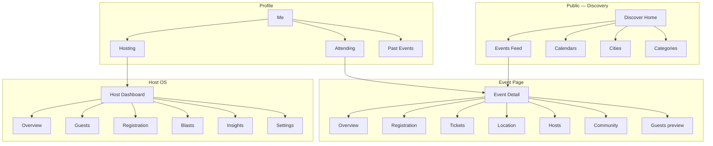
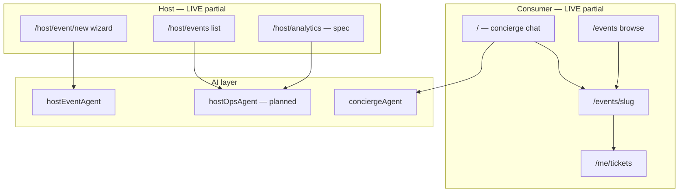
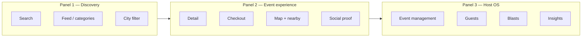
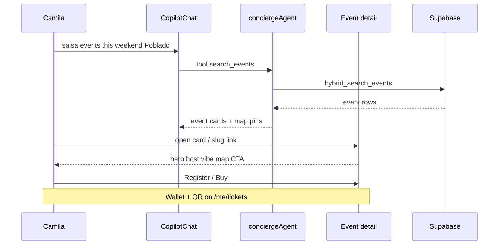
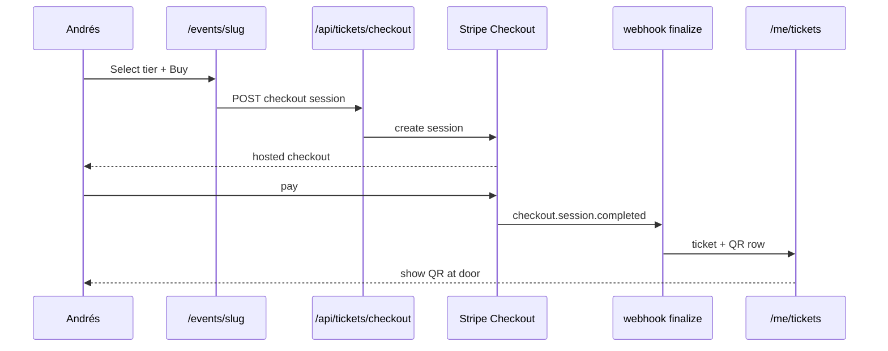
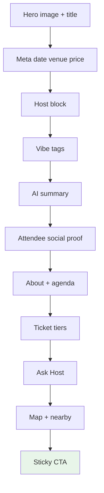
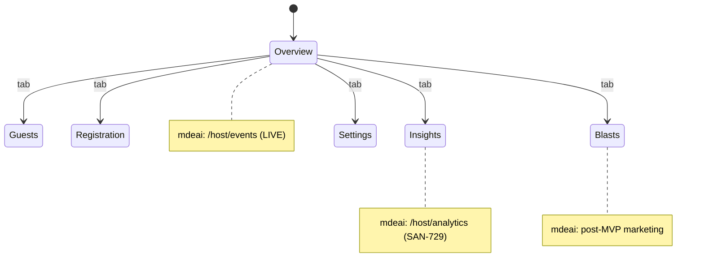
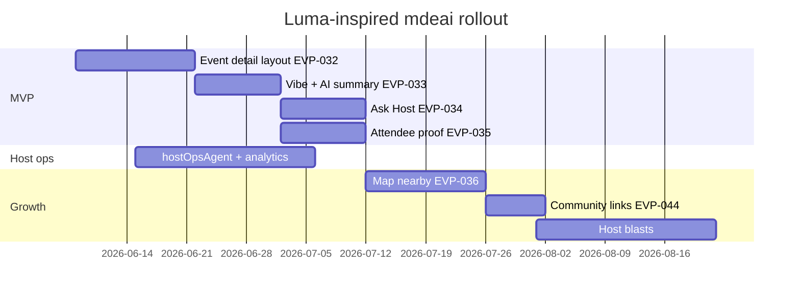
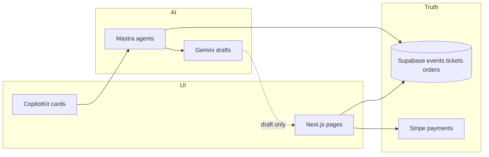

# Luma → mdeai Diagrams

Validated syntax for GitHub/Linear markdown. Split by concept — do not merge into one mega-diagram.

---

## 1. Information architecture (Luma)



---

## 2. mdeai events IA (target)



---

## 3. Three-panel architecture



**mdeai mapping:** Panel 1 = `/` + `/events` · Panel 2 = `/events/[slug]` + map column on chat · Panel 3 = `/host/*` + Copilot sidebar ([`01a-copilotkit-mastra-plan.md`](01a-copilotkit-mastra-plan.md)).

---

## 4. Camila — discover to attend



---

## 5. Andrés — paid checkout



---

## 6. Roberto — create to analyze

```mermaid
flowchart TD
  A[Open /host/event/new] --> B[hostEventAgent chat + wizard]
  B --> C[set_event_basics venue tiers]
  C --> D[HITL preview_and_publish]
  D --> E{Approved?}
  E -->|Yes| F[Supabase events row]
  E -->|No| B
  F --> G[/host/events list]
  G --> H[/host/analytics — planned]
  H --> I[hostOpsAgent Q&A]
  I --> J[salesInsightWorkflow]
```

---

## 7. Event detail content flow (Luma sections)



Maps to PAGE-003b section order.

---

## 8. Host dashboard tabs (Luma vs mdeai)



---

## 9. MVP vs growth roadmap



---

## 10. Data ownership (non-negotiable)



AI never publishes or mutates paid state without HITL.
