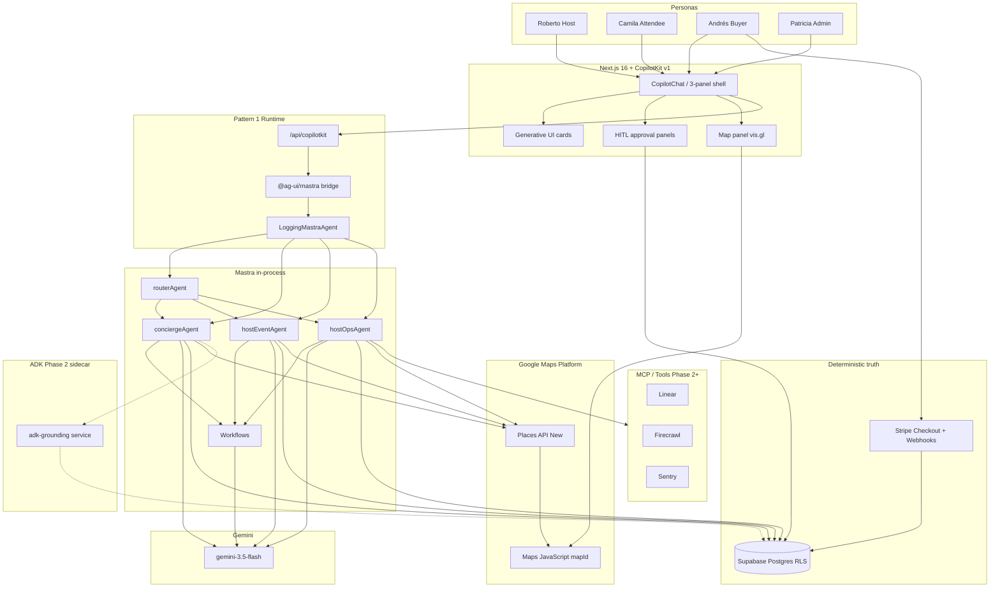

```mermaid
flowchart TB
  subgraph Users["Personas"]
    ROB[Roberto Host]
    CAM[Camila Attendee]
    AND[Andrés Buyer]
    PAT[Patricia Admin]
  end

  subgraph UI["Next.js 16 + CopilotKit v1"]
    CHAT[CopilotChat / 3-panel shell]
    CARDS[Generative UI cards]
    HITL[HITL approval panels]
    MAPUI[Map panel vis.gl]
  end

  subgraph Runtime["Pattern 1 Runtime"]
    API["/api/copilotkit"]
    AGUI["@ag-ui/mastra bridge"]
    LOG[LoggingMastraAgent]
  end

  subgraph Mastra["Mastra in-process"]
    RTR[routerAgent]
    CON[conciergeAgent]
    HE[hostEventAgent]
    HO[hostOpsAgent]
    WF[Workflows]
  end

  subgraph Model["Gemini"]
    GEM[gemini-3.5-flash]
  end

  subgraph Truth["Deterministic truth"]
    SB[(Supabase Postgres RLS)]
    ST[Stripe Checkout + Webhooks]
  end

  subgraph Geo["Google Maps Platform"]
    PL[Places API New]
    MAPS[Maps JavaScript mapId]
  end

  subgraph MCP["MCP / Tools Phase 2+"]
    LIN[Linear]
    FC[Firecrawl]
    SEN[Sentry]
  end

  subgraph ADK["ADK Phase 2 sidecar"]
    ADKSRV[adk-grounding service]
  end

  ROB & CAM & AND & PAT --> CHAT
  CHAT --> CARDS & HITL & MAPUI
  CHAT --> API
  API --> AGUI --> LOG
  LOG --> RTR & CON & HE & HO
  RTR --> CON & HE & HO
  CON & HE & HO --> WF
  CON & HE & HO & WF --> GEM
  HE & HO & CON --> SB
  AND --> ST
  ST --> SB
  CON & HE & HO --> PL
  MAPUI --> MAPS
  PL --> MAPS
  HO --> MCP
  CON -.-> ADKSRV
  ADKSRV -.-> SB
  HITL --> SB
```
