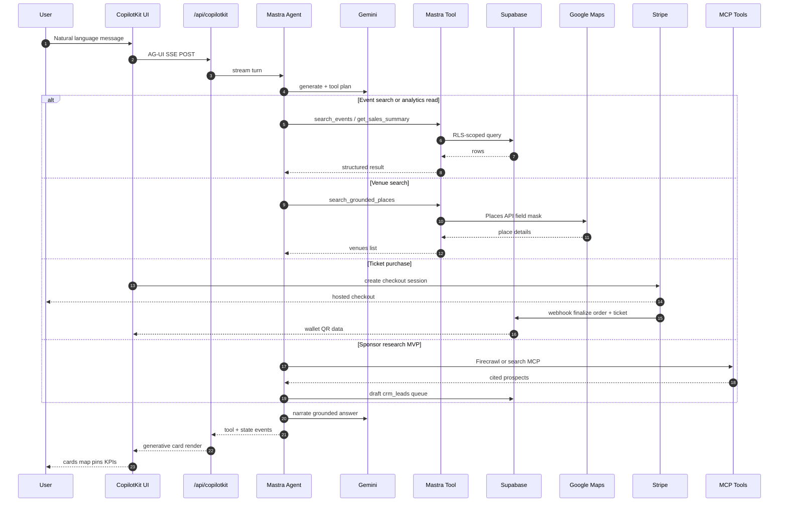

```mermaid
sequenceDiagram
  autonumber
  participant U as User
  participant UI as CopilotKit UI
  participant CK as /api/copilotkit
  participant MA as Mastra Agent
  participant GEM as Gemini
  participant TOOL as Mastra Tool
  participant SB as Supabase
  participant MAP as Google Maps
  participant ST as Stripe
  participant MCP as MCP Tools

  U->>UI: Natural language message
  UI->>CK: AG-UI SSE POST
  CK->>MA: stream turn
  MA->>GEM: generate + tool plan

  alt Event search or analytics read
    MA->>TOOL: search_events / get_sales_summary
    TOOL->>SB: RLS-scoped query
    SB-->>TOOL: rows
    TOOL-->>MA: structured result
  else Venue search
    MA->>TOOL: search_grounded_places
    TOOL->>MAP: Places API field mask
    MAP-->>TOOL: place details
    TOOL-->>MA: venues list
  else Ticket purchase
    UI->>ST: create checkout session
    ST-->>U: hosted checkout
    ST->>SB: webhook finalize order + ticket
    SB-->>UI: wallet QR data
  else Sponsor research MVP
    MA->>MCP: Firecrawl or search MCP
    MCP-->>MA: cited prospects
    MA->>SB: draft crm_leads queue
  end

  MA->>GEM: narrate grounded answer
  MA-->>CK: tool + state events
  CK-->>UI: generative card render
  UI-->>U: cards map pins KPIs
```
