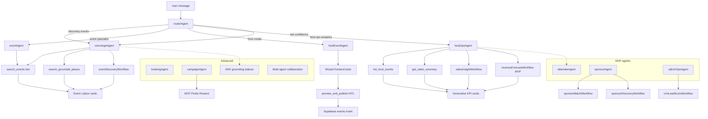

```mermaid
flowchart TD
  START[User message] --> RTR[routerAgent]
  RTR -->|discovery events| CON[conciergeAgent]
  RTR -->|event specialist| EV[eventAgent]
  RTR -->|host create| HE[hostEventAgent]
  RTR -->|host ops analytics| HO[hostOpsAgent]
  RTR -->|low confidence| CON

  CON --> T1[search_events tool]
  CON --> T2[search_grounded_places]
  CON --> W1[eventDiscoveryWorkflow]
  T1 & T2 & W1 --> CARD[Event / place cards]

  HE --> W2[Wizard frontend tools]
  W2 --> HITL[preview_and_publish HITL]
  HITL --> PUB[Supabase events insert]

  HO --> T3[list_host_events]
  HO --> T4[get_sales_summary]
  HO --> W3[salesInsightWorkflow]
  HO --> W4[revenueForecastWorkflow MVP]
  T3 & T4 & W3 & W4 --> KPI[Generative KPI cards]

  EV --> T1

  subgraph MVPMVP["MVP agents"]
    AT[attendeeAgent]
    SP[sponsorAgent]
    AD[adminOpsAgent]
  end

  HO -.-> AT
  SP --> W5[sponsorMatchWorkflow]
  SP --> W6[sponsorDiscoveryWorkflow]
  AD --> W7[crmLeadScoreWorkflow]

  subgraph ADV["Advanced"]
    BK[bookingAgent]
    MK[campaignAgent]
    ADK[ADK grounding sidecar]
    MULTI[Multi-agent collaboration]
  end

  CON -.-> ADK
  MK --> MCP[MCP Postiz Resend]
```
