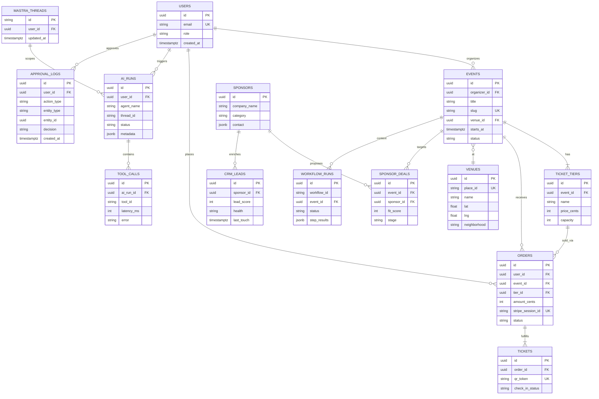

```mermaid
erDiagram
  USERS ||--o{ EVENTS : organizes
  USERS ||--o{ ORDERS : places
  USERS ||--o{ AI_RUNS : triggers
  USERS ||--o{ APPROVAL_LOGS : approves

  EVENTS ||--|{ TICKET_TIERS : has
  EVENTS ||--o{ ORDERS : receives
  EVENTS }o--|| VENUES : at
  EVENTS ||--o{ SPONSOR_DEALS : targets
  EVENTS ||--o{ WORKFLOW_RUNS : context

  TICKET_TIERS ||--o{ ORDERS : sold_via
  ORDERS ||--|{ TICKETS : fulfills

  SPONSORS ||--o{ SPONSOR_DEALS : proposes
  SPONSORS ||--o{ CRM_LEADS : enriches

  AI_RUNS ||--o{ TOOL_CALLS : contains
  MASTRA_THREADS ||--o{ AI_RUNS : scopes

  USERS {
    uuid id PK
    string email UK
    string role
    timestamptz created_at
  }

  EVENTS {
    uuid id PK
    uuid organizer_id FK
    string title
    string slug UK
    uuid venue_id FK
    timestamptz starts_at
    string status
  }

  VENUES {
    uuid id PK
    string place_id UK
    string name
    float lat
    float lng
    string neighborhood
  }

  TICKET_TIERS {
    uuid id PK
    uuid event_id FK
    string name
    int price_cents
    int capacity
  }

  ORDERS {
    uuid id PK
    uuid user_id FK
    uuid event_id FK
    uuid tier_id FK
    int amount_cents
    string stripe_session_id UK
    string status
  }

  TICKETS {
    uuid id PK
    uuid order_id FK
    string qr_token UK
    string check_in_status
  }

  SPONSORS {
    uuid id PK
    string company_name
    string category
    jsonb contact
  }

  SPONSOR_DEALS {
    uuid id PK
    uuid event_id FK
    uuid sponsor_id FK
    int fit_score
    string stage
  }

  CRM_LEADS {
    uuid id PK
    uuid sponsor_id FK
    int lead_score
    string health
    timestamptz last_touch
  }

  AI_RUNS {
    uuid id PK
    uuid user_id FK
    string agent_name
    string thread_id
    string status
    jsonb metadata
  }

  TOOL_CALLS {
    uuid id PK
    uuid ai_run_id FK
    string tool_id
    int latency_ms
    string error
  }

  WORKFLOW_RUNS {
    uuid id PK
    string workflow_id
    uuid event_id FK
    string status
    jsonb step_results
  }

  APPROVAL_LOGS {
    uuid id PK
    uuid user_id FK
    string action_type
    string entity_type
    uuid entity_id
    string decision
    timestamptz created_at
  }

  MASTRA_THREADS {
    string id PK
    uuid user_id FK
    timestamptz updated_at
  }
```
