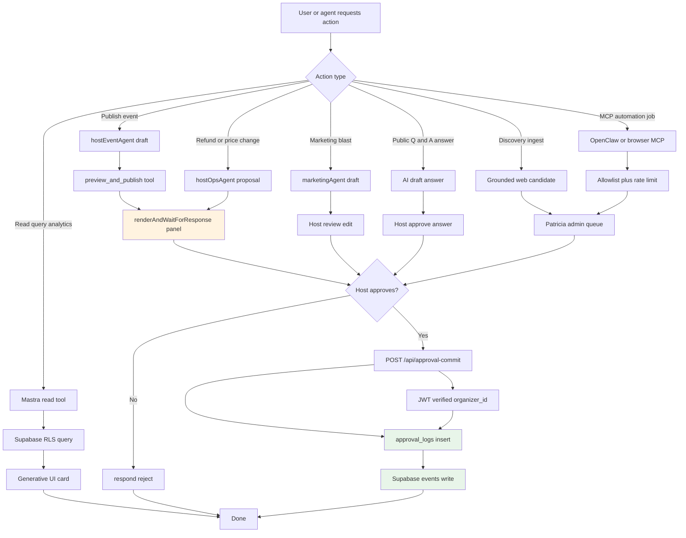

```mermaid
flowchart TD
  A[User or agent requests action] --> B{Action type}

  B -->|Read query analytics| C[Mastra read tool]
  C --> D[Supabase RLS query]
  D --> E[Generative UI card]
  E --> Z[Done]

  B -->|Publish event| F[hostEventAgent draft]
  F --> G[preview_and_publish tool]
  G --> H[renderAndWaitForResponse panel]
  H --> I{Host approves?}
  I -->|No| J[respond reject]
  J --> Z
  I -->|Yes| K[POST /api/approval-commit]
  K --> L[approval_logs insert]
  L --> M[Supabase events write]
  M --> Z

  B -->|Refund or price change| N[hostOpsAgent proposal]
  N --> H

  B -->|Marketing blast| O[marketingAgent draft]
  O --> P[Host review edit]
  P --> I

  B -->|Public Q and A answer| Q[AI draft answer]
  Q --> R[Host approve answer]
  R --> I

  B -->|Discovery ingest| S[Grounded web candidate]
  S --> T[Patricia admin queue]
  T --> I

  B -->|MCP automation job| U[OpenClaw or browser MCP]
  U --> V[Allowlist plus rate limit]
  V --> T

  K --> W[JWT verified organizer_id]
  W --> L

  style H fill:#fff3e0
  style L fill:#e8f5e9
  style M fill:#e8f5e9
```
