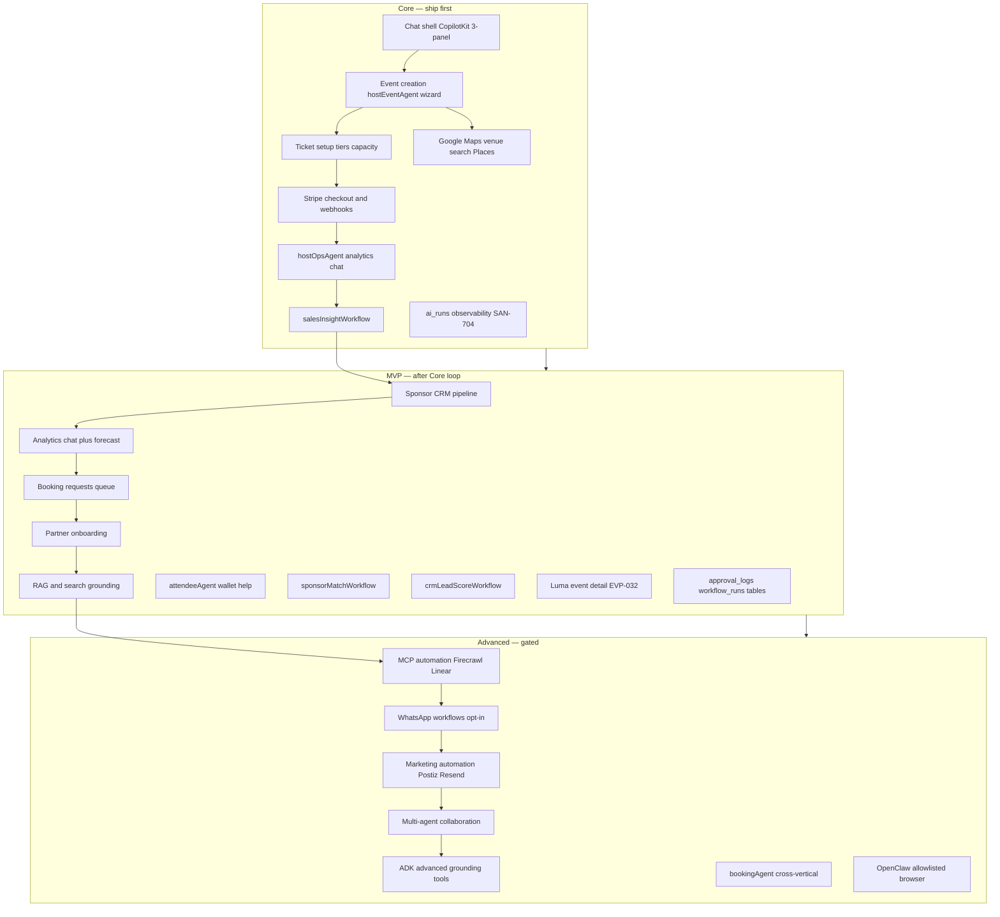

```mermaid
flowchart TB
  subgraph CORE["Core — ship first"]
    C1[Chat shell CopilotKit 3-panel]
    C2[Event creation hostEventAgent wizard]
    C3[Ticket setup tiers capacity]
    C4[Stripe checkout and webhooks]
    C5[Google Maps venue search Places]
    C6[hostOpsAgent analytics chat]
    C7[salesInsightWorkflow]
    C8[ai_runs observability SAN-704]
  end

  subgraph MVP["MVP — after Core loop"]
    M1[Sponsor CRM pipeline]
    M2[Analytics chat plus forecast]
    M3[Booking requests queue]
    M4[Partner onboarding]
    M5[RAG and search grounding]
    M6[attendeeAgent wallet help]
    M7[sponsorMatchWorkflow]
    M8[crmLeadScoreWorkflow]
    M9[Luma event detail EVP-032]
    M10[approval_logs workflow_runs tables]
  end

  subgraph ADV["Advanced — gated"]
    A1[MCP automation Firecrawl Linear]
    A2[WhatsApp workflows opt-in]
    A3[Marketing automation Postiz Resend]
    A4[Multi-agent collaboration]
    A5[ADK advanced grounding tools]
    A6[bookingAgent cross-vertical]
    A7[OpenClaw allowlisted browser]
  end

  CORE --> MVP
  MVP --> ADV

  C1 --> C2
  C2 --> C3
  C3 --> C4
  C2 --> C5
  C4 --> C6
  C6 --> C7
  C7 --> M1
  M1 --> M2
  M2 --> M3
  M3 --> M4
  M4 --> M5
  M5 --> A1
  A1 --> A2
  A2 --> A3
  A3 --> A4
  A4 --> A5
```
