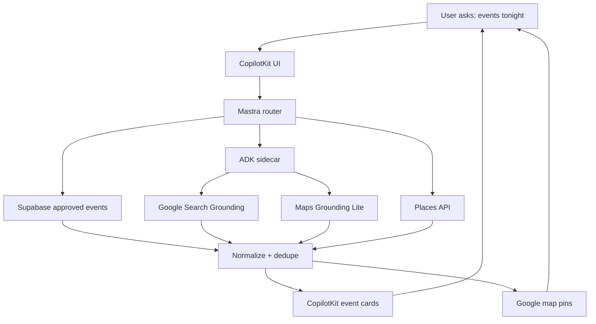

> **Tasks:** [EVP-017-mvp-event-grounding-architecture.md](../EVP-017-mvp-event-grounding-architecture.md) · Pack: [F42](EVP-018-mvp-event-web-discovery-task-pack.md)

Yes — add **comprehensive web search for events/contests later**, but not as MVP core.

## Best tech stack

| Layer                          | Use                                                                 |
| ------------------------------ | ------------------------------------------------------------------- |
| **CopilotKit**                 | Chat UI, event cards, map cards, approval UI                        |
| **Mastra**                     | Main router + workflows                                             |
| **Supabase**                   | Source of truth: saved events, tickets, contests, orders            |
| **Google Search Grounding**    | Fresh web search for public events/contests                         |
| **Google Maps Grounding Lite** | Venue/location/nearby/routing facts                                 |
| **Google Places API**          | Structured venue data, `place_id`, photos, ratings                  |
| **ADK sidecar**                | Google tool orchestration only                                      |
| **OpenClaw**                   | Later automation: scrape, verify, outreach, WhatsApp, browser tasks |

Your own architecture rule already matches this: Supabase owns data, Mastra orchestrates, CopilotKit owns UI, Maps owns geo display, and Gemini explains rather than invents facts. 

## Correct feature plan

### MVP: simple event search

Use:

```txt
Supabase events
+
Google Maps venue enrichment
+
CopilotKit cards/pins
```

MVP should stay focused on first ticket sold + first rental lead captured. 

### Post-MVP: comprehensive event search

Add:

```txt
Google Search Grounding
+
ADK SearchAgent
+
source citations
+
event dedupe
+
confidence score
```

Use for:

* concerts
* football games
* nightlife
* festivals
* pageants
* contests
* food events
* free events
* “tonight / this weekend”

Google Search Grounding is designed for real-time web-backed answers with citations. ([Google AI for Developers][1])

### Advanced: OpenClaw automation

Use OpenClaw only after approval gates.

Use for:

* checking event websites daily
* collecting organizer info
* outreach drafts
* WhatsApp follow-up
* source verification
* screenshot evidence

Do **not** let OpenClaw buy tickets, publish events, edit DB rows, or run money workflows automatically. OpenClaw has browser/automation capabilities, but also real security risk, so keep it gated. ([OpenClaw][2])

## Best workflow



## Search links to use

| Topic                     | Link                                                                                                         |
| ------------------------- | ------------------------------------------------------------------------------------------------------------ |
| CopilotKit                | [https://www.copilotkit.ai/](https://www.copilotkit.ai/)                                                     |
| CopilotKit GitHub         | [https://github.com/CopilotKit/CopilotKit](https://github.com/CopilotKit/CopilotKit)                         |
| Mastra agents             | [https://mastra.ai/docs/agents/overview](https://mastra.ai/docs/agents/overview)                             |
| Mastra workflows          | [https://mastra.ai/docs/workflows/overview](https://mastra.ai/docs/workflows/overview)                       |
| Mastra + CopilotKit       | [https://mastra.ai/guides/build-your-ui/copilotkit](https://mastra.ai/guides/build-your-ui/copilotkit)       |
| Google Search Grounding   | [https://ai.google.dev/gemini-api/docs/google-search](https://ai.google.dev/gemini-api/docs/google-search)   |
| ADK Grounding with Search | [https://adk.dev/grounding/grounding_with_search/](https://adk.dev/grounding/grounding_with_search/)         |
| Maps Grounding Lite       | [https://developers.google.com/maps/ai/grounding-lite](https://developers.google.com/maps/ai/grounding-lite) |
| OpenClaw docs             | [https://docs.openclaw.ai/tools/browser](https://docs.openclaw.ai/tools/browser)                             |
| OpenClaw GitHub           | [https://github.com/openclaw/openclaw](https://github.com/openclaw/openclaw)                                 |

## Final recommendation

Build in this order:

```txt
1. Supabase event search
2. Event cards + map pins
3. Places venue enrichment
4. Google Search Grounding
5. ADK SearchAgent
6. Contest discovery
7. OpenClaw verification/outreach
```

Do **not** make web search the source of truth. Use it to **discover**, then save verified events into Supabase.

[1]: https://ai.google.dev/gemini-api/docs/google-search?utm_source=chatgpt.com "Grounding with Google Search - generateContent API"
[2]: https://docs.openclaw.ai/tools/browser?utm_source=chatgpt.com "Browser (OpenClaw-managed)"
