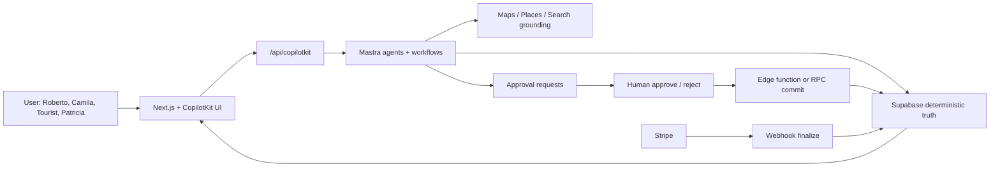
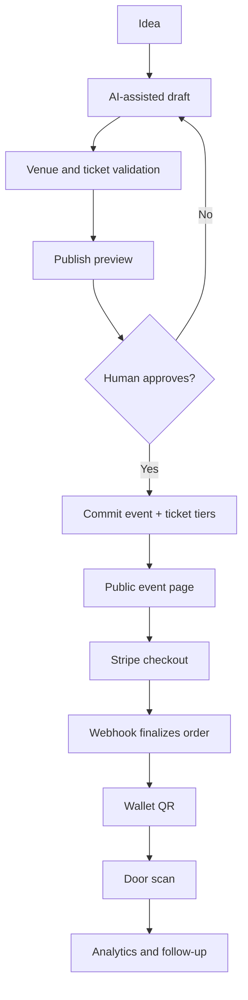
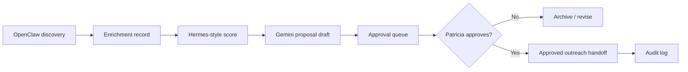

# 1. EXECUTIVE AUDIT

## Verdict

mdeai has the right architectural spine for an AI-native Medellin events product:

```text
Next.js UI
  -> CopilotKit 1.55.2 + AG-UI
  -> /api/copilotkit
  -> Mastra local agents and workflows
  -> Supabase deterministic truth
  -> Stripe deterministic money
  -> Google Maps / Places / Search grounding for geo and freshness
```

The system is not blocked by the high-level architecture. It is blocked by proof discipline and scope control. Event discovery, ticketing, host creation, maps, and grounding have real implementation files in `mdeapp/src`, but sponsor intelligence, OpenClaw automation, Postiz campaigns, venue ops, and advanced city intelligence remain planning-heavy and must stay post-MVP until the revenue loop is proven.

## Scorecard (2026-06-08 — see [`index-events.md`](./index-events.md))

| Area | Score | Honest reading |
|---|---:|---|
| Overall platform (51 tasks) | 38% | Core commerce + agents shipped; analytics, admin, discovery workflows lag. |
| Core commerce | 85% | Checkout, wallet, host wizard LIVE; SAN-115 ledger blocks launch sign-off. |
| AI orchestration | 95% | `conciergeAgent`, `hostEventAgent`, tools LIVE; **`hostOpsAgent` missing** (Analyze step). |
| Host analytics | 0% | `/host/analytics` spec only (PAGE-M02, SAN-729); nav disabled (SAN-730). |
| Production readiness | 55% | Prod discovery green; G1 webhook proof + copilotkit smoke gap. |
| Architecture quality | 86/100 | Correct boundaries; Mastra **v1** verified (`npm run check:mastra` PASS). |
| Map architecture | 45% | Pins/cards exist; event-venue binding staged. |
| Sponsor system | 15% | Strategy only; CRM-lite deferred. |
| Automation | 15% | OpenClaw/Postiz post-MVP. |
| UX | 68% | Luma layer + admin queues missing. |

## Brutal summary

The platform should not become "an agent swarm for events." It should become a reliable event operating system where AI reduces host work, improves discovery, and drafts campaigns, while deterministic systems own publishing, ticket inventory, payments, and audit logs.

---

# 2. WHAT IS ALREADY IMPLEMENTED

Evidence from `mdeapp/src` shows the events surface is more advanced than older PRD text claimed.

## Fully implemented or strongly scaffolded in code

| System | Evidence | Status |
|---|---|---|
| CopilotKit runtime | `src/app/api/copilotkit/route.ts` | Implemented foundation |
| Mastra agents | `src/mastra/agents/{concierge,event-agent,host-event,router}.ts` | Implemented foundation |
| Host events list | `src/app/host/events/page.tsx` | LIVE — no `hostOpsAgent` yet |
| Event search tools | `src/mastra/tools/search-events.ts`, tests | Implemented with tests |
| Event discovery workflow | `src/mastra/workflows/event-discovery-workflow.ts` | Implemented foundation |
| Host event route | `src/app/host/event/new/page.tsx` | Implemented route |
| Host event components | `src/components/host/*` | Implemented UI surface |
| Event detail route | `src/app/events/[slug]/page.tsx` | Implemented route |
| Ticket checkout API | `src/app/api/tickets/checkout/route.ts` | Implemented local route |
| Ticket wallet API/pages | `src/app/api/tickets/wallet/route.ts`, `src/app/me/tickets/*` | Implemented local route |
| Event cards | `src/components/copilot/event-card.tsx` | Implemented and tested |
| Map panels and pins | `src/components/maps/*`, `src/platform/maps/*` | Implemented foundation |
| Grounding route | `src/app/api/grounding/event-web/route.ts` | Implemented local route |
| Unit tests | `src/**/__tests__`, `*.test.ts(x)` | Present |
| E2E screen tests | `e2e/screens/SCREEN-014-event-detail.spec.ts`, `SCREEN-015-tickets.spec.ts`, `SCREEN-016-host-wizard.spec.ts` | Present |

## Partially implemented

| System | Current state | Gap |
|---|---|---|
| Ticketing | Checkout/wallet files and smoke scripts exist | Need refreshed local proof and production Stripe webhook proof. |
| Host publish flow | HITL components and approval schema exist | Need proof that Roberto approval writes only through approved commit path. |
| Event maps | Map cards, pins, fit bounds, details enrichment exist | Need event-specific venue binding and venue autocomplete task sequencing. |
| Search grounding | Grounding docs/tasks and event-web route exist | Need citation UI, quota logging, freshness routing, and allowlist proof. |
| Admin operations | Some admin concepts exist in docs | Need concrete `/admin/events` and exception queues. |

## Planned only

| System | Recommendation |
|---|---|
| Sponsor marketplace | Defer. Build sponsor CRM-lite and proposal drafts first. |
| OpenClaw daily automation | Defer. Plan only until approvals, allowlist, and audit logs exist. |
| Postiz publishing | Defer autonomous posting. MVP can generate campaign drafts only. |
| Venue marketplace | Defer. MVP only needs event-to-venue binding and Places-enriched context. |
| WhatsApp broadcasts | Defer automation. MVP can use share links and manual/reminder templates. |
| Live event overlays | Post-MVP after ticketing and discovery are stable. |
| Hermes predictive scoring | Advisory only; never rank paid state, prices, tickets, or winners directly. |

## Missing critical systems

| Missing | Why it matters |
|---|---|
| **`hostOpsAgent` + host analytics** | Roberto cannot ask “how are sales?” in chat; blocks Analyze step. Plans: [`01a`](01a-copilotkit-mastra-plan.md), [`02`](02-mastra-events.md). |
| Current proof ledger for event tasks | [SAN-115](https://linear.app/sanjiovani/issue/SAN-115) Todo — P0 exit gate. |
| Production Stripe webhook gate | Local Stripe CLI proof is not live-money proof. |
| `/admin/events` ops queue | Patricia needs visibility into failed payments, approvals, and event quality. |
| Sponsor CRM-lite | Sponsor plans are overbuilt without a small deterministic pipeline. |
| OpenClaw governance tables | Automation must be sandboxed before browser workflows are scheduled. |
| Search grounding quota and citations | Fresh web claims need cost control and visible citations. |

---

# 3. CORE MVP

## Exact MVP scope

MVP should prove one revenue loop and one discovery loop:

```text
Tourist/Camila discovers an event
  -> sees grounded event card and map context
  -> buys a ticket
  -> receives wallet QR
  -> door staff can validate

Roberto creates an event
  -> AI helps fill the draft
  -> human approves
  -> Supabase commits published event and ticket tiers
```

## Must ship first

| Priority | Feature | Owner system | Proof required |
|---:|---|---|---|
| P0 | Public event detail | Next.js + Supabase | Browser route proof |
| P0 | Ticket checkout | Stripe + Supabase | Checkout session + order proof |
| P0 | Stripe webhook finalize | Stripe + Supabase | Idempotent paid order proof |
| P0 | Ticket wallet QR | Next.js + Supabase | Auth/user-scoped wallet proof |
| P0 | Host event draft | CopilotKit + Mastra | Host wizard browser proof |
| P0 | HITL publish commit | Edge/RPC + Supabase | Approval log + event row proof |
| P1 | Event discovery cards | Mastra + Supabase | DB-only event results proof |
| P1 | Event map context | Maps + Places | Pin/card sync proof |
| P1 | Search grounding | Gemini Search grounding | Citation + quota proof |
| P1 | Admin exception queue | Next.js + Supabase | Failed payment/approval visibility |

## Do not build yet

| Defer | Reason |
|---|---|
| OpenClaw outbound sponsor automation | Legal, platform, spam, and brand risk before CRM approval gates. |
| Sponsor marketplace | Revenue discovery needed first; marketplace adds roles, contracts, payments, disputes. |
| Complex multi-agent specialist graph | Mastra tools and workflows cover the first event loop. |
| Kubernetes or heavy microservices | No evidence yet that the modular monolith is the bottleneck. |
| Dynamic pricing | Legal/support complexity; not needed for first Medellin event revenue. |
| Live streaming overlays | Useful for contests, but not required for event MVP launch. |

## Minimum lovable product

The minimum lovable version is not "all event-tech." It is a polished Medellin event assistant:

- Roberto can create a beautiful, ticketed event without learning an admin console.
- Camila can discover relevant events with real map context.
- Andres can buy and show a QR ticket.
- Patricia can see when money, publish approvals, or scans fail.

---

# 4. POST-MVP

Post-MVP starts after the first paid event loop passes localhost, staging, and live smoke.

| Area | Features |
|---|---|
| Growth | Referral links, share cards, static map OG previews, reminder emails. |
| Venue | Places autocomplete, saved venue profiles, venue analytics, routes preview. |
| Sponsor | Sponsor CRM-lite, AI proposal drafts, package templates, ROI snapshot. |
| Marketing | Campaign builder, Postiz draft handoff, approval queue, metrics ingest. |
| WhatsApp | Opt-in reminders, ticket delivery, host operational alerts. |
| Live ops | Check-in dashboard, sales velocity, issue queue, refund/admin notes. |
| Grounding | Fresh web event discovery with allowlists and citations. |

---

# 5. ADVANCED PLATFORM

Advanced work should be framed as "city intelligence," not as unchecked autonomy.

| Layer | Advanced capability | Guardrail |
|---|---|---|
| City intelligence | Neighborhood demand, nightlife clustering, tourism/event packages | Advisory only |
| AI concierge | Multi-intent routing across events, restaurants, rentals, venues | Tool results cite source |
| Personalization | User preferences and saved plans | Consent + RLS |
| AI marketing | Segment suggestions, copy variants, campaign calendar | Human approval before publish |
| Sponsor intelligence | Prospect scoring, activation ideas, ROI narratives | Draft only until approved |
| OpenClaw | Lead discovery, screenshot capture, enrichment | Sandboxed, logged, allowlisted |
| Hermes | Venue/sponsor/event scoring | Read-side scoring; no direct mutation |

---

# 6. ROADMAP

## Phase 1 - Proof refresh and MVP hardening

| Work | Depends on | Exit gate |
|---|---|---|
| Re-run current event tests and screen E2E | Existing implementation | Dated evidence in task files |
| Verify ticket checkout and wallet | Stripe test keys | Order + wallet route proof |
| Verify webhook finalize | Stripe CLI locally, dashboard later | Idempotent paid order proof |
| Verify host HITL publish | Host wizard + approval commit | Event row + approval row proof |
| Reconcile task statuses | Evidence files | No "Done" without proof |

## Phase 2 - Event discovery + maps

| Work | Depends on | Exit gate |
|---|---|---|
| Event card quality pass | Event search tool | Event card + empty/error states |
| Event map pin/category sync | MAP-030/MAP-031 | Pin focus and fit bounds proof |
| Venue binding | MAP-010 after MAP-005 | Place ID stored and displayed |
| Search grounding citations | GS-001 to GS-004 | Citation UI + quota log |

## Phase 3 - Sponsor CRM-lite

| Work | Depends on | Exit gate |
|---|---|---|
| Sponsor lead table + RLS | Supabase migration | RLS catalog proof |
| Sponsor proposal drafts | Gemini/Mastra tool | Draft stored, not sent |
| Approval queue | Admin UI | Patricia approve/reject proof |
| ROI snapshot | Orders/referrals | SQL-backed sponsor report |

## Phase 4 - Automation under governance

| Work | Depends on | Exit gate |
|---|---|---|
| OpenClaw allowlist | Sponsor CRM-lite | No job runs outside allowlist |
| Browser automation sandbox | OpenClaw governance | Screenshot + audit proof |
| Postiz draft handoff | Campaign approval | No auto-publish by default |
| WhatsApp templates | Opt-in contacts | Approved template + rate limits |

---

# 7. BEST ARCHITECTURE

## Ownership rules

| System | Owns | Must not own |
|---|---|---|
| Supabase | Events, tickets, orders, approvals, audit logs, RLS truth | LLM reasoning |
| Stripe | Checkout, payment intent/session, money state source | Event content or ticket display |
| Mastra | Agent/tool orchestration, workflows, audit wrapping | Direct critical-state mutation |
| CopilotKit | Conversational UI, generative cards, HITL panels | Business truth |
| Google ADK | Google-specific sidecar intelligence, Maps/grounding service wrappers | Product orchestration |
| Google Maps/Places | Map rendering, place details, routes, place IDs | Event truth |
| Search grounding | Fresh web evidence with citations | Replacing SQL for known events |
| OpenClaw | Approved browser automation and enrichment | Autonomous outreach or writes |
| Hermes-style scoring | Advisory scoring and prioritization | Winners, payments, rankings, prices |
| Postiz | Scheduled social publishing after approval | Campaign strategy approval |

## Correct orchestration pattern



## Event lifecycle



## Sponsor automation boundary



---

# 8. GITHUB REPO REVIEW

`/home/sk/mdeai/github/eventsv` is not present. This review uses the local clones in `/home/sk/mdeai/github/events`.

| Repo | Score | Use level | Production readiness | Reuse | Do not copy |
|---|---:|---|---|---|---|
| Hi.Events | 92 | Strong reference | High, but AGPL/Laravel mismatch | Ticketing, QR, roles, refunds, organizer UX | Runtime, schema wholesale, AGPL code |
| CopilotKit Mastra examples | 96 | Foundation | High as local pattern | Pattern 1 runtime, AG-UI bridge | v2 imports in Phase 1 |
| Gatherly | 84 | Strong reference | Student/demo but coherent | Discovery, saved events, Next/Supabase patterns | Mock AI/provider choices |
| EventFlow-AI | 80 | Ops reference | Strong ops posture | Runbooks, Docker proof, workflow gates | Azure/OpenAI stack |
| Eventflow.ai | 64 | UI inspiration | Static/demo | Wizard constraints and simple CSP ideas | Treating static demo as backend architecture |
| Gather-Up-AI | 68 | Post-MVP reference | Microservice-heavy | Places/RAG venue/vendor ideas | Early microservices |
| venue-concierge | 72 | Venue reference | Unknown from quick local scan | Quote/evaluation patterns | Any unverified automation |
| event-planner-os | 78 | Checklist reference | Template/content source | Roberto planning templates | As product runtime |
| spec-to-agents | 75 | Agent design reference | Pattern only | Spec-to-workflow thinking | Extra orchestrator |
| events-planner-agents | 70 | Agent reference | Pattern only | Router/search/rank ideas | LangGraph/WebSurfer runtime |
| eventforge-ai | 66 | Post-MVP | Python package reference | Sponsor/speaker agent shape | Production dependency |
| match-my-sponser-web | 76 | Sponsor UI reference | MVP-style | Sponsor dashboards, matching CRM | Claims of production readiness without proof |
| eventraa | 45 | Avoid | Demo stack mismatch | Read once for feature ideas | Mongo/CRA runtime |

---

# 9. FEATURE MATRIX

| Feature | MVP | Production core | Advanced | Enterprise | Experimental |
|---|:---:|:---:|:---:|:---:|:---:|
| Event discovery | Yes | Yes | Yes | Yes | - |
| Public event detail | Yes | Yes | Yes | Yes | - |
| Ticket checkout | Yes | Yes | Yes | Yes | - |
| QR wallet | Yes | Yes | Yes | Yes | - |
| Door scan | Yes | Yes | Yes | Yes | - |
| Host AI wizard | Yes | Yes | Yes | Yes | - |
| HITL publish approval | Yes | Yes | Yes | Yes | - |
| Event map pins | P1 | Yes | Yes | Yes | - |
| Places venue binding | P1/P2 | Yes | Yes | Yes | - |
| Search grounding citations | P1/P2 | Yes | Yes | Yes | - |
| Sponsor proposal drafts | No | Yes | Yes | Yes | - |
| Sponsor marketplace | No | No | Yes | Yes | - |
| OpenClaw enrichment | No | No | Yes | Yes | - |
| Postiz scheduling | No | P2 | Yes | Yes | - |
| WhatsApp reminders | No | P2 | Yes | Yes | - |
| Live overlays | No | No | P3 | Yes | Yes |
| Predictive demand scoring | No | No | Advisory | Yes | Yes |

---

# 10. REAL-WORLD USER FLOWS

## Tourist discovering events

1. Tourist asks: "What is happening in Provenza Friday night?"
2. Mastra checks deterministic `events` first.
3. If freshness is needed, Search grounding runs with citations and quota logging.
4. CopilotKit renders event cards and map pins.
5. Tourist opens the event detail and buys a ticket.

## Roberto creating an event

1. Roberto opens `/host/event/new`.
2. `hostEventAgent` helps fill title, date, venue, capacity, and ticket tiers.
3. CopilotKit shows an approval preview.
4. Roberto approves.
5. A commit path writes `events`, `event_tickets`, and approval audit rows.

## Sponsor onboarding

1. Patricia adds a sponsor lead or imports an approved prospect.
2. Gemini drafts a proposal from event facts and sponsor fit.
3. Human reviews package, benefits, price, and send channel.
4. Outreach is sent only after explicit approval.
5. ROI uses SQL-backed ticket/referral metrics, not AI guesses.

## Venue operations

1. Host selects or enters a venue.
2. Places enrichment attaches place ID, address, map coordinates, and public metadata.
3. Venue context informs map display, travel links, and operational checklist.
4. No booking is promised unless a deterministic booking/contract path exists.

## Nightlife discovery

1. User asks for "reggaeton events near El Poblado tonight."
2. SQL events are filtered by time, area, and category.
3. Search grounding can add fresh cited candidates into a review queue.
4. Unapproved web-discovered events are labeled as discovered, not official mdeai events.

---

# 11. RISKS

| Risk | Severity | Fix |
|---|---:|---|
| Docs say Done without current proof | High | Add proof refresh task and evidence links. |
| Production Stripe webhook not permanently configured | High | Add live webhook gate before production launch. |
| Too many sponsor/OpenClaw tasks before CRM-lite | High | Defer automation; ship lead/draft/approval first. |
| Duplicate orchestration via ADK/OpenClaw agents | Medium | Mastra owns product orchestration; ADK/OpenClaw are bounded services. |
| Search grounding hallucination | Medium | Cite sources, label freshness, never overwrite SQL truth automatically. |
| Places quota blowup | Medium | Field masks, cache, per-route budgets. |
| WhatsApp compliance | Medium | Opt-in, templates, rate limits, no bulk pre-MVP. |
| AGPL code contamination from Hi.Events | Medium | Patterns only; no copy-paste runtime. |
| Overbuilt microservices | Medium | Keep modular monolith + Edge Functions until load requires split. |
| Sponsor legal/commercial claims | Medium | Proposals are drafts; contracts and payments require human approval. |

---

# 12. FINAL RECOMMENDATION

## Best final stack

| Layer | Choice |
|---|---|
| Frontend | Next.js 16 + React 19 + Tailwind + shadcn/ui |
| AI UI | CopilotKit 1.55.2 + AG-UI |
| Orchestration | Mastra local agents/workflows through `/api/copilotkit` |
| AI model | Gemini via `@ai-sdk/google`; verify model IDs before implementation |
| Truth | Supabase Postgres + RLS |
| Payments | Stripe Checkout + webhook finalize |
| Maps | vis.gl/react-google-maps + Places API New + Routes later |
| Grounding | Google Search grounding for fresh web evidence only |
| Automation | OpenClaw only after approval queues and audit logs |
| Social | Postiz only for approved scheduling/drafts |
| Testing | Vitest + Playwright + smoke scripts + evidence notes |

## Best implementation order

1. Refresh event proof: tests, screen E2E, checkout, wallet, host wizard (**SAN-115**).
2. **Host AI dashboard:** SAN-730 nav → `hostOpsAgent` → `/host/analytics` (PAGE-M02) → read tools + generative KPI card.
3. Close live-money gap: permanent Stripe webhook and live-domain smoke.
4. Finish deterministic event operations: admin queue, scan/check-in, idempotency.
5. Add grounded discovery with citations and quota.
6. Add event-specific maps/venue binding.
7. Build sponsor CRM-lite and proposal drafts.
8. Add OpenClaw/Postiz only behind approval and audit.

## Planning docs index

| Doc | Role |
|-----|------|
| [`docs/01a-copilotkit-mastra-plan.md`](01a-copilotkit-mastra-plan.md) | **Canonical** CopilotKit dashboard + `hostOpsAgent` UI shell |
| [`docs/02-mastra-events.md`](02-mastra-events.md) | **Canonical** Mastra agents, tools, workflows |
| [`docs/02a-mastra-events.md`](02a-mastra-events.md) | Executive Mastra stage roadmap |
| [`docs/01-CopilotKit Event Dashboard Plan.md`](01-CopilotKit%20Event%20Dashboard%20Plan.md) | Research draft (repo ranking) — superseded by 01a |
| [`index-events.md`](./index-events.md) | Progress tracker + readiness scores |
| [`events-roadmap.md`](./events-roadmap.md) | Product phases + GitHub repo usage |

## Best AI strategy

AI should fill forms, summarize options, recommend venues/sponsors, draft campaigns, and explain analytics. AI must not publish events, finalize payments, create tickets, alter orders, send sponsor outreach, or override deterministic scoring.

## Best monetization path

1. Ticketing fee or organizer subscription for event hosts.
2. Sponsor proposal/digital activation packages after CRM-lite works.
3. Venue lead generation after venue binding and analytics are reliable.
4. City intelligence subscriptions for operators only after enough event data exists.

## Final architecture sentence

mdeai should ship as a Medellin event operating system where CopilotKit makes the workflow feel conversational, Mastra coordinates the work, Supabase and Stripe keep the truth boring, Maps makes discovery local, and automation only acts after humans approve it.
