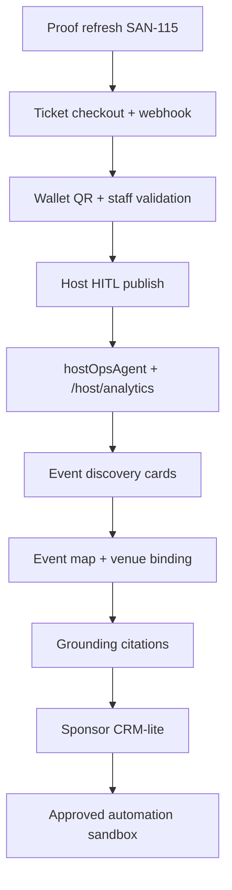

# Events Roadmap

## 1. Executive Summary

The events roadmap should optimize for one working Medellin revenue loop before advanced automation:

```text
Discover event -> view details -> buy ticket -> receive QR -> host sees sale -> staff scans ticket
```

The current repo already has event routes, ticket routes, host wizard files, **`/host/events` list**, Mastra event tools (`conciergeAgent`, `hostEventAgent`), maps components, grounding utilities, unit tests, and Playwright screen tests. The next roadmap step is **proof refresh (SAN-115)**, then **host AI dashboard** (`hostOpsAgent` + `/host/analytics`), then production checkout hardening — not more architecture docs.

**Canonical plans:** [CopilotKit dashboard](01a-copilotkit-mastra-plan.md) · [Mastra agents](02-mastra-events.md) · [Mastra stages](02a-mastra-events.md) · [Tracker](./index-events.md)

## 2. Roadmap Phases

| Phase | Goal | Build | Do not build |
|---|---|---|---|
| Phase 1 | Prove event commerce | Event detail, ticket checkout, wallet QR, webhook, host HITL publish, proof notes | Sponsor marketplace, OpenClaw, Postiz, live overlays |
| **Phase 1.5** | **Host AI dashboard** | SAN-730 nav, `hostOpsAgent`, `/host/analytics` (PAGE-M02), `list_host_events` + `get_sales_summary`, generative KPI card | `eventPlannerAgent`, separate `analyticsAgent`, agent swarms |
| Phase 2 | Improve discovery | Event cards, map pins, Places venue binding, search grounding citations, AI summaries, vibe tags, Ask Host, attendee categories, community links | Autonomous event ingestion |
| Phase 3 | Monetize sponsors | Sponsor CRM-lite, package templates, proposal drafts, approval queue, ROI snapshot | Autonomous outreach |
| Phase 4 | Controlled automation | OpenClaw enrichment, Postiz approved scheduling, WhatsApp opt-in reminders | Unapproved DMs, scraping without allowlist |
| Phase 5 | City intelligence | Neighborhood insights, venue demand, personalization, enterprise dashboards | AI-owned pricing or booking truth |

## 3. Implementation Order

> **Core MVP first** (revenue + host proof). Post-MVP discovery/maps only after **EVP-001-core** is green.  
> Authoritative step table: [`../INDEX.md`](../INDEX.md). Audit: [`../../audit/32-events-audit.md`](../../audit/32-events-audit.md).

| Order | ID | Track | Depends on | Output | Required proof |
|---:|---|---|---|---|---|
| 1 | EVP-001-core / SAN-115 | **core** | EVP-002..012 | Refresh all Done evidence | `npm test`, Playwright 014/015/016, smoke:ticket-* |
| 2 | EVP-003-core | **core** | EVP-002-core | Distinct webhook secrets | F11-evidence T9 green |
| 3 | EVP-013-core | **core** | SCREEN-006 | EventCard polish + filters | Vitest + chat cards |
| 4 | EVP-014-core / SAN-730 | **core** | EVP-010-core | `/host/events` list + enable host nav | 🟢 list LIVE; nav + analytics shell next |
| 5 | **SAN-729** | **core** | SAN-730, hostOpsAgent | `/host/analytics` + Copilot shell | PAGE-M02 + chat-with-data |
| 6 | **hostOpsAgent** | **core** | Mastra scaffold | Read tools + `salesInsightWorkflow` | See [02-mastra-events.md](02-mastra-events.md) |
| 7 | EVP-015-mvp | **mvp** | EVP-001-core, GS-001/003 | Grounded discovery | Citations + quota log |
| 8 | EVP-016-mvp | **mvp** | MAP-004, MAP-010 | Venue + map pins | Field mask proof |
| 9 | EVP-032-mvp | **mvp** | EVP-013-core, EVP-016-mvp | Luma-style event detail | Mobile + desktop screenshot proof |
| 10 | EVP-033-mvp | **mvp** | EVP-032-mvp | Vibe tags + AI summary | Approval proof |
| 11 | EVP-034-mvp | **mvp** | EVP-032-mvp | Ask Host + AI Q&A | Host approval proof |
| 12 | EVP-035-mvp | **mvp** | EVP-002-core, EVP-032-mvp | Attendee categories | Privacy-threshold tests |
| 13 | EVP-036-mvp | **mvp** | EVP-016-mvp, EVP-024-mvp | Nearby map intelligence | Field mask + UI proof |
| 14 | EVP-037-mvp | **mvp** | EVP-033-mvp, EVP-035-mvp | Event decision concierge | Prompt eval + card proof |
| 15 | EVP-042-mvp | **mvp** | EVP-033-mvp, EVP-035-mvp, EVP-037-mvp | Smart recommendations | Deterministic ranking test |
| 16 | EVP-043-mvp | **mvp** | EVP-016-mvp, EVP-024-mvp, EVP-036-mvp | Neighborhood/safety/transit/weather | Graceful fallback tests |
| 17 | EVP-044-mvp | **mvp** | EVP-032-mvp, EVP-034-mvp | WhatsApp/community links | Visibility/RLS tests |
| 18 | EVP-045-mvp | **mvp** | EVP-010-core, EVP-012-core, EVP-034-mvp | Pricing suggestions + moderation | AI cannot finalize price/ban |
| 19 | EVP-046-mvp | **mvp** | EVP-032-mvp, EVP-035-mvp, EVP-044-mvp | Live event updates | Visibility tests |
| 20 | EVP-047-postmvp | **post-mvp** | EVP-036-mvp, EVP-037-mvp, EVP-043-mvp | AI night itinerary builder | Trip save proof |
| 21 | EVP-029-advanced | **advanced** | Commerce proof | Sponsor CRM-lite | RLS + approval |
| 22 | EVP-030-advanced | **advanced** | EVP-029-advanced | OpenClaw/Postiz sandbox | Allowlist + audit log |

## 4. GitHub Repos To Use

Use repos as reference architectures, not copy/paste apps.

| Repo path | Use level | Score | Use for | How to use | Avoid |
|---|---|---:|---|---|---|
| `/home/sk/mdeai/CopilotKit/examples/integrations/mastra` | FOUNDATION | 96 | CopilotKit + Mastra Pattern 1 | Keep `/api/copilotkit` in-process runtime and v1 hooks | Mixing v2 imports |
| `/home/sk/mdeai/github/events/Hi.Events` | STRONG REFERENCE | 92 | Ticketing, QR, check-in, refunds, roles | Copy product patterns into Supabase/Next tasks | Copying AGPL code or Laravel runtime |
| `/home/sk/mdeai/github/events/Gatherly` | STRONG REFERENCE | 84 | Discovery, saved events, plans, Next/Supabase | Borrow route/product flow ideas | Groq/OpenAI provider and demo styling |
| `/home/sk/mdeai/github/events/EventFlow-AI` | OPS REFERENCE | 80 | Runbooks, jobs, admin ops, quality gates | Reuse operational discipline and proof gates | Azure/OpenAI stack and Docker-only mandate |
| `/home/sk/mdeai/github/events/match-my-sponser-web` | SPONSOR UI REFERENCE | 76 | Organizer/sponsor dashboard shapes | Borrow CRM-lite dashboard ideas | Treating matching claims as proven AI |
| `/home/sk/mdeai/github/events/venue-concierge` | VENUE REFERENCE | 72 | Venue quotes and evaluation UX | Borrow venue intake/evaluation concepts | Unverified automation |
| `/home/sk/mdeai/github/events/event-planner-os` | CHECKLIST REFERENCE | 78 | Event planning checklists | Convert templates into host wizard suggestions | Runtime dependency |
| `/home/sk/mdeai/github/events/spec-to-agents` | AGENT REFERENCE | 75 | Spec-to-workflow thinking | Use for task decomposition ideas | Additional orchestrator |
| `/home/sk/mdeai/github/events/events-planner-agents` | AGENT REFERENCE | 70 | Router/search/rank ideas | Borrow safe ranking patterns | LangGraph/WebSurfer runtime |
| `/home/sk/mdeai/github/events/Gather-Up-AI` | POST-MVP | 68 | Venue/vendor RAG ideas | Read for later Places/RAG workflows | Early microservices |
| `/home/sk/mdeai/github/events/eventforge-ai` | POST-MVP | 66 | Sponsor/speaker agent shapes | Read for Phase 3 agent prompts | Python runtime dependency |
| `/home/sk/mdeai/github/events/eventraa` | AVOID | 45 | Feature inspiration only | Do not implement from it | Mongo/CRA stack mismatch |

## 5. Architecture Sequence



## 6. Grounding For Events

Events grounding must be DB-first.

| Query type | First source | When to use Search grounding | Write behavior |
|---|---|---|---|
| Published mdeai event | Supabase `events` | Never required | Read only |
| Fresh city event question | Supabase, then Search grounding | If user asks "today", "this weekend", "latest", or source freshness matters | Save to review queue only |
| Venue facts | Places API New cache | If web has current venue announcements | Human approval before event binding |
| Sponsor research | Sponsor CRM, then Search grounding | Admin-only research | Draft prospect only |

Grounding tasks to respect:

| Task | Role |
|---|---|
| `GS-001` | Search grounding types and parser |
| `GS-002` | Citation UI |
| `GS-003` | Quota and logging |
| `GS-004` | Freshness router |
| `EVT-D05` | Event query templates and allowlist |

## 7. Maps For Events

Maps should not become a separate product. They should make event discovery and event planning local.

| Map capability | MVP use | Task chain |
|---|---|---|
| Event pins | Show discovered/published events on map | MAP-001, F49, F50, MAP-030 |
| Place details | Venue name, address, coordinates | MAP-004, MAP-018E |
| Venue binding | Host wizard selects/validates venue | MAP-010 |
| Nearby search | Post-MVP sponsor/venue discovery | MAP-005 -> MAP-006 |
| Routes | Post-MVP attendee travel card | MAP-011 |
| Static map previews | Marketing/share cards | MAP-023 |

## 8. Sponsor Roadmap

Do not start with marketplace complexity. Start with Patricia's CRM-lite.

| Stage | Build | AI role | Human gate |
|---|---|---|---|
| Lead | Sponsor lead record | Enrich and classify | Save/delete |
| Fit | Event-sponsor match score | Explain fit | Approve score use |
| Proposal | Package draft | Draft benefits/copy | Approve before send |
| Outreach | Email/WhatsApp/Postiz handoff | Draft only | Approve per send |
| ROI | Ticket/referral report | Summarize SQL-backed metrics | Approve external report |

## 9. OpenClaw + Postiz Roadmap

OpenClaw and Postiz are not MVP.

| Phase | OpenClaw | Postiz |
|---|---|---|
| MVP | No runtime use | No runtime use |
| Phase 3 | Manual approved enrichment jobs | Draft campaign plan only |
| Phase 4 | Scheduled allowlisted discovery | Approved scheduled posts |
| Enterprise | Audited browser automation with rate limits | Multi-channel calendar and analytics |

Mandatory controls:

- Source allowlist.
- Per-job approval.
- Rate limits.
- Full audit logs.
- Screenshot/evidence capture.
- No autonomous outbound DMs.
- No autonomous contract, payment, or campaign launch.

## 10. Testing Roadmap

| Layer | Test |
|---|---|
| Unit | Event formatting, ticket schemas, search classifiers, map pin contracts |
| Integration | Ticket checkout route, wallet route, approval commit path |
| E2E | Event detail, tickets, host wizard, map layout |
| Smoke | `smoke:ticket-checkout`, `smoke:ticket-paid-proof`, `verify:grounding`, `smoke:search-grounding` |
| Production | Live domain smoke, Stripe dashboard webhook, Supabase row proof |

## 11. Launch Gates

No production events launch until:

1. `npm run test` passes.
2. Event screen E2E passes.
3. Ticket checkout smoke passes locally.
4. Stripe webhook finalize is proven idempotent.
5. Live Vercel route responds.
6. Production Stripe webhook is configured.
7. Supabase RLS is verified for event/ticket/order tables.
8. Host publish requires approval.
9. AI cannot publish or mutate paid state directly.
10. Patricia has an exception path for failed payments or bad event data.

## 12. Final Roadmap Recommendation

Ship the event system in this order:

```text
proof refresh (SAN-115)
  -> checkout/webhook/wallet
  -> host HITL publish
  -> hostOpsAgent + /host/analytics (Phase 1.5)
  -> event cards and map pins
  -> Luma-style detail + Ask Host + attendee/vibe layer
  -> grounded freshness with citations
  -> smart recommendations + nearby intelligence
  -> admin exception queue
  -> sponsor CRM-lite
  -> approved OpenClaw/Postiz automation
```

That keeps mdeai startup-fast, revenue-first, and safe enough to become a larger Medellin city/event intelligence platform later.
