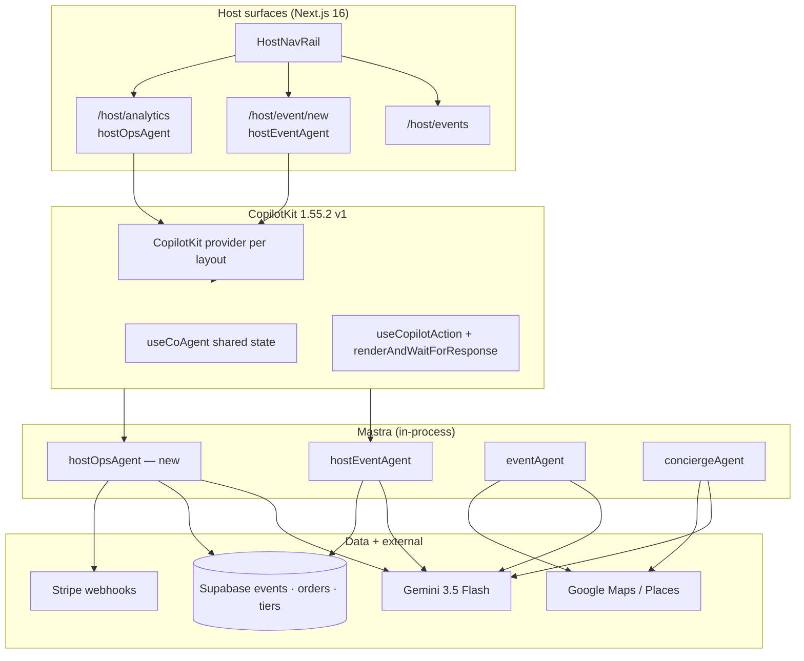

# CopilotKit + Mastra — Events AI Dashboard Plan

**Verdict:** Do **not** fork a new app from CopilotKit examples. **Extend mdeapp** using patterns from **Mastra PM Canvas** + **Project Manager** + **Generative UI** + **Banking Showcase**. Roberto already has `hostEventAgent` + HITL wizard at `/host/event/new`; the dashboard layer adds **list → analytics → chat-with-data** on the same CopilotKit v1 stack.

**Canonical rule:** CopilotKit **1.55.2 v1 only** (`useCoAgent`, `useCopilotAction`, `renderAndWaitForResponse`). No v2 / `copilotkit-develop` in Phase 1.

---

## 0. mdeapp today (disk-verified)

| Surface | Route | Agent | CopilotKit | Status |
|---------|-------|-------|------------|:---:|
| Concierge discovery | `/` | `conciergeAgent` | `useCoAgent` + generative cards | 🟢 LIVE |
| Host publish wizard | `/host/event/new` | `hostEventAgent` | `HostEventCopilotBridge`, HITL publish | 🟢 LIVE |
| Host event list | `/host/events` | — | Server page, no agent yet | 🟢 LIVE |
| Host analytics | `/host/analytics` | — | Nav disabled | ⚪ Spec PAGE-M02 |
| Event detail + checkout | `/events/[slug]` | — | Stripe modal | 🟢 LIVE |

**Gap:** No unified **AI dashboard shell** (sidebar chat + KPI panels + generative cards) for Roberto post-publish. That is what this plan covers.

---

## 1. Executive verdict — CopilotKit examples ranked

| Rank | Repo | URL | Best use for mdeai Events | Core / Adv | Score | Decision |
|---:|---|---|---|---:|---|
| 1 | **Mastra PM Canvas** | [examples/canvas/mastra-pm](https://github.com/CopilotKit/CopilotKit/tree/main/examples/canvas/mastra-pm) | Shared state + task board + Mastra agent | Core | 96 | **FOUNDATION** (patterns) |
| 2 | **mdeapp `/host/event/new`** | `mdeapp/src/components/host/` | HITL wizard, `EventDraftState`, `hostEventAgent` | Core | 95 | **FOUNDATION** (already built) |
| 3 | **Project Manager** | [copilotkit.ai/examples/project-manager](https://www.copilotkit.ai/examples/project-manager) | AI updates plan from chat | Core | 94 | **COPY PATTERNS** |
| 4 | **Generative UI** | [showcases/generative-ui](https://github.com/CopilotKit/CopilotKit/tree/main/examples/showcases/generative-ui) | Event cards, ticket forms, approval panels | Core | 93 | **COPY PATTERNS** |
| 5 | **Banking Showcase** | [showcases/banking](https://github.com/CopilotKit/CopilotKit/tree/main/examples/showcases/banking) | Publish/refund/payout HITL | Core | 91 | **COPY PATTERNS** |
| 6 | **Travel Planner** | [copilotkit.ai/examples/travel-planner](https://www.copilotkit.ai/examples/travel-planner) | Venue shortlist + map (reuse `mde-maps`) | Core | 90 | **REFERENCE ONLY** |
| 7 | **Chat With Your Data** | [copilotkit.ai/examples/chat-with-your-data](https://www.copilotkit.ai/examples/chat-with-your-data) | “Why are sales low?” over Supabase | Core | 89 | **COPY PATTERNS** (Phase 2) |
| 8 | **Multi-Page** | [showcases/multi-page](https://github.com/CopilotKit/CopilotKit/tree/main/examples/showcases/multi-page) | Copilot persists across host routes | Core | 79 | **COPY PATTERNS** |
| 9 | **Microsoft Kanban** | [showcases/microsoft-kanban](https://github.com/CopilotKit/CopilotKit/tree/main/examples/showcases/microsoft-kanban) | Production checklist board | Core | 78 | **REFERENCE ONLY** |
| 10 | **Strands CRM** | [showcases/strands-crm](https://github.com/CopilotKit/CopilotKit/tree/main/examples/showcases/strands-crm) | Sponsor/partner pipeline | Adv | 84 | **DEFER** |
| 11 | **Multi-Agent Canvas** | [showcases/multi-agent-canvas](https://github.com/CopilotKit/CopilotKit/tree/main/examples/showcases/multi-agent-canvas) | Host + ticket + venue agents | Adv | 85 | **DEFER** |
| 12 | **ADK Dashboard** | [showcases/adk-dashboard](https://github.com/CopilotKit/CopilotKit/tree/main/examples/showcases/adk-dashboard) | Google ADK sidecar UI | Adv | 87 | **DEFER** (Phase 2 ADK) |
| 13 | **Deep Agents / MCP Apps** | showcases | Long-running automation | Adv | 82 | **DEFER** |
| 14 | **Todo showcase** | [showcases/todo](https://github.com/CopilotKit/CopilotKit/tree/main/examples/showcases/todo) | Learning only | Ref | 70 | **AVOID** (too thin) |

> Standalone `CopilotKit/mastra-pm-canvas` repo is **archived** — use monorepo path only.

---

## 2. Best foundation choice

### Base = mdeapp host stack + PM Canvas patterns

| Layer | Keep from mdeapp | Borrow from Mastra PM Canvas |
|-------|------------------|------------------------------|
| Runtime | `POST /api/copilotkit` + `getLocalAgentsWithLogging` | Same — already Mastra-native |
| Agent wiring | `useCoAgent({ name: "hostEventAgent" })` | Shared canvas state shape for tasks/KPIs |
| HITL | `renderAndWaitForResponse` on publish | Approval cards for refunds, tier edits |
| UI shell | `HostNavRail` + `CopilotChat` column | Optional center **dashboard canvas** (KPIs + board) |
| State | `EventDraftState` (wizard) | New `HostDashboardState` (list + analytics + tasks) |

**Do not delete:** `/host/event/new` wizard — it is the create flow. Dashboard is **operate** flow.

**Adapt from PM Canvas:**
- Project tasks → **event ops tasks** (vendors, check-in, marketing)
- Project metadata → **selected event** + ticket KPIs
- Canvas columns → **Pre-launch · Live · Post-event** (not generic Kanban)

**Risks if wrong repo chosen:**
- Greenfield PM app → duplicates wizard, breaks SAN-366 publish path
- CopilotKit v2 example → version pin violation, POST storms
- ADK dashboard as base → splits orchestrator (Mastra stays primary per CLAUDE.md)

---

## 3. AI dashboard feature plan

| Feature | Traditional dashboard | AI-first improvement | Best repo pattern | MVP / Adv |
|---------|----------------------|----------------------|-------------------|-----------|
| Host home | Static event table | Chat: “Summarize my events this month” | Chat With Your Data | **MVP** |
| Event list | Filters + sort | AI highlights stale drafts, low sales | Project Manager | **MVP** |
| Analytics KPIs | Fixed charts | Ask: “Which tier underperformed?” | Chat With Your Data | **MVP** |
| Create event | Form | NL wizard (exists) | mdeapp host wizard | **MVP** ✅ |
| Ticket tiers | Admin form | AI suggests tiers from capacity | Generative UI | **MVP** (partial ✅) |
| Publish | Button | HITL approval panel | Banking Showcase | **MVP** ✅ |
| Venue shortlist | Manual search | Map + Places compare | Travel Planner + `mde-maps` | MVP |
| Vendor checklist | Spreadsheet | AI task board | Mastra PM Canvas | Adv |
| Sponsor outreach | CRM table | Draft email HITL | Strands CRM | Adv |
| Admin ops | Log grep | “Why did webhook fail?” | Chat With Your Data | Adv |
| Multi-agent | — | Host + ticketing + venue agents | Multi-Agent Canvas | Adv |

---

## 4. Event planner use case — Medellín Fashion Night

| Phase | Roberto says | Agent / UI | Output |
|-------|--------------|------------|--------|
| Create | “Fashion night, 150 guests, El Poblado, March 15” | `hostEventAgent` @ `/host/event/new` | Draft + ticket tiers |
| Approve | “Publish it” | HITL `preview_and_publish` | Live `/events/medellin-fashion-night` |
| Operate | “How are VIP sales vs GA?” | `hostOpsAgent` @ `/host/analytics` | KPI cards + chart |
| Plan ops | “Checklist: DJ, lighting, photographer, security” | Dashboard task board (PM Canvas pattern) | Kanban tasks in shared state |
| Venue | “Compare Provenza venues under $2k” | `venueAgent` + map column | Shortlist cards + pins |
| Sponsors | “Draft boutique sponsor email” | `sponsorAgent` (later) | HITL email draft |
| Door | “Staff QR check-in plan” | Static PAGE + AI summary | Checklist |
| Post-event | “Revenue report + no-shows” | `analyticsAgent` workflow | PDF-style summary in chat |

---

## 5. Architecture recommendation



### Agent split (avoid duplicate `eventPlannerAgent` on MVP)

| Agent | Scope | When to load |
|-------|-------|--------------|
| `hostEventAgent` | Create + publish draft | `/host/event/new` only |
| `hostOpsAgent` | List, KPIs, tasks, Q&A over organizer data | `/host/events`, `/host/analytics` |
| `eventAgent` | Public discovery search | `/`, `/chat` |
| `conciergeAgent` | Multi-vertical concierge | `/` |

`hostOpsAgent` **subsumes** the doc’s `eventPlannerAgent` for Phase 1 — one ops agent, not two planners.

---

## 6. Implementation plan

| Phase | Goal | Repos / patterns | Deliverables | Success test |
|------:|------|------------------|--------------|--------------|
| **0** | Unblock navigation | mdeapp | [SAN-730](https://linear.app/sanjiovani/issue/SAN-730) enable `/host/events` in `HostNavRail` | Roberto clicks Events link |
| **1** | Host layout shell | Multi-Page + mdeapp | Shared `HostCopilotProvider` wrapper for `/host/*` | Agent name matches Mastra key |
| **2** | Analytics dashboard | Chat With Your Data + PAGE-M02 | `/host/analytics` KPI row + event selector | Auth + organizer RLS |
| **3** | Ops copilot chat | Project Manager | `hostOpsAgent` + `useCoAgent` on analytics page | “Sales for Fashion Night?” returns tier breakdown |
| **4** | Generative KPI cards | Generative UI | `useCopilotAction` render ticket chart / tier table | Cards appear in chat column |
| **5** | HITL for sensitive ops | Banking Showcase | Refund / tier price change approval | No DB write without `respond()` |
| **6** | Task board (optional) | Mastra PM Canvas | `HostDashboardState.tasks[]` + simple 3-column board | AI adds “Book photographer” task |
| **7** | Chat-with-data tools | Mastra tools | `get_organizer_sales`, `list_host_events` server tools | Tool calls scoped by `organizer_id` |
| **8** | Venue compare | Travel Planner + mde-maps | Venue shortlist on dashboard | Places field mask + mapId |
| **9** | Multi-agent | Multi-Agent Canvas | Split `venueAgent` / `ticketingAgent` | **Post-MVP** |

**MVP boundary (Phases 0–5):** Nav + analytics page + ops chat + HITL — **no** full Kanban, **no** sponsor CRM, **no** ADK dashboard.

---

## 7. CopilotKit v1 implementation checklist (per surface)

### `/host/analytics` (new)

```text
layout.tsx     → <CopilotKit {...getCopilotKitClientProps("hostOpsAgent")}>
page.tsx       → Server: fetch KPIs by organizer_id
dashboard.tsx  → Client: KPI cards + chart + CopilotChat sidebar
bridge.tsx     → useCoAgent<HostDashboardState> + useCopilotReadable(selectedEvent)
tools (Mastra) → get_sales_summary, explain_webhook_failure (read-only first)
```

### Shared state schema (add to 3 places)

1. `HostDashboardState` Zod in `host-ops-agent.ts`
2. `src/lib/types/host-dashboard.ts`
3. `useCoAgent` generic in bridge

Fields (MVP): `selectedEventId`, `dateRange`, `kpis`, `tasks[]`, `insights[]`

---

## 8. Risks and blockers

| Risk | Severity | Why it matters | Fix |
|------|----------|----------------|-----|
| Wrong foundation (new repo) | 🔴 High | Duplicates wizard; delays SAN-115 | Extend mdeapp host routes only |
| CopilotKit v2 mix | 🔴 High | Prod breakage, hook mismatch | `copilotkitV1` skill; pin 1.55.2 |
| Second planner agent | 🟡 Med | Context split Roberto | `hostOpsAgent` only for dashboard |
| No RLS on ops tools | 🔴 High | Cross-organizer data leak | Verify JWT + `organizer_id` in every tool |
| AI hallucinated sales | 🟡 Med | Wrong business decisions | Tools return DB facts; LLM narrates only |
| Overbuilt Kanban | 🟡 Med | Scope creep before ledger | Phase 6 optional; ship KPIs first |
| No HITL on refunds | 🔴 High | Revenue loss | Banking pattern before refund tool |
| Agent name mismatch | 🔴 High | Silent 404 on copilotkit | `useCoAgent` name === `Mastra({ agents })` key |

---

## 9. Mapping to Linear / specs

| This plan phase | Linear | Spec |
|-----------------|--------|------|
| 0 | [SAN-730](https://linear.app/sanjiovani/issue/SAN-730) | Host nav |
| 2–3 | [SAN-729](https://linear.app/sanjiovani/issue/SAN-729) | [PAGE-M02](PAGE-M02-host-analytics.md) |
| 1 | — | New: `PAGE-M03-host-copilot-shell.md` (todo) |
| 5 | SAN-248 area | HITL refund spec |
| P0 gate | [SAN-115](https://linear.app/sanjiovani/issue/SAN-115) | EVP-001 proof ledger |

---

## 10. Final recommendation

| Decision | Answer |
|----------|--------|
| **Best foundation** | **mdeapp `hostEventAgent` stack** + **Mastra PM Canvas** state/board patterns |
| **Best pattern repos** | Project Manager, Generative UI, Banking Showcase, Chat With Your Data |
| **Best MVP scope** | Phases **0–5** (nav, analytics, ops chat, generative KPIs, HITL) |
| **Do not build yet** | Multi-agent canvas, ADK dashboard, sponsor CRM, WhatsApp automation, full Kanban |
| **Do not add** | Separate `eventPlannerAgent` — use `hostOpsAgent` |

### Exact next 5 tasks

| # | Task | Owner surface | Verify |
|---|------|---------------|--------|
| 1 | **SAN-730** — enable `/host/events` + `/host/analytics` nav links | `host-nav-rail.tsx` | Playwright: nav click → 200 |
| 2 | Scaffold **`hostOpsAgent`** in Mastra + register in `/api/copilotkit` | `src/mastra/agents/` | Mastra Studio shows agent |
| 3 | **`/host/analytics` page** — KPI server fetch + empty Copilot shell | PAGE-M02 | Auth 307 when logged out |
| 4 | **`HostOpsCopilotBridge`** — `useCoAgent` + read-only tools `list_host_events`, `get_sales_summary` | host components | Chat returns real tier counts |
| 5 | **Generative tier chart card** — one `useCopilotAction` render | Generative UI pattern | Prompt → card in chat |

---

## 11. Prompt crosswalk

| File | Role |
|------|------|
| [06-copilot-kit-events.md](06-copilot-kit-events.md) | Full audit prompt (20 repos) |
| [06a-copilotkit-events.md](06a-copilotkit-events.md) | Short ranking answer |
| [01-CopilotKit Event Dashboard Plan.md](01-CopilotKit%20Event%20Dashboard%20Plan.md) | First-pass research (merged here) |
| **This doc** | **Canonical implementation plan** for mdeapp |

---

## Related

- [`./02-mastra-events.md`](02-mastra-events.md) — Mastra agents, tools, workflows
- [`./02a-mastra-events.md`](02a-mastra-events.md) — executive Mastra stage roadmap
- [`../events-prd.md`](events-prd.md) · [`../events-roadmap.md`](events-roadmap.md)
- [`../index-events.md`](index-events.md) — progress tracker
- [`../event-pages.md`](event-pages.md) — route inventory
- [`../specs/DIAGRAMS.md`](DIAGRAMS.md) — host journey diagrams
- [`../../../mdeapp/docs/ARCHITECTURE.md`](../../../mdeapp/docs/ARCHITECTURE.md) — CopilotKit + Mastra wiring
- Skill: `copilotkitV1` · `copilotkit-integrations` · `mastra`
