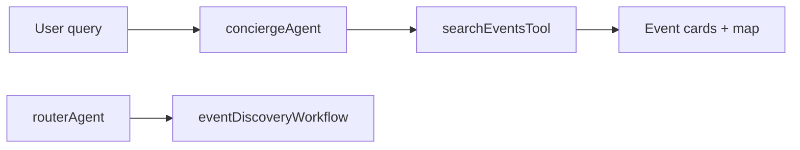
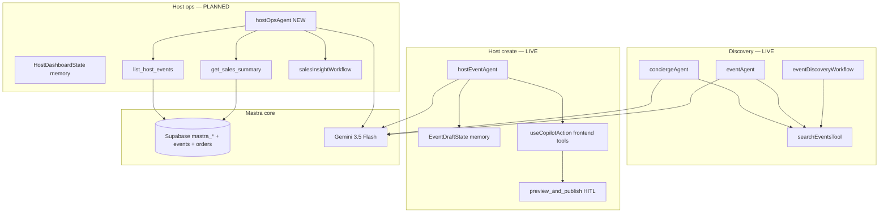

# Mastra Events — Operating System Plan

**Verdict:** mdeapp already runs a **minimal viable Mastra events stack** (`conciergeAgent`, `eventAgent`, `hostEventAgent`, `eventDiscoveryWorkflow`). Do **not** add 10+ agents or agent swarms. Extend with **`hostOpsAgent`** + **3 host workflows** + **read-only analytics tools** to close the loop to “Analyze Results.”

**Companion UI plan:** [01a-copilotkit-mastra-plan.md](01a-copilotkit-mastra-plan.md) (CopilotKit shell, HITL, dashboard).

---

## 0a. Mastra v1 verified (2026-06-08)

| Check | Result |
|-------|--------|
| `@mastra/core` | **1.35.0** — v1 line ([upgrade guide](https://mastra.ai/guides/migrations/upgrade-to-v1/overview)) |
| Subpath imports (`/agent`, `/tools`, `/mastra`) | 🟢 |
| `RequestContext` (not `RuntimeContext`) | 🟢 |
| `createTool(inputData, context)` | 🟢 |
| `npm run check:mastra` | 🟢 PASS |
| `@ag-ui/mastra` | 0.2.1-beta.2 — bridge still 0.x |
| `@mastra/observability` | Not installed — custom `tool-audit-context` instead |

**Plan new agents on v1 patterns** — no 0.x codemod needed.

---

## 0. North star loop

```text
Discover Event  →  Create Event  →  Publish Event  →  Sell Ticket  →  Attend Event  →  Analyze Results
     🟢 LIVE           🟢 LIVE          🟢 LIVE           🟢 LIVE         🟡 partial        🔴 gap
```

| Step | Persona | Mastra today | Surface |
|------|---------|--------------|---------|
| Discover | Camila / Andrés | `conciergeAgent` + `eventAgent` + `searchEventsTool` | `/` |
| Create | Roberto | `hostEventAgent` + `EventDraftState` | `/host/event/new` |
| Publish | Roberto | HITL `preview_and_publish` (CopilotKit frontend tool) | `/host/event/new` |
| Sell | Andrés | Stripe edges (not Mastra) | `/events/[slug]` |
| Attend | Andrés | Wallet / QR (not Mastra) | `/me/tickets` |
| Analyze | Roberto | **Missing agent + tools** | `/host/analytics` ⚪ |

**MVP success metric (from prompt 09):** Host creates → publishes → tickets sell → revenue tracked → event completes → report generated. **Steps 1–4 work; 5–6 need `hostOpsAgent`.**

---

## 1. Executive verdict — Mastra repos ranked

| Rank | Repository | URL | Event use | Core/Adv | Score | Decision |
|---:|---|---|---|---:|---|
| 1 | **mdeapp `src/mastra/`** | disk | Production orchestrator | Core | 99 | **FOUNDATION** (keep) |
| 2 | [Mastra Core](https://github.com/mastra-ai/mastra) | upstream | Agents, tools, workflows, memory | Core | 99 | **FOUNDATION** |
| 3 | [Personal Assistant Example](https://github.com/mastra-ai/personal-assistant-example) | template | Planner copilot + memory patterns | Core | 98 | **COPY PATTERNS** → `hostOpsAgent` |
| 4 | [Mastra Triage](https://github.com/mastra-ai/mastra-triage) | template | Intent routing | Core | 96 | **REFERENCE** — we have `routerAgent` + `conciergeAgent` |
| 5 | [AGUI Dojo](https://github.com/mastra-ai/mastra-agui-dojo) | template | Agent ↔ UI state | Core | 95 | **COPY PATTERNS** — CopilotKit already bridges AG-UI |
| 6 | [Template Text-to-SQL](https://github.com/mastra-ai/template-text-to-sql) | template | Sales Q&A over Postgres | Core | 94 | **COPY PATTERNS** → `hostOpsAgent` tools |
| 7 | [Template Browsing Agent](https://github.com/mastra-ai/template-browsing-agent) | template | Venue web research | Core | 96 | **REFERENCE** — prefer `mde-maps` Places for MVP |
| 8 | [Template Deep Search](https://github.com/mastra-ai/template-deep-search) | template | Sponsor/company research | Adv | 97 | **DEFER** Phase 2 |
| 9 | [Apify MCP Agent](https://github.com/apify/actor-mastra-mcp-agent) | integration | Venue scrape | Adv | 94 | **DEFER** |
| 10 | [Customer Feedback Summarization](https://github.com/mastra-ai/template-customer-feedback-summarization) | template | Post-event reviews | Adv | 93 | **DEFER** |
| 11 | [AI Buddies](https://github.com/mastra-ai/ai-buddies) | template | Multi-agent teams | Adv | 91 | **AVOID** MVP |
| 12 | [Social Agent Mastra](https://github.com/benrobertsonio/social-agent-mastra) | community | Marketing posts | Adv | 90 | **DEFER** |
| 13 | [AgentStack](https://github.com/ssdeanx/AgentStack) | community | Orchestration | Adv | 88 | **AVOID** MVP |
| 14 | WhatsApp chat bot guides | [mastra.ai/examples](https://mastra.ai/examples/v0/agents/whatsapp-chat-bot) | Phase 2 channel | Adv | 75 | **DEFER** (PRD defers WhatsApp) |

**Do not fork templates into a new app.** Port **patterns** into `mdeapp/src/mastra/`.

---

## 2. mdeapp Mastra inventory (disk-verified 2026-06-08)

### Registered agents (`src/mastra/index.ts`)

| Agent key | File | Tools (Mastra) | CopilotKit surface | Status |
|-----------|------|----------------|-------------------|:---:|
| `conciergeAgent` | `agents/concierge.ts` | `search-events`, `search-rentals`, `search-grounded-places`, … | `/` default | 🟢 |
| `eventAgent` | `agents/event-agent.ts` | `search-events` | Routed / specialist | 🟢 |
| `hostEventAgent` | `agents/host-event.ts` | **none** (frontend `useCopilotAction`) | `/host/event/new` | 🟢 |
| `routerAgent` | `agents/router.ts` | `classify-intent` | Internal / legacy path | 🟢 |
| `rentalAgent` | `agents/rental-agent.ts` | rentals | `/` rentals intent | 🟢 |
| `evaluationAgent` | `agents/evaluation.ts` | eval | Dev only | 🟡 |
| `pingAgent` | `agents/index.ts` | — | Smoke | 🟢 |

### Workflows

| Workflow | File | Purpose | Status |
|----------|------|---------|:---:|
| `eventDiscoveryWorkflow` | `workflows/event-discovery-workflow.ts` | Search → format cards | 🟢 |
| `conciergeRoutingWorkflow` | `workflows/concierge-routing-workflow.ts` | Multi-intent routing | 🟢 |
| `rentalSearchWorkflow` | `workflows/rental-search-workflow.ts` | Rentals | 🟢 |

### Event tools

| Tool | File | Used by |
|------|------|---------|
| `searchEventsTool` | `tools/search-events.ts` | `conciergeAgent`, `eventAgent` |
| `searchWebGroundedEventsTool` | `tools/search-web-grounded-events.ts` | `conciergeAgent` |

### Host wizard (CopilotKit, not Mastra tools)

| Frontend action | Bridge | HITL |
|-----------------|--------|:---:|
| `set_event_basics` | `host-event-copilot-bridge.tsx` | — |
| `set_venue` | same | — |
| `add_ticket_tier` | same | — |
| `preview_and_publish` | same | 🟢 |

---

## 3. Agent plan — map prompt 09 to mdeapp reality

### Build now (Phase 1 — CORE)

| Prompt name | mdeapp decision | Rationale |
|-------------|-----------------|-----------|
| `routerAgent` | **Keep** — do not expand | `conciergeAgent` owns UX; router for workflow dispatch only |
| `hostEventAgent` | **Keep** — extend tools later | Create/publish path shipped |
| `conciergeAgent` | **Keep** — already does discovery | Prompt lists as Phase 2 — **wrong for mdeapp**; already LIVE |
| `eventAgent` | **Keep** | Specialist + working memory |
| `venueAgent` | **Defer separate agent** | Use `search-grounded-places` on concierge; optional tool on `hostEventAgent` |
| `ticketingAgent` | **Merge into `hostOpsAgent`** | Tier setup stays wizard; sales ops → ops agent |
| `analyticsAgent` | **Implement as `hostOpsAgent`** | One ops agent, not two planners |
| `eventPlannerAgent` | **Do not add** | Duplicates `hostEventAgent` + `hostOpsAgent` |

### Proposed new agent: `hostOpsAgent`

| Field | Value |
|-------|-------|
| **Key** | `hostOpsAgent` (must match `useCoAgent` + Mastra registry) |
| **Surface** | `/host/events`, `/host/analytics` |
| **Model** | `gemini-3.5-flash` |
| **Memory** | `HostDashboardState` (Zod) — selectedEventId, kpis, dateRange |
| **Tools (MVP)** | `list_host_events`, `get_sales_summary`, `get_tier_breakdown` (all RLS-scoped) |
| **Pattern source** | Personal Assistant + Text-to-SQL templates |
| **Must not** | Write DB, refund, or publish without HITL |

### Build next (Phase 2 — MVP)

| Agent | When | Pattern repo |
|-------|------|--------------|
| `sponsorAgent` | After SAN-115 + ticket proof | Deep Search template |
| `crmAgent` | Partner pipeline LIVE | Personal Assistant |
| Venue compare tool on host | SAN-500 venue step | Browsing Agent (light) |

### Build later (Phase 3 — ADVANCED)

| Agent | Gate |
|-------|------|
| `marketingAgent` | Postiz + approval workflow |
| `partnerAgent` | Partners vertical shipped |
| `adminOpsAgent` | Patricia `/admin` surfaces |
| `automationAgent` | HITL-only drafts |

### Do NOT build (prompt 09 agreement)

```text
Multi-agent swarms · Autonomous outreach · Auto-publishing · Auto-spending
Agent-to-agent networks · 10+ agents in MVP · MultiAgentCoordinator
```

---

## 4. Workflow plan

### Existing (keep)



### Build now — host workflows

| Workflow | Steps | Mastra location | Output |
|----------|-------|-----------------|--------|
| **`createEventWorkflow`** | idea → basics → venue → tiers → review | **Already split:** wizard UI + `hostEventAgent` | Published event |
| **`ticketSetupWorkflow`** | capacity → tiers → Stripe validate | Partial in wizard; add **verify** step tool | Checkout-ready tiers |
| **`venueShortlistWorkflow`** | Places search → compare → score → top 5 | **New** `workflows/venue-shortlist-workflow.ts` | Venue list in state |
| **`salesInsightWorkflow`** | query orders → summarize → recommend | **New** `workflows/sales-insight-workflow.ts` | Narrated KPI report |

`createEventWorkflow` as a single Mastra workflow is **optional** — the wizard + HITL path is the shipped orchestration. Do not replace it; add workflow only for **repeatable server-side** steps (sales insight, venue shortlist).

### Build next (Phase 2)

| Workflow | Steps | Template |
|----------|-------|----------|
| `sponsorDiscoveryWorkflow` | research → score → shortlist | Deep Search |
| `eventFeedbackWorkflow` | collect → summarize → actions | Customer Feedback |
| `eventLaunchWorkflow` | verify checkout → wallet → QR smoke | Custom |

### Build later (Phase 3)

| Workflow | Steps |
|----------|-------|
| `marketingCampaignWorkflow` | content → HITL → schedule |
| `sponsorProposalWorkflow` | package → draft → HITL |
| `postEventReportWorkflow` | revenue → attendance → summary |
| `adminExceptionWorkflow` | failures → diagnose → fix plan |

---

## 5. Tool plan (Mastra `createTool`)

### Phase 1 — add under `src/mastra/tools/host/`

| Tool | Input | Output | Auth |
|------|-------|--------|------|
| `list_host_events` | `status?`, `limit?` | `{ id, title, slug, startsAt, salesCount }[]` | `organizer_id` from session |
| `get_sales_summary` | `eventId` | `{ revenue, orders, tiers[] }` | RLS |
| `get_tier_breakdown` | `eventId` | tier sold / capacity | RLS |
| `suggest_ticket_tiers` | `capacity`, `venueType?` | recommended tiers (no write) | — |

### Phase 1 — venue (optional, SAN-500)

| Tool | Reuse |
|------|-------|
| `search_venue_candidates` | Wrap Places via `mde-maps` patterns; field mask required |

### Phase 2

| Tool | Source |
|------|--------|
| `query_event_analytics` | Text-to-SQL template (read-only, parameterized) |
| `search_sponsor_candidates` | Deep Search pattern |

### Hard rules

- **No service-role in tools** unless route verifies user first (`createClient()`).
- Tools return **facts**; LLM narrates — no invented ticket counts.
- **Write tools** (publish, refund, tier edit) → HITL CopilotKit actions only in Phase 1.

---

## 6. Architecture



### Agent routing (host vs concierge)

| User intent | Route to | Not |
|-------------|----------|-----|
| “Salsa this weekend” | `conciergeAgent` | `hostEventAgent` |
| “Create fashion night March 15” | `hostEventAgent` | `conciergeAgent` |
| “How many VIP tickets sold?” | `hostOpsAgent` | `hostEventAgent` |
| “Find rooftop venue 200 cap” | `hostEventAgent` or concierge `search-grounded-places` | new `venueAgent` (MVP) |

---

## 7. Phased implementation

| Phase | Goal | Mastra deliverables | Repo patterns | Success test |
|------:|------|---------------------|---------------|--------------|
| **0** | Baseline | Document agent keys; smoke `mastra.agents.*` | mdeapp disk | `npm test -- host-event-agent` pass |
| **1a** | Ops agent scaffold | `hostOpsAgent` + register in `index.ts` + CopilotKit logging | Personal Assistant | Studio lists agent |
| **1b** | Read tools | `list_host_events`, `get_sales_summary` | Text-to-SQL | Tool returns real counts for Roberto |
| **1c** | Sales workflow | `salesInsightWorkflow` (3 steps) | Mastra Core workflows | “Revenue for Fashion Night?” grounded answer |
| **1d** | Venue workflow | `venueShortlistWorkflow` (optional SAN-500) | Browsing / mde-maps | Top 5 venues with scores |
| **1e** | Wizard tools (optional) | Move 1–2 actions to Mastra tools mirroring frontend | AGUI Dojo | Parity with `set_event_basics` |
| **2** | Sponsor + CRM | `sponsorAgent` + `sponsorDiscoveryWorkflow` | Deep Search | Shortlist only, no auto-send |
| **2** | Analytics SQL | `query_event_analytics` read-only | Text-to-SQL | Admin-safe queries |
| **3** | Marketing + admin | `marketingAgent`, `adminOpsAgent` | Social Agent | HITL on all writes |

**Align with CopilotKit plan:** Phase 1a–1c matches [01a-copilotkit-mastra-plan.md §6](01a-copilotkit-mastra-plan.md#6-implementation-plan) phases 2–4.

---

## 8. Real-world example — Medellín Fashion Night

| Step | User | Mastra component | Status |
|------|------|------------------|:---:|
| 1 | “Create event for 250 guests in Poblado” | `hostEventAgent` → draft state | 🟢 |
| 2 | “Suggest venues” | `venueShortlistWorkflow` or Places tool | 🔴 |
| 3 | “VIP $80, GA $25” | wizard `add_ticket_tier` | 🟢 |
| 4 | “Publish” | HITL `preview_and_publish` | 🟢 |
| 5 | Camila: “fashion events this week” | `conciergeAgent` → `searchEventsTool` | 🟢 |
| 6 | Andrés buys ticket | Stripe (outside Mastra) | 🟢 |
| 7 | “How are sales vs last week?” | `hostOpsAgent` → `salesInsightWorkflow` | 🔴 |
| 8 | “Post-event report” | `postEventReportWorkflow` | ⚪ Phase 3 |

---

## 9. Risks and blockers

| Risk | Severity | Fix |
|------|----------|-----|
| Duplicate planner agents (`eventPlanner` + `hostEvent` + `hostOps`) | 🔴 | One create agent, one ops agent |
| `hostEventAgent` tools `{}` — all logic in frontend | 🟡 | OK for MVP; add Mastra tools when reusing outside wizard |
| Agent name mismatch (`hostEventAgent` vs `host-event-agent`) | 🔴 | CopilotKit `name` === Mastra registry **key** |
| Text-to-SQL without RLS | 🔴 | Parameterize `organizer_id`; no raw SQL from LLM |
| Fork Personal Assistant repo | 🔴 | Port patterns only |
| WhatsApp agent early | 🟡 | Phase 2 per PRD |
| AI Buddies multi-agent | 🟡 | Defer until single-agent ops proven |

---

## 10. Linear / spec mapping

| Mastra work | Linear | Spec / file |
|-------------|--------|-------------|
| `hostOpsAgent` + tools | [SAN-729](https://linear.app/sanjiovani/issue/SAN-729) | [PAGE-M02](PAGE-M02-host-analytics.md) |
| Host nav + analytics shell | [SAN-730](https://linear.app/sanjiovani/issue/SAN-730) | Copilot plan §6 phase 0 |
| Venue step | [SAN-500](https://linear.app/sanjiovani/issue/SAN-500) | Host wizard |
| Launch proof | [SAN-115](https://linear.app/sanjiovani/issue/SAN-115) | EVP-001 ledger |
| Luma / discovery agents | SAN-119+ | Post-MVP workflows |

---

## 11. Final recommendation

| Decision | Answer |
|----------|--------|
| **Foundation** | **mdeapp `src/mastra/`** — do not greenfield |
| **Best template repos** | Personal Assistant, Text-to-SQL, AGUI Dojo, Mastra Triage (reference) |
| **Build now** | `hostOpsAgent` + 3 read tools + `salesInsightWorkflow` |
| **Keep as-is** | `conciergeAgent`, `eventAgent`, `hostEventAgent`, `eventDiscoveryWorkflow` |
| **Do not build yet** | `sponsorAgent`, `crmAgent`, `marketingAgent`, multi-agent, WhatsApp bot |
| **Rename avoidance** | No `EventPlannerAgent` — use existing names |

### Exact next 5 Mastra tasks

| # | Task | File(s) | Verify |
|---|------|---------|--------|
| 1 | Add `HostDashboardState` Zod + types | `lib/types/host-dashboard.ts`, agent file | typecheck |
| 2 | Create `hostOpsAgent` with instructions + memory | `agents/host-ops.ts`, `index.ts` | `mastra.agents.hostOpsAgent` in smoke test |
| 3 | Implement `list_host_events` + `get_sales_summary` tools | `tools/host/*.ts` | Vitest with mocked Supabase |
| 4 | Register agent in `logging-mastra-agent.ts` allowlist | `copilotkit/logging-mastra-agent.ts` | POST `/api/copilotkit` 200 |
| 5 | Scaffold `salesInsightWorkflow` (fetch → summarize → recommend) | `workflows/sales-insight-workflow.ts` | workflow unit test |

---

## 12. Prompt crosswalk

| File | Role |
|------|------|
| [09-mastra-plan-prompt.md](09-mastra-plan-prompt.md) | Phase 1/2/3 roadmap draft |
| [07-mastra-repos.md.md](07-mastra-repos.md.md) | Top 20 Mastra repos ranked |
| [01a-copilotkit-mastra-plan.md](01a-copilotkit-mastra-plan.md) | CopilotKit UI + `hostOpsAgent` shell |
| [02a-mastra-events.md](02a-mastra-events.md) | Executive stage roadmap |
| [01-CopilotKit Event Dashboard Plan.md](01-CopilotKit%20Event%20Dashboard%20Plan.md) | Original repo ranking (research) |
| **This doc** | **Canonical Mastra agent/workflow/tool plan** |

---

## Related

- [`../index-events.md`](index-events.md) — AI readiness 95% (agents LIVE; ops gap)
- [`../../../mdeapp/docs/ARCHITECTURE.md`](../../../mdeapp/docs/ARCHITECTURE.md)
- Skill: `mastra` · `mastra-smoke-test` · `copilotkit-integrations`
