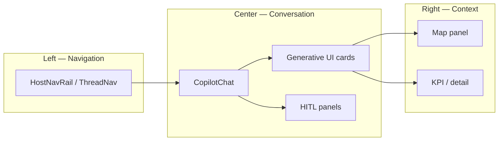
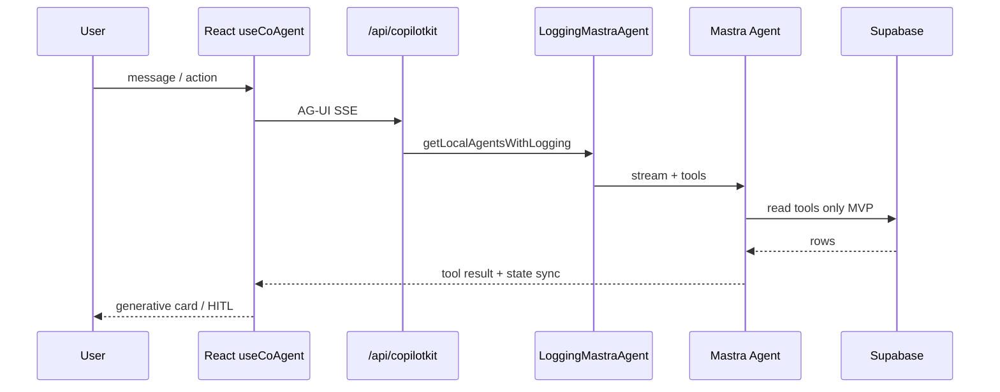
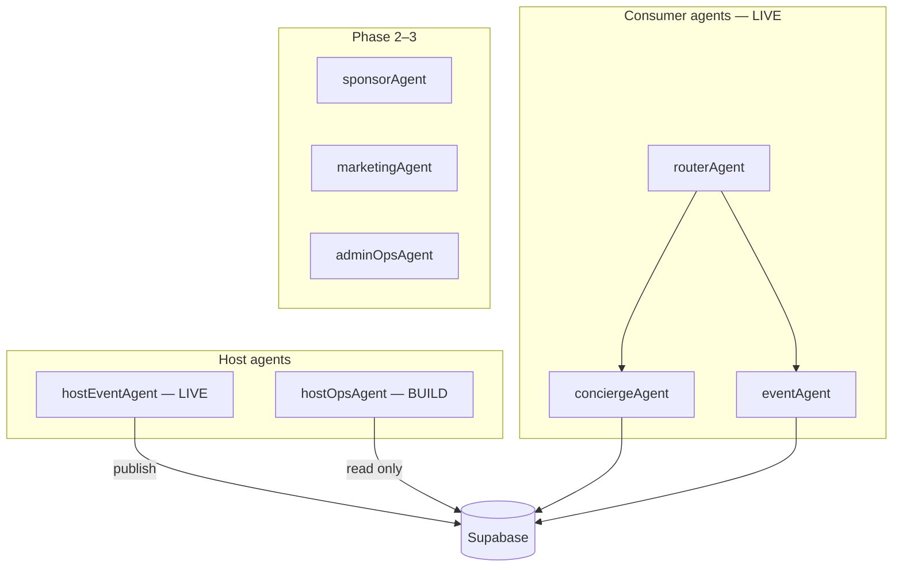
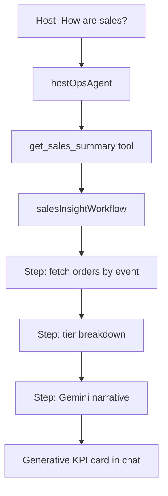
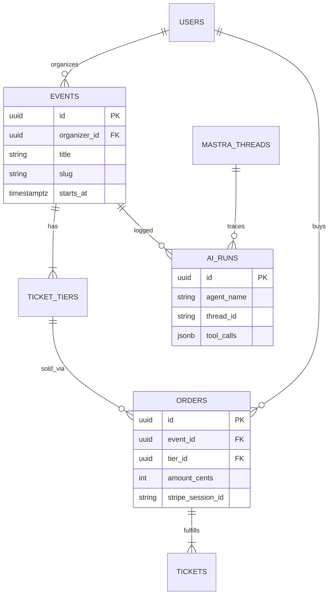
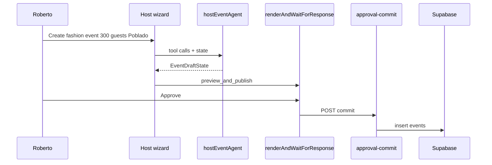
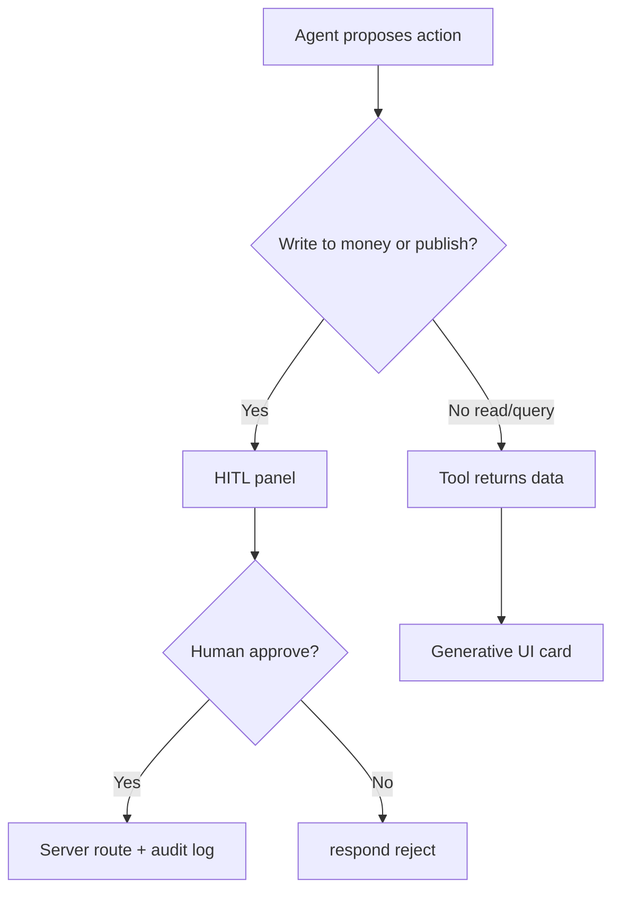

# AI-Native Events OS — CopilotKit + Mastra (V1)

> **Superseded by V2:** [`04-AI-native-system.md`](./04-AI-native-system.md) — audit-refined canonical plan.

**Verdict:** mdeai should feel like **chat-first event operations** on top of a **boring deterministic core** — not a 12-agent dashboard replacement. **Extend mdeapp** with CopilotKit **Pattern 1** (in-process `/api/copilotkit`) + Mastra agents/workflows. Prompt 11’s vision is right; its **agent count and `eventPlannerAgent` naming are wrong** for Phase 1.

**North star:** Discover → Create → Publish → Sell → Attend → **Analyze** (Analyze is the gap).

---

## 0. How this doc relates to sibling plans

| Doc | Owns |
|-----|------|
| **This file (`03`)** | Unified AI architecture, UX panels, agent/workflow caps, data flows, roadmap |
| [`01a-copilotkit-mastra-plan.md`](./01a-copilotkit-mastra-plan.md) | CopilotKit UI shell, hooks, HITL, dashboard phases 0–9 |
| [`02-mastra-events.md`](./02-mastra-events.md) | Agent registry, tools, workflows, Mastra repo patterns |
| [`02a-mastra-events.md`](./02a-mastra-events.md) | Executive stage roadmap (Core / MVP / Advanced) |
| [`../prompts/11-AI-event-copilotkit-mastra.md`](../prompts/11-AI-event-copilotkit-mastra.md) | Full generative prompt (19 sections) — use to extend this plan |

---

## 1. Executive summary

### Why AI-native beats traditional dashboards (for Roberto)

| Area | Traditional (Eventbrite / Luma) | mdeai AI-native |
|------|--------------------------------|-----------------|
| Create event | Multi-page forms | Natural language wizard + HITL publish 🟢 LIVE |
| Discovery | Browse + filters | Concierge chat + cards + map pins 🟢 LIVE |
| Sales questions | Insights tab, exports | **`hostOpsAgent`** chat over Supabase facts 🔴 next |
| Refunds / tier edits | Admin forms | HITL approval cards (Banking pattern) ⚪ |
| Marketing | Blast composer | AI drafts + human send (Phase 3) ⚪ |

### Why CopilotKit + Mastra (not ADK / LangGraph / swarm)

| Layer | Choice | Rule |
|-------|--------|------|
| UI + streaming | CopilotKit **1.55.2 v1** | `useCoAgent`, `useCopilotAction`, `renderAndWaitForResponse` |
| Orchestration | Mastra **in-process** | `MastraAgent.getLocalAgents({ mastra })` in `/api/copilotkit` |
| Bridge | `@ag-ui/mastra` | Agent key === CopilotKit `agent` prop |
| Truth | Supabase + Stripe | AI narrates; never owns money or inventory |
| Model | Gemini only | `gemini-3.5-flash` default |

**Skills:** `copilotkitV1` · `mastra.md` (integrations) · `mastra` — verify APIs on disk, not training data.

### Competitive edge vs Luma / Eventbrite

Luma wins social proof on the event page; mdeai wins **conversational discovery + host ops Q&A + Medellín map context** without forking the stack.

---

## 2. Vision — constrained for production

Prompt 11 asks for *ChatGPT + Eventbrite + Linear + Notion + Maps*. **Phase 1 delivery:**

```text
/ + /chat     → concierge discovery (LIVE)
/host/event/new → create + HITL publish (LIVE)
/host/events  → list (LIVE)
/host/analytics → KPI + hostOpsAgent (BUILD NOW)
/events/[slug] → commerce + Luma emotional layer (EVP-032)
```

**Replace gradually:** forms/menus/tables **on host surfaces** — not consumer checkout or Stripe.

---

## 3. Core vs MVP vs Advanced

| Phase | Goal | Max agents | Max workflows | Users |
|-------|------|------------|---------------|-------|
| **Core** | Create → publish → sell → **track revenue in chat** | **5** | **3** | Roberto, Camila, Andrés |
| **MVP** | CRM-lite, sponsors, venue intel, Luma detail | **8** | **6** | + Patricia |
| **Advanced** | Marketing automation, WhatsApp, MCP ops | **12** | **10** | + ops automation |

### Core (ship now)

| Capability | Agent / workflow | Status |
|------------|------------------|--------|
| Event creation | `hostEventAgent` + wizard tools | 🟢 |
| Publish approval | HITL `preview_and_publish` | 🟢 |
| Discovery | `conciergeAgent`, `eventAgent`, `searchEventsTool` | 🟢 |
| Ticketing | Stripe (outside Mastra) | 🟢 |
| Revenue Q&A | **`hostOpsAgent`** + `salesInsightWorkflow` | 🔴 |
| Venue shortlist | `venueShortlistWorkflow` (optional) | ⚪ SAN-500 |

### MVP (after SAN-115 + hostOps)

Sponsor research, NL analytics tools, Luma sections (vibe, Ask Host), guest export — see [`02-mastra-events.md` §7](./02-mastra-events.md).

### Advanced (gated)

`marketingAgent`, `adminOpsAgent`, WhatsApp, Postiz, multi-agent canvas — **no** until Core loop proven.

---

## 4. Three-panel UX architecture

### Desktop (mdeai target)

```text
┌────────────┬──────────────────────────────┬─────────────────┐
│ LEFT       │ CENTER                       │ RIGHT           │
│ Nav rail   │ CopilotChat                  │ Context panel   │
│ · Chats    │ · User messages              │ · Map + pins    │
│ · Host     │ · Generative UI cards        │ · Event detail  │
│ · Trips    │ · Workflow progress          │ · KPI charts    │
│ · Saved    │ · Quick prompts              │ · HITL approval │
└────────────┴──────────────────────────────┴─────────────────┘
```

| Surface | Left | Center | Right |
|---------|------|--------|-------|
| `/` | Thread nav | Concierge + event cards | Map |
| `/host/event/new` | Host nav | Wizard + `hostEventAgent` | Preview / map pin |
| `/host/analytics` | Host nav | `hostOpsAgent` chat | KPI + tier chart |

### Responsive

| Breakpoint | Behavior |
|------------|----------|
| Mobile | Single column; sticky CTA; chat sheet or bottom tab |
| Tablet | Collapsed nav; map below chat |
| Desktop ≥1360px | Full 3-panel (SCREEN testing standard) |



---

## 5. CopilotKit + Mastra runtime (Pattern 1)



### v1 invariants (from `copilotkitV1`)

| Rule | Violation symptom |
|------|-------------------|
| `agent` prop === Mastra registry **key** | 404 / silent no agent |
| Stable CopilotKit props (no inline `{}`) | POST storm |
| Tool `name` === Mastra `createTool` id | Card never renders |
| `available: "disabled"` + `render` for backend tools | Double execution |
| HITL: `renderAndWaitForResponse` + `/api/approval-commit` | Publish without audit |

Full wiring: [`mastra.md`](../../../.claude/skills/copilotkit-integrations/references/integrations/mastra.md) · [`pattern-1-route.md`](../../../.claude/skills/copilotkitV1/references/runtime/pattern-1-route.md).

---

## 6. Agent architecture (corrected from prompt 11)

### Do not add

| Prompt 11 name | Use instead |
|----------------|-------------|
| `eventPlannerAgent` | `hostEventAgent` + `hostOpsAgent` |
| `analyticsAgent` | `hostOpsAgent` |
| `ticketingAgent` | Wizard + Stripe routes |
| `automationAgent` | Phase 3 workflows only |

### Agent registry

| Agent | Purpose | Route / trigger | Memory schema | Tools (MVP) | Status |
|-------|---------|-----------------|---------------|-------------|--------|
| `routerAgent` | Intent routing | internal | — | classify | 🟢 |
| `conciergeAgent` | Multi-vertical discovery | `/`, `/chat` | `MdeState` | `search_events`, rentals, places | 🟢 |
| `eventAgent` | Event specialist | via router | — | `search_events` | 🟢 |
| `hostEventAgent` | Create + publish draft | `/host/event/new` | `EventDraftState` | frontend tools `{}` | 🟢 |
| **`hostOpsAgent`** | Sales Q&A, KPIs, tasks | `/host/events`, `/host/analytics` | **`HostDashboardState`** | `list_host_events`, `get_sales_summary` | 🔴 |
| `sponsorAgent` | Sponsor research | Phase 2 | — | deep search | ⚪ |
| `crmAgent` | Guest pipeline | Phase 2 | — | read CRM | ⚪ |
| `marketingAgent` | Campaign drafts | Phase 3 | — | Postiz handoff | ⚪ |
| `adminOpsAgent` | Patricia queues | `/admin` | — | exception tools | ⚪ |



### `HostDashboardState` (new — 3-place sync)

Fields: `selectedEventId`, `dateRange`, `kpis`, `tasks[]`, `insights[]`

1. Zod in `host-ops-agent.ts`  
2. `src/lib/types/host-dashboard.ts`  
3. `useCoAgent<HostDashboardState>` in `HostOpsCopilotBridge`

---

## 7. Workflow architecture

| Workflow | Steps | Phase | Owner |
|----------|-------|-------|-------|
| `eventDiscoveryWorkflow` | search → rank → cards | Core | 🟢 LIVE |
| `ticketSetupWorkflow` | tiers → stripe verify | Core | 🟡 wizard |
| **`salesInsightWorkflow`** | fetch sales → summarize → recommend | Core | 🔴 |
| `venueShortlistWorkflow` | Places → score → top 5 | Core opt | ⚪ |
| `sponsorDiscoveryWorkflow` | research → shortlist | MVP | ⚪ |
| `marketingCampaignWorkflow` | draft → HITL → send | Advanced | ⚪ |
| `postEventReportWorkflow` | aggregate → narrative | Advanced | ⚪ |
| `adminExceptionWorkflow` | failed payment → queue | MVP | ⚪ |



**Mastra rule:** workflows for deterministic steps; agents for reasoning — not agent-to-agent chains in MVP.

---

## 8. Data model (events AI touchpoints)



**AI tables:** `mastra_threads`, `ai_runs` (F13) — service role in `/api/copilotkit` only after user JWT verified.

**AI must not write:** `orders`, `ticket_inventory`, `stripe_*` without HITL + server route.

---

## 9. Data flows

### Event creation (LIVE)



### Ticket purchase (LIVE)

User → `/events/[slug]` → checkout modal → Stripe → webhook → `/me/tickets` QR.

### Conversational analytics (BUILD)

| Question | Agent | Data source | UI |
|----------|-------|-------------|-----|
| Tickets sold today? | `hostOpsAgent` | `orders` + `tickets` | KPI card |
| Revenue vs last event? | `hostOpsAgent` | `salesInsightWorkflow` | chart card |
| Which tier sold most? | `hostOpsAgent` | `get_sales_summary` | table card |
| Refund this order? | `hostOpsAgent` | HITL only | Banking panel |

---

## 10. User journeys

See also [`../design/luma/03-diagrams.md`](../design/luma/03-diagrams.md).

| Persona | Journey | Primary agents |
|---------|---------|----------------|
| **Camila** | Chat discover → detail → buy | `conciergeAgent` |
| **Andrés** | Browse → Stripe → QR | — (deterministic) |
| **Roberto** | Wizard → publish → list → **analyze** | `hostEventAgent`, **`hostOpsAgent`** |
| **Patricia** | Exception queue → approve | `adminOpsAgent` (future) |

---

## 11. Chat toolbar (MVP subset)

Prompt 11 lists 50 actions — **Phase 1 host toolbar** (analytics surface):

| Icon | Action | Agent | Result |
|------|--------|-------|--------|
| 📊 | Sales summary | `hostOpsAgent` | Tier breakdown card |
| 📅 | List my events | `hostOpsAgent` | Event picker |
| 🎟 | Tier performance | `hostOpsAgent` | Chart |
| 📍 | Venue on map | `hostOpsAgent` + Places | Map pin |
| ✉️ | Draft blast | `marketingAgent` | Phase 3 |
| ⚙️ | Event settings | navigation | Route only |

Full 50-action matrix: expand in Phase 2 using prompt 11 §6.

---

## 12. Auto-population / context

| Context source | Auto-filled fields | Example |
|----------------|-------------------|---------|
| User profile | organizer_id, name | Host KPI scope |
| Last hosted event | `selectedEventId` | Default analytics target |
| Working memory | `dateRange`, `tasks[]` | Thread-persisted dashboard |
| `useCopilotReadable` | selected event JSON | Copilot sees KPI row |
| Supabase tool output | tier counts, revenue | LLM narrates facts only |

---

## 13. MCP strategy (phased)

| MCP | Use case | Core | MVP | Advanced |
|-----|----------|------|-----|----------|
| Supabase | Tool data | ✅ | ✅ | ✅ |
| Google Maps | Venues, nearby | ✅ | ✅ | ✅ |
| Gemini docs | Model verify | ✅ | ✅ | ✅ |
| Linear | Task sync | ops | ✅ | ✅ |
| Stripe | Read-only totals | ✅ | ✅ | ✅ |
| WhatsApp | Reminders | — | — | HITL |
| Postiz | Social drafts | — | — | HITL |
| Apify / Browser | Scrape discovery | — | queue | OpenClaw |

---

## 14. Screens (AI surfaces)

| Screen | Route | Agent | Phase | Wireframe |
|--------|-------|-------|-------|-----------|
| Concierge | `/` | `conciergeAgent` | Core 🟢 | — |
| Host wizard | `/host/event/new` | `hostEventAgent` | Core 🟢 | host wizard |
| Host list | `/host/events` | — → `hostOpsAgent` | Core 🟢 | [luma 06](../design/luma/screens/06-host-overview.md) |
| Host analytics | `/host/analytics` | `hostOpsAgent` | Core 🔴 | [luma 10](../design/luma/screens/10-host-insights.md) |
| Event detail | `/events/[slug]` | — | MVP | [luma 03](../design/luma/screens/03-event-detail.md) |
| Sponsor desk | `/host/sponsors` | `sponsorAgent` | MVP | — |
| Admin queue | `/admin/events` | `adminOpsAgent` | MVP | — |

---

## 15. Competitive scores (honest)

| Platform | UX | AI | Ops automation | Discovery | Score |
|----------|---:|---:|---------------:|----------:|------:|
| Luma | 92 | 35 | 50 | 85 | 78 |
| Eventbrite | 75 | 25 | 70 | 70 | 65 |
| **mdeai today** | 68 | **90** | 40 | 88 | **72** |
| **mdeai + hostOps + Luma detail** | 85 | 92 | 65 | 90 | **88** |

---

## 16. Implementation roadmap

### Phase 1 — Core AI loop (weeks 1–3)

| # | Task | Files | Verify |
|---|------|-------|--------|
| 1 | SAN-730 enable host nav | `host-nav-rail.tsx` | Playwright nav 200 |
| 2 | `hostOpsAgent` + `HostDashboardState` | `agents/host-ops.ts`, `index.ts` | `mastra.agents.hostOpsAgent` |
| 3 | Read tools | `tools/host/list-host-events.ts`, `get-sales-summary.ts` | Vitest + RLS |
| 4 | Register in logging allowlist | `logging-mastra-agent.ts` | POST `/api/copilotkit` 200 |
| 5 | `/host/analytics` page | `app/host/analytics/` | PAGE-M02 auth |
| 6 | `HostOpsCopilotBridge` | `components/host/` | Chat returns tier counts |
| 7 | Generative tier card | `useCopilotAction` disabled render | Prompt → card |
| 8 | `salesInsightWorkflow` | `workflows/sales-insight-workflow.ts` | workflow test |
| 9 | SAN-115 proof ledger | evidence md | EVP-001 green |

### Phase 2 — MVP intelligence (weeks 4–8)

EVP-032 Luma detail · EVP-033–035 social layer · `sponsorAgent` scaffold · guest export · `venueShortlistWorkflow`.

### Phase 3 — Advanced (post-launch)

Marketing drafts · admin ops · WhatsApp opt-in · MCP automation sandbox.

---

## 17. AI safety & approval gates



| Action | Gate |
|--------|------|
| Publish event | HITL 🟢 |
| Refund / price change | HITL required |
| Email/WhatsApp blast | HITL + template |
| Public Q&A answer | Host approve |
| Discovery ingest | Patricia queue |

---

## 18. Risks

| Risk | Severity | Mitigation |
|------|----------|------------|
| CopilotKit v2 drift | 🔴 | `copilotkitV1` skill only |
| Agent sprawl from prompt 11 | 🔴 | Cap 5 Core; no `eventPlannerAgent` |
| Cross-organizer tool leak | 🔴 | JWT + `organizer_id` on every tool |
| Hallucinated revenue | 🟡 | Tools return numbers; LLM explains |
| POST storm | 🟡 | Stable props; LESSONS §1 |
| Kanban before ledger | 🟡 | Phase 6 optional in 01a |

---

## 19. Final recommendation

| Decision | Answer |
|----------|--------|
| **Best MVP scope** | Phases 0–5 from [`01a`](./01a-copilotkit-mastra-plan.md) + `salesInsightWorkflow` |
| **Best UI architecture** | 3-panel; host analytics = chat + KPI column |
| **Best agent architecture** | 4 LIVE + 1 new (`hostOpsAgent`); no planner duplicate |
| **Best workflow architecture** | 3 Core workflows max before sponsor |
| **Best foundation** | mdeapp Pattern 1 — never greenfield CopilotKit example |
| **Biggest opportunity** | Conversational analytics Roberto can't get on Luma |
| **Biggest risk** | Shipping 12 agents before SAN-115 ledger |

### Next 10 implementation tasks (ordered)

1. SAN-730 — host nav links  
2. `HostDashboardState` types (3 places)  
3. `hostOpsAgent` scaffold  
4. `list_host_events` tool + tests  
5. `get_sales_summary` tool + tests  
6. `logging-mastra-agent` allowlist  
7. `/host/analytics` server page + layout with `CopilotKit agent="hostOpsAgent"`  
8. `HostOpsCopilotBridge`  
9. One generative KPI `useCopilotAction`  
10. `salesInsightWorkflow` + Vitest  

Tasks 11–50: EVP-032–037, sponsor CRM, admin queue — see [`../events-roadmap.md`](../events-roadmap.md).

---

## 20. Prompt 11 crosswalk

| Prompt § | Covered in |
|----------|------------|
| §1 Executive | §1 |
| §2 Vision | §2–3 |
| §3 Core/MVP/Advanced | §3 |
| §4 Three panel | §4 |
| §5 Chat | §6, §12 |
| §6 Toolbar 50 | §11 (MVP subset) |
| §7 Auto population | §12 |
| §8 Agents | §6 (corrected) |
| §9 Workflows | §7 |
| §10 Data model | §8 |
| §11 Data flow | §9 |
| §12 Journeys | §10 |
| §13 MCP | §13 |
| §14 Analytics | §9 table |
| §15 Screens | §14 |
| §16 Competitive | §15 |
| §17 Roadmap | §16 |
| §18 Opportunities | §3 Advanced |
| §19 Final + 50 tasks | §19 |

---

## Related

- [`../events-prd.md`](../events-prd.md) · [`../events-roadmap.md`](../events-roadmap.md)
- [`../../../mdeapp/docs/ARCHITECTURE.md`](../../../mdeapp/docs/ARCHITECTURE.md)
- [`../../../LESSONS.md`](../../../LESSONS.md) § CopilotKit / Mastra
- Skills: `.claude/skills/copilotkitV1` · `copilotkit-integrations/.../mastra.md` · `mastra`
