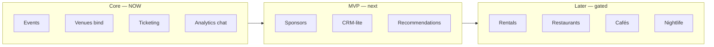
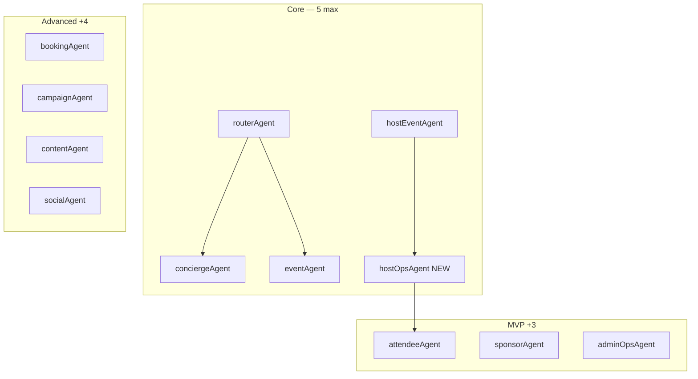
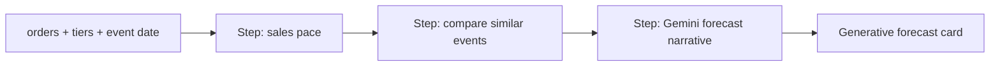
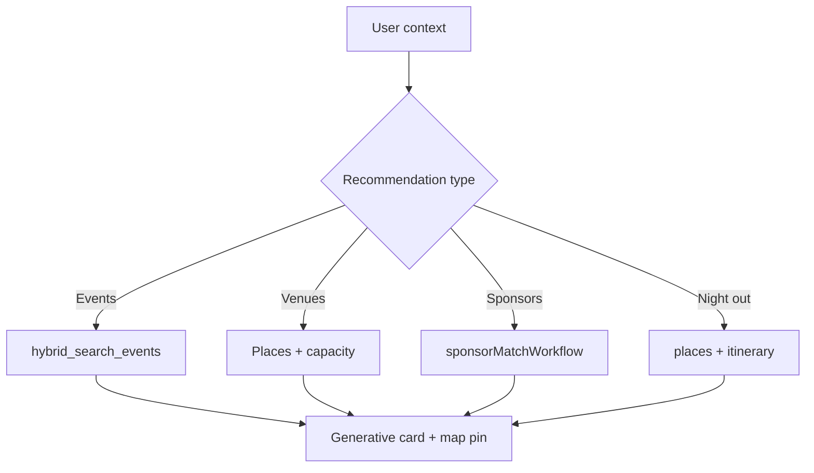
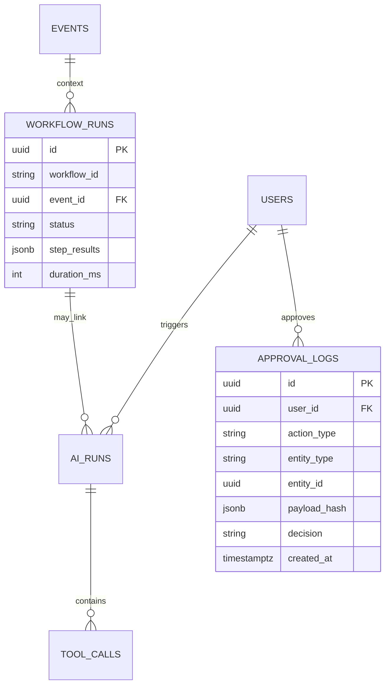
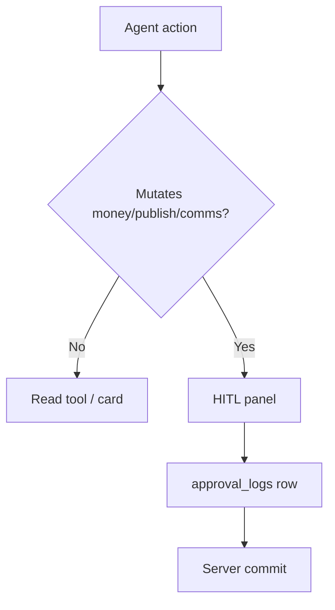

# AI-Native Events OS — V2

**Overall verdict:** 🟢 **Strong architecture — proceed with `hostOpsAgent` + `salesInsightWorkflow` first.** Do **not** add agents until analytics chat works on prod.

**V1 baseline:** [`03-copilotkit-mastraAI.md`](./03-copilotkit-mastraAI.md)  
**This doc (V2)** adds audit gaps: observability tables, `attendeeAgent`, recommendation engine, revenue forecast, sponsor matching, CRM scoring, expanded MCP, missing screens, scope firewall.

**North star:** Discover → Create → Publish → Sell → Attend → **Analyze** → **Forecast** (Analyze = P0; Forecast = MVP+).

---

## 0. Executive scorecard (post-audit)

| Area | Score | Status | V2 action |
|------|------:|--------|-----------|
| Product vision | 98/100 | 🟢 | Keep chat-first thesis |
| CopilotKit architecture | 96/100 | 🟢 | Pattern 1 locked |
| Mastra architecture | 95/100 | 🟢 | v1 verified |
| UX architecture | 94/100 | 🟢 | 3-panel + toolbar expansion |
| Agent design | 92/100 | 🟢 | +`attendeeAgent` designed, not Core |
| Workflow design | 94/100 | 🟢 | +`revenueForecastWorkflow` |
| MVP scope control | 99/100 | 🟢 | Vertical firewall §2 |
| Data architecture | 90→**94** | 🟡→🟢 | Observability schema §8 |
| Analytics strategy | 93/100 | 🟢 | Forecast layer §7 |
| CRM & sponsors | 85→**90** | 🟡 | Matching + lead score §10–11 |
| Marketing system | 78/100 | ⚪ | Split agents Advanced §12 |
| MCP strategy | 88→**92** | 🟡 | Expanded §13 |
| Security & permissions | 90/100 | 🟡 | RLS + approval_logs |
| AI safety | 94/100 | 🟢 | HITL gates unchanged |
| Production readiness | 89/100 | 🟡 | SAN-704 ai_runs prod fix |

| Grade | Result |
|-------|--------|
| Architecture | **A** |
| Product design | **A+** |
| MVP definition | **A+** |
| Final | **93/100** |

**Completion:** 🟢 80% · 🟡 15% design refinement · ⚪ 5% future · 🔴 0% blockers

---

## 1. What V2 fixes (audit delta)

| Audit gap | V2 section | Phase |
|-----------|------------|-------|
| Missing `attendeeAgent` | §6 | MVP (after hostOps) |
| Missing `bookingAgent` | §6 | Advanced |
| Missing `revenueForecastWorkflow` | §7 | MVP |
| Recommendation engine not explicit | §9 | MVP design |
| ERD too small | §8 | Core schema design |
| AI observability thin | §8 | Core (fix SAN-704) |
| Sponsor matching | §10 | MVP |
| CRM lead scoring | §11 | MVP |
| Marketing too broad | §12 | Advanced split |
| Missing screens | §14 | MVP roadmap |
| MCP gaps | §13 | Phased |
| Multi-vertical scope creep | §2 | **Firewall** |

---

## 2. Scope firewall (biggest risk)

**Do not build all verticals at once.**



| Phase | In scope | Out of scope |
|-------|----------|--------------|
| **Core** | Events, venues (Places), ticketing, `hostOpsAgent` | Rentals, restaurants, nightlife agents |
| **MVP** | Sponsors, CRM-lite, Luma detail, `attendeeAgent` | `bookingAgent`, multi-vertical booking |
| **Advanced** | `bookingAgent`, marketing automation, WhatsApp | Agent swarms, 20+ agents |

`conciergeAgent` already routes multi-vertical on `/` — **events plan does not expand rental/restaurant Mastra agents** until Core loop signed (SAN-115).

---

## 3. AI-first stack (unchanged, validated)

```text
AI + Actions + Workflows + Dashboard
```

NOT `Dashboard + AI widget`.

| Layer | Choice |
|-------|--------|
| UI | CopilotKit 1.55.2 v1 — `useCoAgent`, `useCopilotAction`, `renderAndWaitForResponse` |
| Runtime | Pattern 1 — `/api/copilotkit` + `LoggingMastraAgent` |
| Orchestration | Mastra in-process — max **5** Core / **8** MVP / **12** Advanced agents |
| Truth | Supabase + Stripe — AI narrates, HITL writes |

---

## 4. Agent architecture V2

### Core agents (max 5) — ship order

| # | Agent | Surface | Status |
|---|-------|---------|--------|
| 1 | `routerAgent` | internal | 🟢 |
| 2 | `conciergeAgent` | `/`, `/chat` | 🟢 |
| 3 | `eventAgent` | via router | 🟢 |
| 4 | `hostEventAgent` | `/host/event/new` | 🟢 |
| 5 | **`hostOpsAgent`** | `/host/events`, `/host/analytics` | 🔴 **P0** |

### MVP agents (+3 → total 8)

| Agent | Purpose | Tools (sketch) | Route |
|-------|---------|----------------|-------|
| **`attendeeAgent`** | Ticket help, reminders, nearby, recs | `get_wallet_tickets`, `suggest_nearby_places`, `recommend_events` | `/me/tickets`, event detail chat entry |
| `sponsorAgent` | Research + **fit scoring** | `search_sponsor_prospects`, `score_sponsor_fit` | `/host/sponsors` |
| `adminOpsAgent` | Exception queue (read-first) | `list_failed_payments`, `list_pending_approvals` | `/admin/events` |

### Advanced (+4 → total 12)

| Agent | Notes |
|-------|-------|
| `bookingAgent` | Unified booking across verticals — **not until** events commerce proven |
| `campaignAgent` | Email blast drafts |
| `contentAgent` | Social copy |
| `socialAgent` | Postiz handoff |

### Never add (agent explosion)

```text
eventPlannerAgent · ticketingAgent · analyticsAgent · revenueAgent · reportAgent
```

→ **`hostOpsAgent`** subsumes ops/analytics/revenue Q&A.



### `attendeeAgent` (designed now, build after hostOps)

| Input | Output | Example |
|-------|--------|---------|
| User + ticket id | QR help, event time | "When does my ticket gate open?" |
| Location | Nearby café/bar | "Coffee before Visionarios Night?" |
| Profile + history | Event recommendations | "Similar events this week" |

**Reuse:** `conciergeAgent` tools where possible — `attendeeAgent` is a **narrow specialist** on `/me/tickets`, not a second discovery brain.

---

## 5. Workflow architecture V2

| Workflow | Phase | Purpose |
|----------|-------|---------|
| `eventDiscoveryWorkflow` | Core 🟢 | Search → rank → cards |
| `salesInsightWorkflow` | Core 🔴 | Sales Q&A for Roberto |
| **`revenueForecastWorkflow`** | MVP | Pace → projected attendance → revenue |
| `venueShortlistWorkflow` | Core opt | Places → top 5 |
| `sponsorDiscoveryWorkflow` | MVP | Web research → shortlist |
| **`sponsorMatchWorkflow`** | MVP | Score brands by event fit |
| **`crmLeadScoreWorkflow`** | MVP | Lead qualification + health |
| `marketingCampaignWorkflow` | Advanced | Draft → HITL → send |
| `postEventReportWorkflow` | Advanced | Post-event narrative |

### `revenueForecastWorkflow` (MVP)



| Output | Example |
|--------|---------|
| Pace | "12 tickets/day — on track for 180/250" |
| Forecast | "Expected revenue $4,200–$4,800 at current pace" |
| Action | "Consider early-bird push — 40% capacity at T-7" |

**Rule:** Numbers from SQL; LLM explains only.

---

## 6. Recommendation engine (explicit)

| Engine | Agent / workflow | Data | Phase |
|--------|------------------|------|-------|
| **Event → event** | `attendeeAgent` / `conciergeAgent` | `hybrid_search_events`, user saves | MVP (EVP-042) |
| **Event → venue** | `venueShortlistWorkflow` | Places + event capacity | Core opt |
| **Event → sponsor** | `sponsorMatchWorkflow` | sponsor CRM + web | MVP |
| **Event → restaurant/bar** | `conciergeAgent` places | grounded places | MVP (EVP-036) |
| **User compatibility** | `conciergeAgent` | vibe tags + attendee breakdown | MVP (EVP-042) |



---

## 7. Data architecture V2

### Existing on disk

| Table | Purpose | Status |
|-------|---------|--------|
| `ai_runs` | Agent turn logging (F13) | 🟢 schema; 🟡 **SAN-704 prod write gap** |
| `mastra_threads` | Thread scope | 🟢 |
| Tool span RPCs | `fn_record_tool_call_*` | 🟢 in types |

### Add for V2 observability (design now, migrate before MVP sign-off)

| Table | Purpose | Phase |
|-------|---------|-------|
| `workflow_runs` | Mastra workflow execution id, steps, status, duration | Core design |
| `approval_logs` | HITL decisions: publish, refund, blast, Q&A | Core design |
| `tool_calls` (or extend ai_runs JSON) | Per-tool args hash, latency, error | Core — partial via RPC |



### AI observability (Patricia / Sofía)

| View | Source | Phase |
|------|--------|-------|
| Agent execution history | `ai_runs` | Core — fix prod |
| Workflow history | `workflow_runs` | MVP |
| Token usage | `ai_runs` metadata | Core |
| Failure tracking | `ai_runs.status` + Sentry | Core |
| Approval tracking | `approval_logs` | Core design |
| Host-facing dashboard | `/admin/ai-runs` | MVP |

**Action:** Close [SAN-704](https://linear.app/sanjiovani/issue/SAN-704) before claiming observability Done.

---

## 8. Sponsor system V2

| Stage | Capability | Agent / workflow |
|-------|------------|------------------|
| Research | Find prospects | `sponsorDiscoveryWorkflow` |
| **Matching** | Fit score by event category | **`sponsorMatchWorkflow`** |
| Shortlist | Ranked list | `sponsorAgent` |
| Proposal | Draft package | Gemini + HITL |
| Outreach | Email/WhatsApp | Human approve only |

**Example — Fashion Night:**

```text
Input:  event tags [fashion, networking, Poblado]
Output: ranked sponsors [jewelry 92, beauty 88, fintech 41]
```

---

## 9. CRM V2

| Capability | Workflow | Phase |
|------------|----------|-------|
| Lead capture | Supabase `crm_leads` | MVP |
| **Lead scoring** | **`crmLeadScoreWorkflow`** | MVP |
| **Lead health** | Stale / hot flags | MVP |
| Pipeline UI | `/host/crm` or admin | MVP |

Fields: fit score, last touch, event affinity, sponsor tier interest.

---

## 10. Marketing V2 (Advanced split)

**Do not ship one `marketingAgent` blob.**

| Agent | Job | Channel |
|-------|-----|---------|
| `campaignAgent` | Blast structure, audience | Email |
| `contentAgent` | Copy, subject lines | All |
| `socialAgent` | Post drafts | Postiz HITL |

All writes → `approval_logs` → send.

---

## 11. MCP strategy V2

| MCP | Use case | Core | MVP | Advanced |
|-----|----------|------|-----|----------|
| Supabase | Tools + RLS | ✅ | ✅ | ✅ |
| Google Maps | Venues, nearby | ✅ | ✅ | ✅ |
| Gemini docs | Models | ✅ | ✅ | ✅ |
| Linear | Tasks | ✅ | ✅ | ✅ |
| Stripe | Revenue read | ✅ | ✅ | ✅ |
| **Sentry** | Agent/workflow errors | ✅ | ✅ | ✅ |
| **PostHog** | Funnel + chat analytics | — | ✅ | ✅ |
| **Resend** | Transactional email | — | MVP | ✅ |
| **Firecrawl** | Sponsor/discovery scrape | — | queue | ✅ |
| Browser / OpenClaw | Allowlisted enrichment | — | — | HITL |
| Postiz | Social schedule | — | — | HITL |
| WhatsApp | Reminders | — | — | opt-in |

---

## 12. UX — chat toolbar V2

### Host (`hostOpsAgent`) — Core

| Icon | Action | Workflow |
|------|--------|----------|
| 📊 | Sales summary | `salesInsightWorkflow` |
| 📅 | List events | `list_host_events` |
| 🎟 | Tier breakdown | tool |
| 📍 | Venue map | Places |
| 📈 | **Forecast** | `revenueForecastWorkflow` |
| 🎯 | Goals / tasks | `HostDashboardState.tasks` |

### MVP additions

| Icon | Action |
|------|--------|
| 🔍 | Research sponsors |
| 🤝 | Sponsor matches |
| 📝 | Draft proposal |
| 🌙 | After-party places |

### Attendee (`attendeeAgent`) — MVP

| Icon | Action |
|------|--------|
| 🎫 | My tickets |
| 🔔 | Reminders |
| 🍽️ | Nearby dinner |
| ✨ | Recommend events |

### Out of Core (Later)

🏠 Rentals · 🍽️ Restaurants · 🌙 Nightlife booking → `bookingAgent` Advanced.

---

## 13. Screens roadmap V2

| Screen | Route | Priority | Agent |
|--------|-------|----------|-------|
| Host analytics | `/host/analytics` | **P0** | `hostOpsAgent` |
| Approval center | `/host/approvals` | MVP | HITL history |
| Notifications | `/me/notifications` | MVP | system |
| Inbox | `/host/inbox` | MVP | guest Q&A |
| Sponsor pipeline | `/host/sponsors` | MVP | `sponsorAgent` |
| CRM pipeline | `/host/crm` | MVP | `crmLeadScoreWorkflow` |
| Revenue forecast | `/host/analytics/forecast` | MVP | `revenueForecastWorkflow` |
| AI observability | `/admin/ai-runs` | MVP | — |
| Attendee assistant | `/me/tickets` chat | MVP | `attendeeAgent` |

Wireframes: [`../design/luma/`](../design/luma/00-index.md)

---

## 14. AI safety (validated — no change)

Publish · refund · price change · mass comm → **HITL + `approval_logs`**.



---

## 15. Implementation roadmap V2

### P0 — Core (do not skip)

| # | Task | Status |
|---|------|--------|
| 1 | SAN-730 host nav | 🔴 |
| 2 | `hostOpsAgent` + `HostDashboardState` | 🔴 |
| 3 | `list_host_events`, `get_sales_summary` | 🔴 |
| 4 | `/host/analytics` + `HostOpsCopilotBridge` | 🔴 |
| 5 | `salesInsightWorkflow` | 🔴 |
| 6 | Generative KPI card | 🔴 |
| 7 | **SAN-704** — `ai_runs` prod writes | 🔴 |
| 8 | **Design** `approval_logs` + `workflow_runs` migration | 🟡 |
| 9 | SAN-115 proof ledger | 🔴 |

### P1 — MVP (after analytics chat works)

| # | Task |
|---|------|
| 10 | `revenueForecastWorkflow` + forecast card |
| 11 | `attendeeAgent` on `/me/tickets` |
| 12 | Recommendation engine (EVP-042) |
| 13 | `sponsorMatchWorkflow` + pipeline screen |
| 14 | `crmLeadScoreWorkflow` |
| 15 | EVP-032 Luma detail |
| 16 | Approval center + inbox screens |

### P2 — Advanced

`bookingAgent` · marketing split · WhatsApp · AI observability admin UI.

---

## 16. Top 10 improvements (audit → status)

| Priority | Improvement | Status | Phase |
|----------|-------------|--------|-------|
| 1 | Build `hostOpsAgent` | 🔴 | P0 |
| 2 | Build `salesInsightWorkflow` | 🔴 | P0 |
| 3 | Add `approval_logs` table | 🟡 designed | P0 design |
| 4 | Add `workflow_runs` table | 🟡 designed | P0 design |
| 5 | Extend `ai_runs` / tool observability | 🟡 SAN-704 | P0 |
| 6 | Add `attendeeAgent` | 🟡 designed | P1 |
| 7 | Sponsor matching engine | 🟡 designed | P1 |
| 8 | CRM lead scoring | 🟡 designed | P1 |
| 9 | Revenue forecasting | ⚪ designed | P1 |
| 10 | AI observability dashboard | ⚪ | P2 |

---

## 17. Final verdict

```text
Overall Grade:        A  (93/100)
MVP Readiness:        95/100
Production Readiness: 89/100
Overengineering Risk: Low

Recommended action:
  Ship hostOpsAgent + salesInsightWorkflow + fix ai_runs prod.
  Do NOT add attendeeAgent, sponsorAgent, or bookingAgent until
  Roberto can ask "how are sales?" in chat and get grounded answers.
```

**Discipline rule:** One new agent per **proven** loop — host ops next, attendee second, sponsor third.

---

## 18. Doc map

| Doc | Role |
|-----|------|
| [**Diagrams**](../diagrams/00-INDEX.md) | Mermaid: architecture, journeys, ERD, approval, roadmap |
| [**Wireframes**](../wireframes/INDEX.md) | 37 screen specs + 3-panel shell + journeys |
| [**AIE tasks**](../tasks/AI-native-system/index-aievents.md) | 32 tasks Core→MVP→Advanced implementation order |
| **04 (this)** | V2 canonical AI architecture |
| [03](./03-copilotkit-mastraAI.md) | V1 baseline |
| [01a](./01a-copilotkit-mastra-plan.md) | CopilotKit UI phases |
| [02](./02-mastra-events.md) | Mastra tools detail |
| [../events-roadmap.md](../events-roadmap.md) | Product phases |
| [../../../LESSONS.md](../../../LESSONS.md) | POST storm, agent names |

---

## Related skills

- `.claude/skills/copilotkitV1`
- `.claude/skills/copilotkit-integrations/references/integrations/mastra.md`
- `.claude/skills/mastra`
