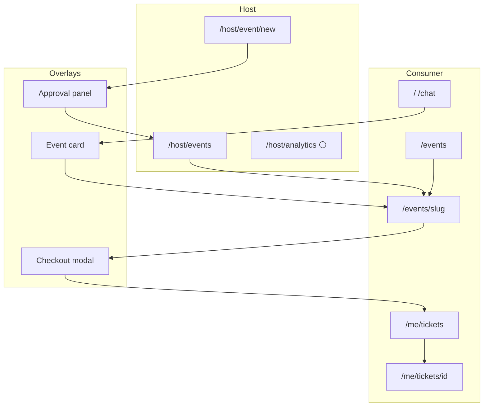
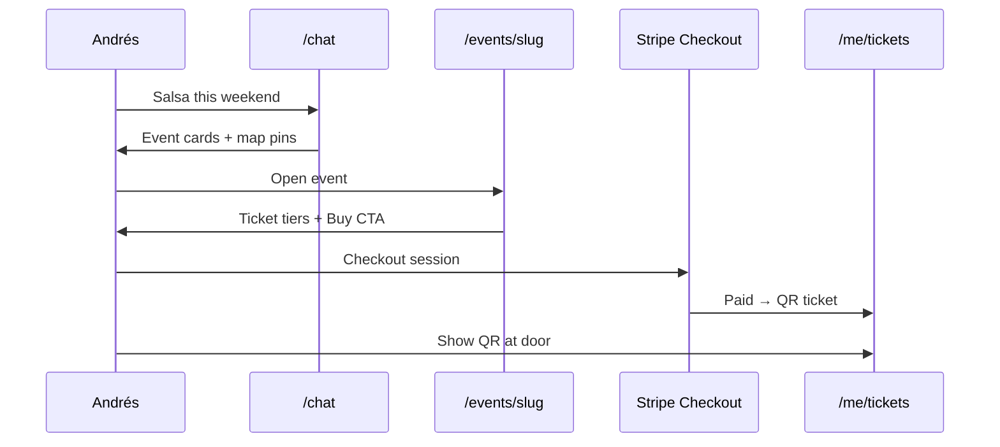
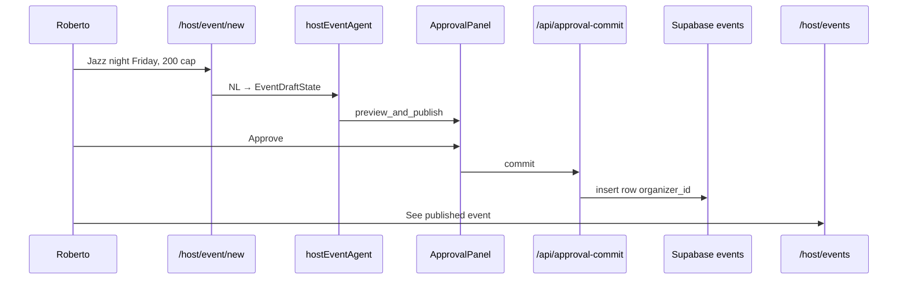
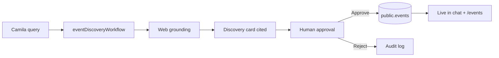
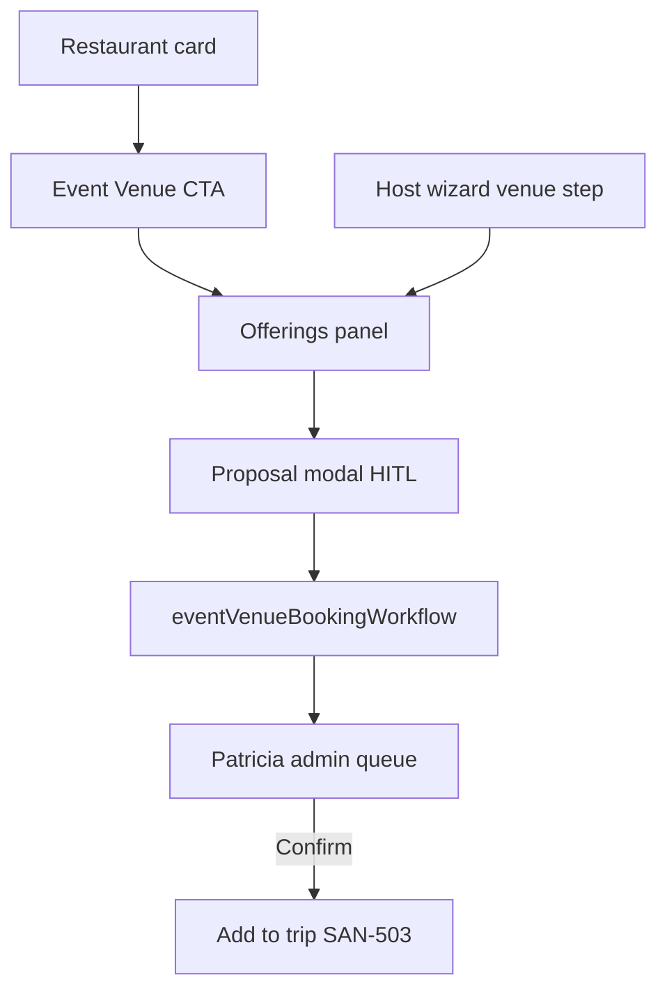

# Events UI — flow diagrams

**Updated:** 2026-06-08 · **Checklist:** [`../prompts/03-checklist.md`](03-checklist.md)

---

## 1. Events UI route map

---

## 2. Buyer ticket journey (Andrés)

---

## 3. Host publish journey (Roberto)

---

## 4. Discovery approval — future (Patricia)

**Linear:** SAN-119 → SAN-128 → SAN-129

---

## 5. Venue booking — future (Roberto + Patricia)

**Linear:** SAN-492 → SAN-494–502

---

## Missing workflow matrix

| Workflow | Trigger | Status | Linear |
|----------|---------|--------|--------|
| Event DB search | Chat query | 🟢 LIVE | EVP-005 |
| Host publish | HITL approve | 🟢 LIVE | SAN-366 |
| Ticket checkout | Buy CTA | 🟢 LIVE | EVP-002 |
| Web discovery | Stale catalog | ⚪ Stub | SAN-125 |
| Discovery save | Patricia approve | ⚪ | SAN-129 |
| Venue booking | Proposal modal | ⚪ | SAN-501 |
| Social promo draft | Host publish | ⚪ | SAN-133 |
