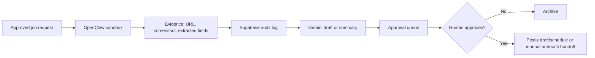

# EVP-030-advanced — OpenClaw/Postiz approval sandbox

## Objective

Prepare OpenClaw and Postiz for controlled post-MVP automation without allowing autonomous scraping, outreach, or publishing.

## Architecture

## Required controls

- Source allowlist.
- Per-job approval.
- Daily and per-domain caps.
- Screenshot/evidence capture.
- Full audit logs.
- Robots/TOS/legal review before production scraping.
- No autonomous DMs.
- No autonomous contracts.
- No autonomous campaign launch.

## Acceptance criteria

- OpenClaw jobs cannot run without an approval record.
- Every job records input, output, screenshot/evidence pointer, and actor.
- Postiz receives drafts only unless an approved scheduling workflow exists.
- Failed jobs are visible in admin.
- Rate limits are configurable.
