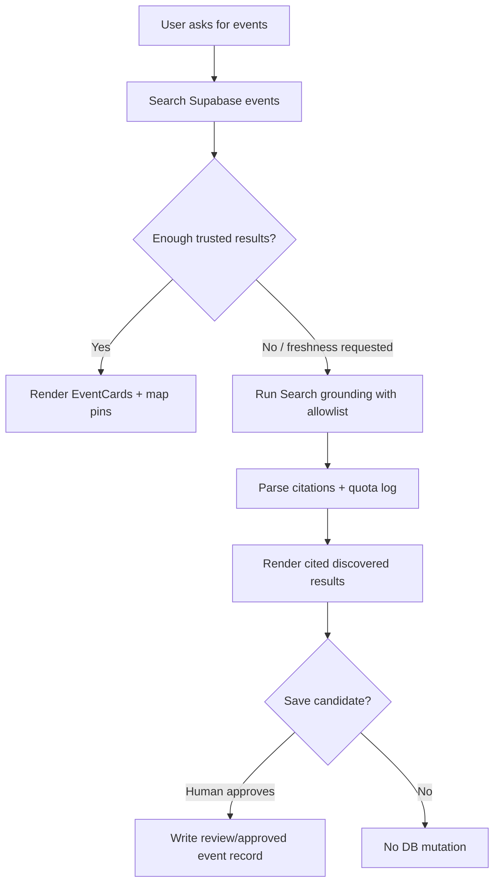

# EVP-015-mvp — Grounded event discovery

## Objective

Make event discovery DB-first and freshness-aware. Published mdeai events come from Supabase. Web grounding is used only when the user asks for current/fresh events or when the event is not in the catalog.

## Workflow

## Files/modules

- `src/mastra/tools/search-events.ts`
- `src/mastra/tools/search-web-grounded-events.ts`
- `src/app/api/grounding/event-web/route.ts`
- `src/components/copilot/event-card.tsx`
- `src/components/copilot/event-web-citation-*`
- `src/mastra/lib/search-grounding-*`

## Acceptance criteria

- Known events are returned from Supabase without web search.
- Fresh queries can call grounding and display citations.
- Grounding quota is logged.
- Web-discovered events are labeled as discovered/unverified until approved.
- No web result automatically becomes a published event.
- Tests cover DB-only, grounded, no-result, and quota-blocked cases.
