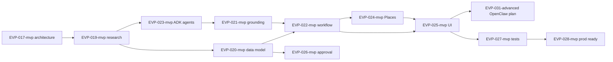

# EVP-018-mvp — Event web discovery task pack

> **Canonical plans:** [10-event-discover-plan.md](../../plan/events/event-discovery/10-event-discover-plan.md) (ingest + Maps + Mastra + CopilotKit) · [11-openclaw-event-discovery.md](../../plan/events/event-discovery/11-openclaw-event-discovery.md) (OpenClaw/ClawEvents worker).  
> **Skill routing:** [`event-discovery-skill-routing.md`](./docs/event-discovery-skill-routing.md).  
> Split from [`F-39-prompt-event-search.md`](./docs/F-39-prompt-event-search.md). Execute after EVP-017-mvp + EVP-013-core.

## Executive summary

Comprehensive **web-backed event discovery** for Medellín: concerts, contests, nightlife, festivals, tours, pageants. Flow: Supabase first → Google Search Grounding enrichment → Places geo → normalize/dedupe → CopilotKit cards → **human approval** before DB write.

**Not MVP.** Contaminates MVP if web results become source of truth or OpenClaw auto-publishes.

## Task index

| ID | Title | Depends | Effort | Phase |
|----|-------|---------|--------|-------|
| [EVP-019-mvp](./EVP-019-mvp-research-official-docs.md) | Research + official docs | EVP-017-mvp | 1d | 2 |
| [EVP-020-mvp](./EVP-020-mvp-discovered-events-data-model.md) | Discovered events data model | EVP-019-mvp | 2d | 2 |
| [EVP-022-mvp](./EVP-022-mvp-event-discovery-workflow.md) | `eventDiscoveryWorkflow` | EVP-020-mvp, EVP-005-core | 3d | 2 |
| [EVP-023-mvp](./EVP-023-mvp-adk-search-maps-agents.md) | ADK SearchAgent + MapsAgent | EVP-019-mvp | 3d | 2 |
| [EVP-021-mvp](./EVP-021-mvp-google-search-grounding.md) | Google Search Grounding integration | EVP-023-mvp | 2d | 2 |
| [EVP-024-mvp](./EVP-024-mvp-places-enrichment.md) | Places API enrichment | EVP-022-mvp, MAP | 2d | 2 |
| [EVP-025-mvp](./EVP-025-mvp-copilotkit-discovery-ui.md) | CopilotKit discovery UI | EVP-022-mvp, SCREEN-006 | 3d | 2 |
| [EVP-031-advanced](./EVP-031-advanced-openclaw-automation-plan.md) | OpenClaw automation (plan only) | EVP-025-mvp | 1d | 3 |
| [OCL-042-mvp](../openclaw/tasks/OCL-042-mvp-clawevents-medellin-automation.md) | ClawEvents + OC-EVD worker (implement) | EVP-020, EVP-022 | 3–5d | 3 |
| [EVP-026-mvp](./EVP-026-mvp-human-approval-save-flow.md) | Human approval save flow | EVP-020-mvp, EVP-011-core | 2d | 2 |
| [EVP-027-mvp](./EVP-027-mvp-discovery-test-plan.md) | Discovery test plan | EVP-025-mvp | 2d | 2 |
| [EVP-028-mvp](./EVP-028-mvp-production-readiness.md) | Production readiness checklist | EVP-027-mvp | 1d | 2 |

## Dependency graph

## Plan EVD → EVP map (executable slice)

| Plan step | EVP task |
|-----------|----------|
| EVD-01..02 Schema + seeds | EVP-020, EVP-007 |
| EVD-03..05 Scrape, normalize, dedupe | EVP-022 |
| EVD-06 Places | EVP-024, EVP-016 |
| EVD-07..08 Approval + cron | EVP-026, EVP-022 |
| EVD-09..10 Search + tests | EVP-005 (done), EVP-027 |
| EVD-11..12 Summary + metrics | EVP-022, EVP-020 |
| OC-EVD / CLAW | OCL-042, EVP-031 |

Full table: [`event-discovery-skill-routing.md`](./docs/event-discovery-skill-routing.md).

## Global hard rules (all EVT-D tasks)

1. Supabase owns truth — web is enrichment only
2. AI proposes; humans approve; edge fn writes
3. No OpenClaw in Phase 2 MVP slice
4. No service-role in `mdeapp/src`
5. Every Places call uses `X-Goog-FieldMask`
6. Gemini only in production agents
7. CopilotKit pinned 1.55.2 until Phase 2 v2 migration
8. RLS on every new table + ≥1 policy
9. `ai_runs` / `event_discovery_runs` audit logging
10. Feature flag: `EVENT_WEB_DISCOVERY=0` default off

## Success criteria (pack complete)

- [ ] All 11 EVT-D spec files exist with acceptance criteria
- [ ] EVP-017-mvp architecture doc cross-linked
- [ ] No task writes to Supabase without approval flow
- [ ] Mermaid diagrams in EVP-017-mvp + EVP-022-mvp + EVP-026-mvp
- [ ] Test plan covers grounding failure + dedupe + RLS
- [ ] Cost/rate-limit section in EVP-028-mvp

## Score impact

| Metric | If shipped correctly |
|--------|---------------------|
| Camila discovery UX | +15 visible MVP |
| Ops risk if skipped approval | -30 security |
| **Net when gated** | +10 MVP / +25 Phase 2 |

## Next 10 implementation tasks after MVP (ordered)

1. EVP-006-core — clarify gate + chips
2. EVP-007-core — prompt + source registry
3. EVP-017-mvp — architecture doc
4. EVP-019-mvp — MCP docs research
5. EVP-020-mvp — schema migration
6. EVP-023-mvp — ADK agent contracts
7. EVP-021-mvp — grounding wire-up
8. EVP-022-mvp — Mastra workflow
9. EVP-025-mvp — discovery UI cards
10. EVP-026-mvp — approval HITL panel
