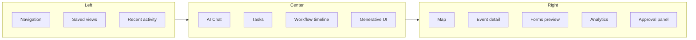

# Three-Panel AI Workspace

Primary application shell for AI-native events (and shared concierge surfaces).

---

## Desktop (≥1360px)

```text
┌────────────┬────────────────────────────────────┬──────────────────┐
│ LEFT 240px │ CENTER flex-1                      │ RIGHT 360–420px  │
├────────────┼────────────────────────────────────┼──────────────────┤
│ Logo       │ CopilotChat thread                 │ Map panel        │
│ Nav rail   │ · User messages                    │ · Event pins     │
│ · Home     │ · Agent replies                    │ · Venue detail   │
│ · Events   │ · Generative UI cards              │ · KPI charts     │
│ · Host     │ · Workflow progress strip          │ · HITL approval  │
│ · Tickets  │ · Quick prompt chips               │ · Event preview  │
│ · Saved    │ Input + Send                       │ · Nearby places  │
│ Collections│                                    │                  │
│ Recent     │                                    │                  │
│ Memory*    │                                    │                  │
└────────────┴────────────────────────────────────┴──────────────────┘
```

*Memory = thread-scoped working memory indicator (Mastra).



---

## Tablet (768–1359px)

| Panel | Behavior |
|-------|----------|
| Left | Collapsible icon rail; expand on hover |
| Center | Full width default |
| Right | Bottom sheet or swipe tab (Map · Detail · Analytics) |

```text
┌──┬──────────────────────────────────────┐
│≡ │ CopilotChat + cards                  │
│  ├──────────────────────────────────────┤
│  │ [Map] [Detail] [Analytics]  ← tabs   │
└──┴──────────────────────────────────────┘
```

---

## Mobile (<768px)

| Element | Behavior |
|---------|----------|
| Nav | Bottom tab bar: Discover · Events · Host · Tickets · Me |
| Chat | Full-screen with back to results strip |
| Map | Half-sheet above keyboard or dedicated tab |
| HITL | Full-screen modal |
| Sticky CTA | Event detail buy bar (Luma pattern) |

```text
┌─────────────────────────┐
│ Header + back           │
├─────────────────────────┤
│ Chat / content          │
├─────────────────────────┤
│ [Discover][Events][Me]  │
└─────────────────────────┘
```

---

## Surface variants

| Surface | Left | Center | Right |
|---------|------|--------|-------|
| `/` discovery | Thread nav | `conciergeAgent` | Map + cards |
| `/host/event/new` | Host nav | `hostEventAgent` wizard | Live preview |
| `/host/analytics` | Host nav | `hostOpsAgent` | KPI + charts |
| `/events/[slug]` | — (consumer) | N/A — single column + sticky buy | Optional map section in-page |

---

## CopilotKit wiring

| Hook | Panel |
|------|-------|
| `useCoAgent` | Center state sync |
| `useCopilotAction` disabled `render` | Center cards |
| `useCopilotReadable` | Right context injection |
| `renderAndWaitForResponse` | Right approval overlay |

**Global patterns:** [037-global-ux-patterns](./events/037-global-ux-patterns.md) — ⌘K command bar, AI FAB, context pills, Copilot Tasks panel.
