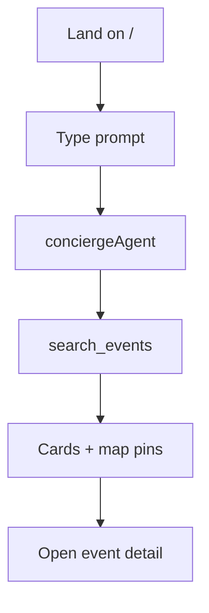

# Wireframe: Home Discovery

## Page goal

Primary discovery — user asks in natural language, gets event cards + map pins without form filters.

## User type

Attendee · Tourist

## User stories

```text
As Camila I want to ask for events this weekend in Poblado
So that I see relevant cards and map pins immediately
```

## Components

| Component | Type |
|-----------|------|
| ThreadNav | layout |
| CopilotChat | design-system |
| EventCard | domain |
| MapPanel | domain |
| QuickPromptChips | page |
| WorkflowProgressStrip | page (future) |

## Three-panel layout

**Left:** threads, trips, saved · **Center:** concierge chat + inline cards · **Right:** map sync pins

## Desktop

```text
┌──────┬────────────────────────────┬────────────┐
│ Nav  │ Find salsa this weekend…   │ Map        │
│      │ [event-card] [event-card]  │ ● ● ● pins │
│      │ [Ask anything…]      [Send]│            │
└──────┴────────────────────────────┴────────────┘
```

## AI features

| Feature | Detail |
|---------|--------|
| `useCoAgent` | `conciergeAgent` |
| Generative UI | `search_events` → EventCard |
| Workflow | `eventDiscoveryWorkflow` |
| Memory | `MdeState.lastQuery` |

## Data sources

`events`, `hybrid_search_events`, `mastra_threads`, `ai_runs`

## States

| State | Behavior |
|-------|----------|
| Loading | Typing indicator + skeleton cards |
| Empty | "No events — try broader dates" + chips |
| Error | Retry banner on copilotkit |

## Mobile

Chat full width; map bottom sheet on card focus.

## Mermaid


