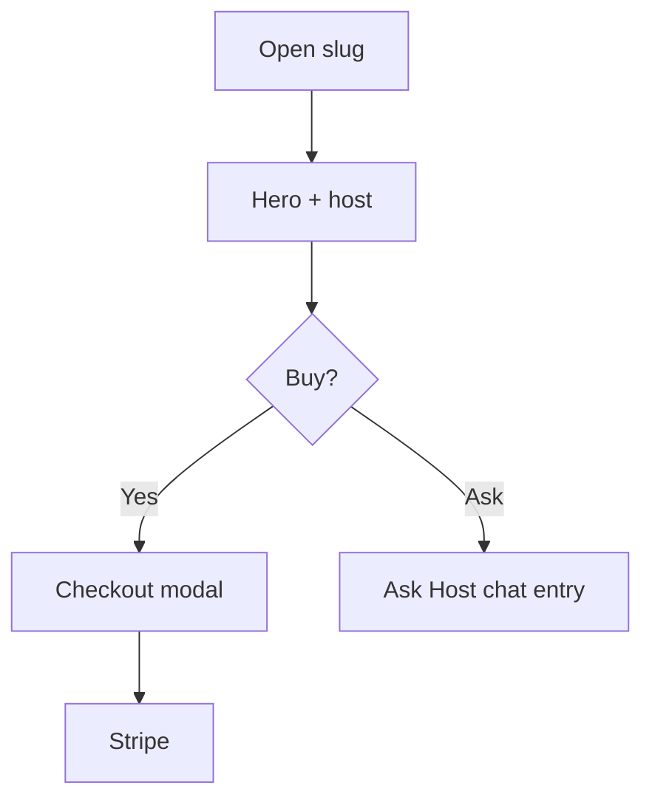

# Wireframe: Event Details

## Page goal

Convert browse → purchase; establish trust via host, vibe, social proof (Luma-inspired).

## User type

Attendee

## User stories

```text
As Andrés I want to understand who hosts and who's going
So that I register with confidence
```

## Components

EventDetailHero · EventHostBlock · EventVibeTags · EventAiSummary · EventAttendeeStrip · EventTicketTiers · StickyBuyBar · EventAskHost · EventDetailMap · BookingCheckoutModal

## Layout

Consumer single-column (not 3-panel). Desktop: narrative left + sticky ticket card right.

## Mobile

```text
┌─────────────────────────┐
│ [←]              [Share]│
│ HERO IMAGE              │
│ Visionarios Night IV      │
│ Thu 6:30pm · Poblado      │
│ [Hosted by Parceros]    │
│ #networking #startup      │
│ AI: Best for founders…    │
│ 👤 42 going              │
│ Tickets GA $25 [Buy]      │
│ Map + nearby              │
│▓▓ STICKY Register ▓▓▓▓▓▓│
└─────────────────────────┘
```

## AI features

| Feature | Phase |
|---------|-------|
| AI summary | MVP EVP-033 |
| Ask Host draft | MVP EVP-034 |
| Compatibility | MVP EVP-042 |

## Data sources

`events`, `ticket_tiers`, `organizer` profile, Places cache

## States

Sold out · 404 · skeleton loading

## Mermaid


