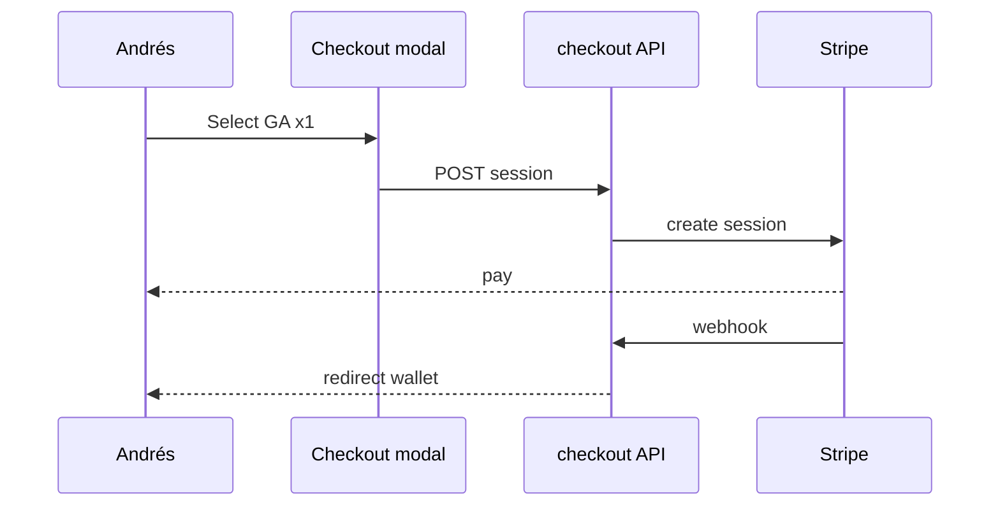

# Wireframe: Checkout

## Page goal

Frictionless pay — deterministic path, no agent mutating orders.

## User type

Attendee

## User stories

```text
As Andrés I want to pay in two taps
So that I get my ticket immediately
```

## Components

BookingCheckoutModal · TierSelector · QtyStepper · StripeRedirectButton · OrderSummary

## Layout

Modal over event detail — no 3-panel.

## Flow ASCII

```text
Detail → Modal (tier, qty, total) → Stripe hosted → /me/tickets
```

## AI features

None on checkout path — agent may explain tiers **before** modal opens only.

## Data sources

`ticket_tiers`, `/api/tickets/checkout`, Stripe session, webhook → `orders`, `tickets`

## States

Processing · payment failed · success redirect

## Mobile

Full-screen modal; Apple Pay when available.

## Mermaid


