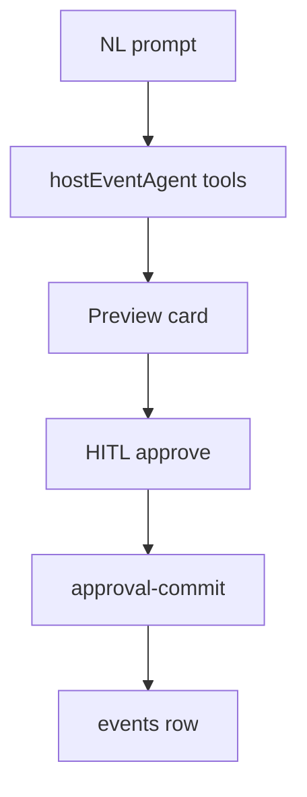

# Wireframe: Create Event

## Page goal

Replace 50+ form fields with NL chat + live preview + HITL publish.

## User type

Host

## User stories

```text
As Roberto I want to say "fashion event 250 guests Poblado"
So that AI fills draft and I approve publish
```

## Components

HostNavRail · WorkflowStepper · CopilotChat · LivePreviewCard · HITLApprovalPanel · VenueMapPin

## Layout

**Left:** host nav · **Center:** `hostEventAgent` chat · **Right:** live preview + map pin

## AI features

| Tool | UI |
|------|-----|
| `set_event_basics` | Form fields |
| `set_venue` | Places search |
| `add_ticket_tier` | Tier rows |
| `preview_and_publish` | HITL panel |

## Data sources

`EventDraftState` working memory → `events` on approve

## States

Draft · awaiting HITL · published · error on commit

## Mermaid



See [`../journeys/event-creation.md`](../journeys/event-creation.md).
