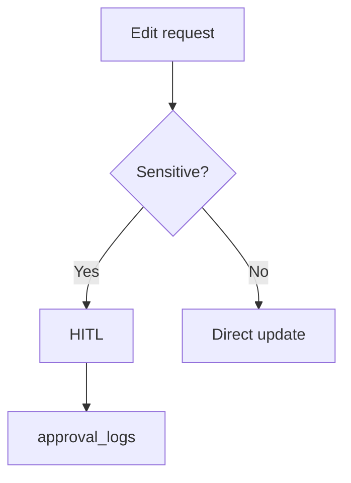

# Wireframe: Edit Event

## Page goal

Post-publish edits with AI assist — price/tier changes require HITL.

## User type

Host

## User stories

```text
As Roberto I want to update capacity via chat
So that I don't hunt through admin forms
```

## Components

Same as create + PublishedBanner · ChangeLog · HITL for sensitive fields

## AI features

`hostOpsAgent` or `hostEventAgent` read-only on published + HITL write tools

## Data sources

`events`, `ticket_tiers`, `approval_logs`

## Mermaid


