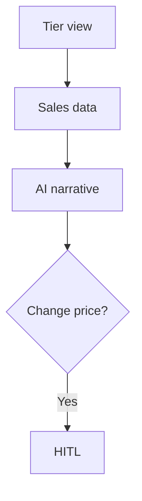

# Wireframe: Ticket Management

## Page goal

View/edit tiers, capacity, sold counts — AI explains performance.

## User type

Host

## User stories

```text
As Roberto I want to see which tier sells fastest
So that I adjust pricing
```

## Components

TierTable · SoldProgressBar · AddTierButton · PriceChangeHITL

## Layout

Center: tier table · Right: `hostOpsAgent` chat "VIP 80% sold"

## Data sources

`ticket_tiers`, `orders` aggregates

## AI features

`get_sales_summary` tool · price change → HITL

## Mermaid


