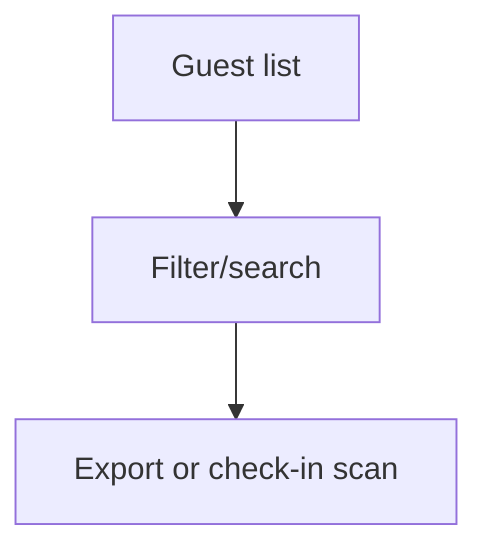

# Wireframe: Attendee Management

## Page goal

Guest list, check-in status, export — Luma Guests tab equivalent.

## User type

Host

## Components

GuestSearch · GuestTable · ExportCSV · CheckInBadge · FilterByTier

## Desktop

```text
┌─────────────────────────────────────────┐
│ Guests · Fashion Night    [Export CSV]  │
│ Search…                               │
│ Name        Tier   Check-in             │
│ Ana Gómez   VIP    ✓                    │
└─────────────────────────────────────────┘
```

## AI features

`hostOpsAgent`: "how many VIP unchecked?" without opening table

## Data sources

`orders`, `tickets`, profiles

## Mermaid


