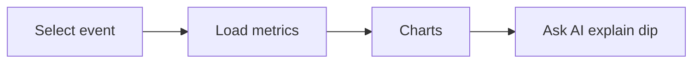

# Wireframe: Event Analytics

## Page goal

Per-event funnel: views → registrations → revenue over time.

## User type

Host

## Components

EventPicker · RegistrationsOverTimeChart · ConversionFunnel · TrafficSourcePlaceholder

## AI features

Same `hostOpsAgent` with `selectedEventId` in shared state

## Conversion funnel (requires analytics tables)

| Stage | Metric | Table |
|-------|--------|-------|
| View | page views | `event_views` |
| Detail | slug loads | `event_views` |
| Checkout | modal open | client event |
| Paid | order created | `orders` |

```sql
-- MVP schema (design)
event_views(event_id, session_id, utm_source, created_at)
visitor_sessions(id, user_id, started_at)
```

## Data sources

`orders`, `events`, `event_views`, `AnalyticsState` — [038-shared-state](../038-shared-state.md)

## Mermaid


