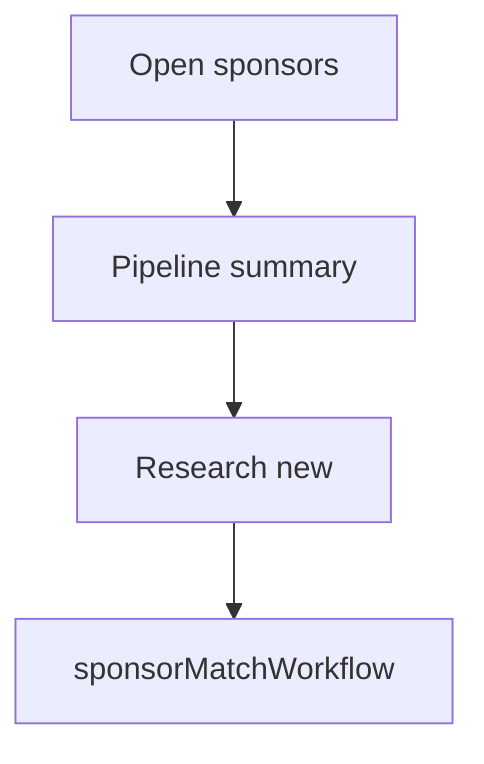

# Wireframe: Sponsor Dashboard

## Page goal

Overview of sponsor pipeline per event — research, match, proposal status.

## User type

Host

## Components

PipelineSummary · ActiveDealsList · ResearchCTA · FitScoreBadge

## Three-panel

Center: sponsor chat · Right: matched sponsors list

## AI features

`sponsorAgent` · `sponsorDiscoveryWorkflow`

## Data sources

`sponsors`, `sponsor_deals`, `crm_leads`

## Mermaid

