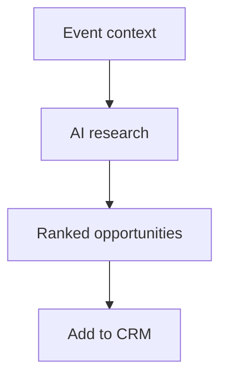

# Wireframe: Sponsor Opportunities

## Page goal

Discover sponsor prospects for upcoming events with AI fit scores.

## Components

OpportunityCard · CategoryFilter · **FitScoreBadge** · AddToPipeline · MatchExplainPanel

## Sponsor match score (audit differentiator)

```text
Fashion Night · Poblado
├── Luxury Beauty Co     96%
├── Jewelry House        92%
├── Fintech Startup      34%
└── Energy Drink Brand   28%
```

Score inputs: event category, audience, budget, brand safety rules (deterministic) + LLM explain.

## AI features

Firecrawl MCP + `sponsorMatchWorkflow` · `SponsorDashboardState`

## Mermaid


