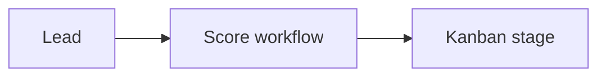

# Wireframe: Sponsorship CRM

## Page goal

Lead pipeline with AI lead scoring and health flags.

## Components

PipelineKanban · LeadCard · LeadScore · HealthBadge · crmLeadScoreWorkflow output

## AI features

`crmLeadScoreWorkflow` · `sponsorAgent` enrich

## Data sources

`crm_leads`, `sponsors`, `sponsor_deals`

## Mermaid

