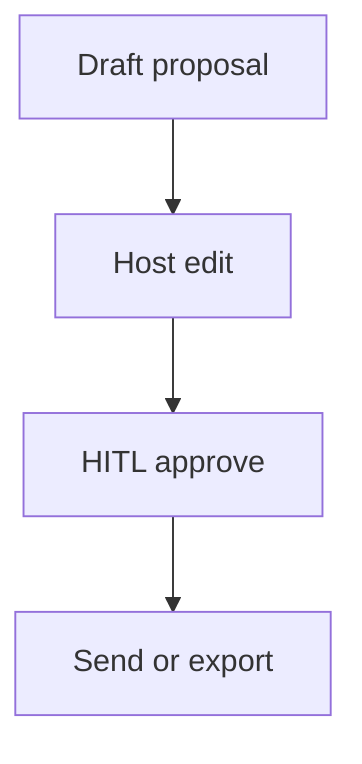

# Wireframe: Proposal Center

## Page goal

Draft, review, approve sponsor packages before send.

## Components

ProposalEditor · PackageTemplate · PreviewPDF · ApproveSendHITL

## AI features

Gemini draft · HITL before external send

## Mermaid

