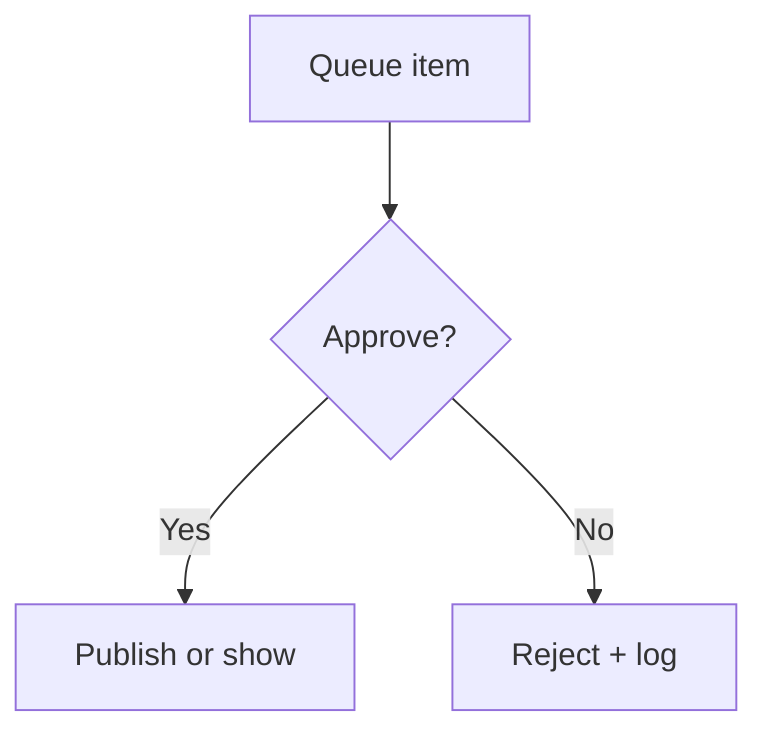

# Wireframe: Moderation

## Page goal

Review flagged events, discovery queue, public Q&A approvals.

## Components

ModerationQueue · EventPreview · ApproveReject · DiscoveryCandidateCard

## AI features

AI drafts flagged — human decides

## Mermaid

