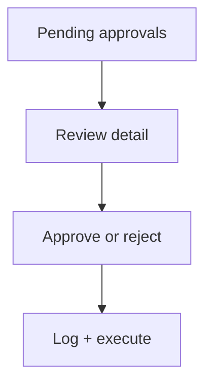

# Wireframe: Approval Center

## Page goal

**Unified approval queue** (audit: stop scattering approvals) — publish, price changes, sponsor proposals, moderation, blasts.

Routes: `/host/approvals` (host) · Patricia uses [020](./020-moderation.md) + [034](./034-exception-center.md) for ops.

## Components

ApprovalLogTable · FilterByType · DetailDrawer · ResubmitAction

## Data sources

`approval_logs`

## Mermaid

