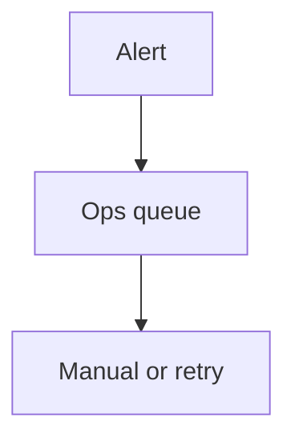

# Wireframe: Admin Operations

## Page goal

Failed webhooks, Stripe disputes, system health, AI run failures.

## Components

WebhookFailureList · RetryButton · ai_runs failure filter · Sentry link

## AI features

`adminOpsAgent` summarize incident

## Mermaid

