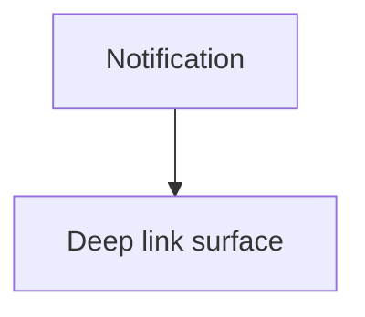

# Wireframe: Notifications

## Page goal

Ticket confirmations, event reminders, host alerts.

## Components

NotificationList · ReadUnread · DeepLinkToTicketOrEvent

## Data sources

`notifications` table or edge-triggered rows

## Mermaid

