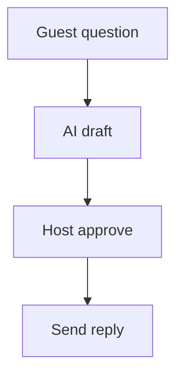

# Wireframe: Host Inbox

## Page goal

Guest questions, Ask Host queue, AI-drafted replies.

## Components

InboxThreadList · MessagePreview · AiDraftReply · ApproveSend

## AI features

Ask Host EVP-034 drafts · host approves

## Mermaid

