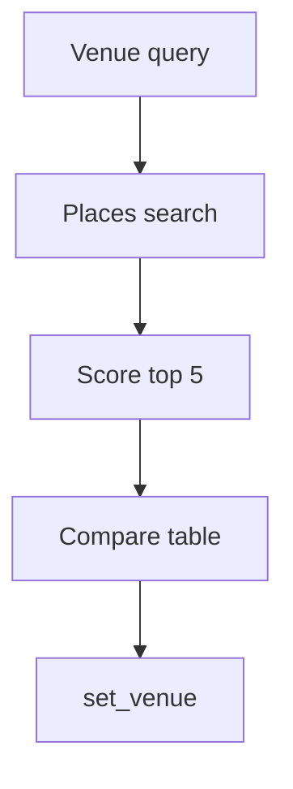

# Wireframe: Venue Comparison

## Page goal

Compare top Places venues by capacity, neighborhood, budget.

## Components

VenueCompareTable · MapPins · ScoreColumn · SelectVenueCTA

## AI features

`venueShortlistWorkflow` · Google Maps Places field mask

## Mermaid

