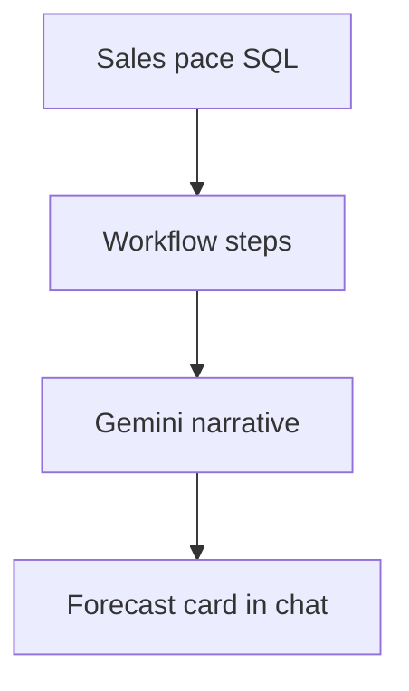

# Wireframe: Revenue Forecast

## Page goal

Projected attendance and revenue from sales pace.

## Components

ForecastCard · PaceChart · ScenarioBand · ActionSuggestions

## AI features

`revenueForecastWorkflow` · generative forecast card

## Mermaid

