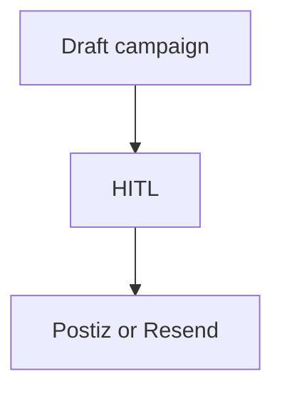

# Wireframe: Campaign Center

## Page goal

Draft email/social campaigns — HITL before Postiz/Resend send.

## Components

CampaignList · DraftEditor · AudiencePicker · ScheduleHITL

## AI features

`campaignAgent` · `contentAgent` · `socialAgent` (Advanced split)

## Mermaid

