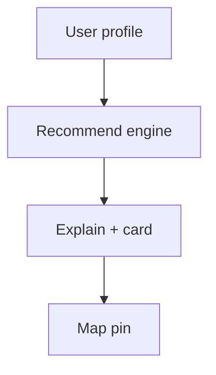

# Wireframe: AI Recommendations

## Page goal

"Why this event?" personalized recommendations with compatibility.

## Components

RecommendationCard · CompatibilityScore · ExplainPanel · SaveCTA

## AI features

EVP-042 · `useCopilotReadable` user prefs · hybrid search

## Mermaid

