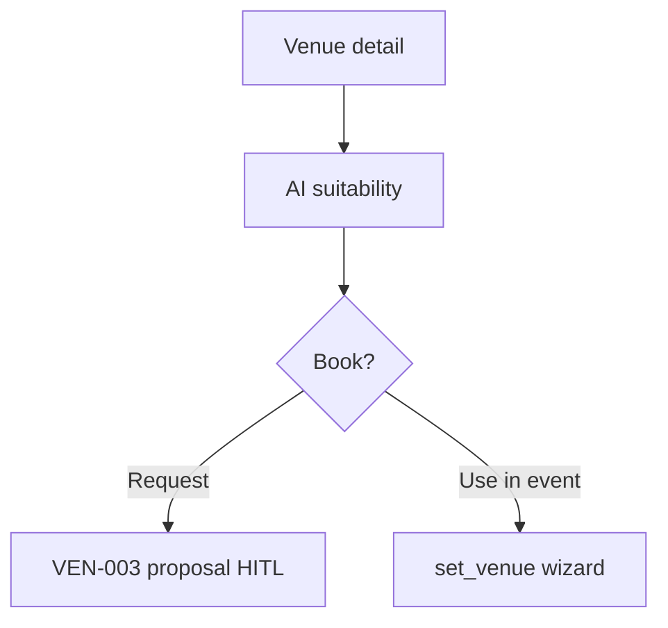

# Wireframe: Venue Details

## Page goal

Peerspace/Airbnb-style venue page — photos, capacity, amenities, map, pricing, AI suitability for an event type.

## User type

Host · Renter of space

## User stories

```text
As Roberto I want to see if a rooftop fits a fashion show
So that AI scores fit before I request a booking
```

## Components

VenueHeroGallery · CapacityAmenitiesGrid · PricingBlock · AvailabilityCalendar · VenueMap · AiSuitabilityCard · NearbyRestaurants · RequestProposalCTA

## Mobile

```text
┌─────────────────────────┐
│ Photo carousel          │
│ Rooftop Aurora          │
│ Poblado · 300 cap       │
│ AI: 96% fashion events  │
│ [$800 min spend]        │
│ [Request proposal]      │
│ Map + nearby dining     │
└─────────────────────────┘
```

## AI features

Gemini suitability blurb from event type + venue attributes · link to `venueShortlistWorkflow`

## Data sources

`venues`, Places enrichment, `venue_bookings` availability

## States

Unavailable dates · No pricing · 404

## Mermaid


