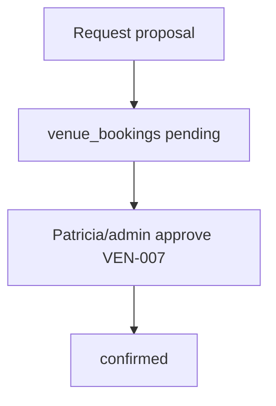

# Wireframe: Host Bookings

## Page goal

Manage venue booking requests, reservations, rental inquiries — host-side of marketplace.

## User type

Host

## User stories

```text
As Roberto I want to see pending venue proposals
So that I track confirmations before event day
```

## Components

BookingRequestTable · StatusPills · VenueLink · EventLink · AdminApprovalBadge · FilterByStatus

## Desktop

```text
┌─────────────────────────────────────────┐
│ Bookings                    [+ Request] │
│ Venue          Event      Status        │
│ Rooftop Aurora Fashion    pending       │
│ Laureles Hall  Jazz Night confirmed     │
└─────────────────────────────────────────┘
```

## AI features

`hostOpsAgent`: "which bookings need follow-up?"

## Data sources

`venue_bookings`, `venues`, `events`, VEN-007 admin queue

## Mermaid


