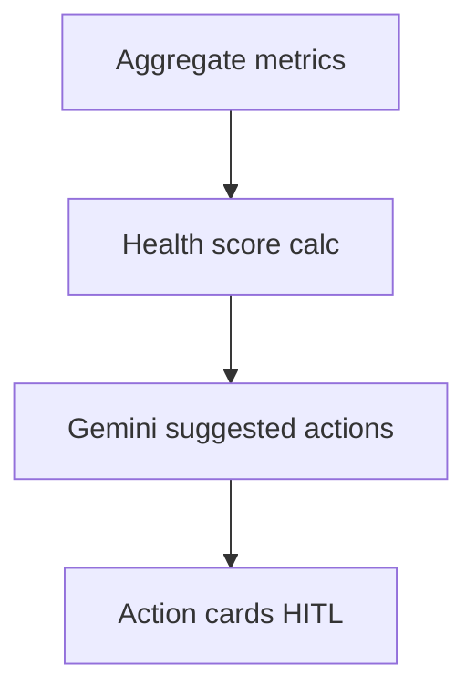

# Wireframe: Event Health Dashboard

## Page goal

AI-generated health score + actionable fixes — differentiator vs Luma/Eventbrite.

## User type

Host · Admin

## User stories

```text
As Roberto I want to know why sales are slow
So that I get suggested actions not just charts
```

## Components

HealthScoreRing · FactorBreakdown · SuggestedActionsList · SalesPaceIndicator · MarketingWeakFlag

## Health factors

| Factor | Weight |
|--------|--------|
| Sales pace vs target | 30% |
| Venue capacity fit | 20% |
| Page conversion | 20% |
| Refund rate | 15% |
| Engagement (saves, shares) | 15% |

## Example UI

```text
Health 83/100
⚠ Sales pace low — 18% capacity at T-7
⚠ Marketing weak — no blast sent
✓ Venue fit strong
Suggested: Send reminder blast · Add early bird tier
```

## AI features

`hostOpsAgent` + `revenueForecastWorkflow` + rules engine (deterministic score, LLM narrative)

## Data sources

`orders`, `event_views`, `events`, `approval_logs`

## Mermaid


