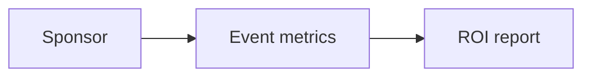

# Wireframe: Sponsor ROI

## Page goal

Prove sponsor value — impressions, leads, conversions tied to event.

## Components

RoiMetricCards · LeadFunnel · AttributedRevenue · ExportReportHITL

## Data sources

`sponsor_deals`, `crm_leads`, `orders` (promo codes future)

## Mermaid

