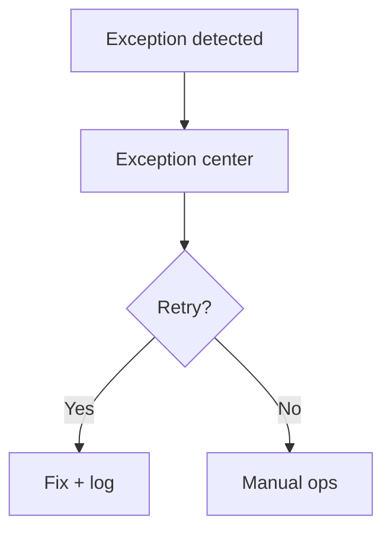

# Wireframe: Exception Center

## Page goal

Dedicated ops queue — failed payments, webhooks, refunds, ticket generation errors.

## User type

Admin

## Components

ExceptionTable · SeverityBadge · RetryAction · StripeLink · SentryLink · ai_runs correlation

## Rows

| Type | Source |
|------|--------|
| Webhook failed | Stripe |
| Ticket not minted | checkout finalize |
| Refund error | Stripe |
| Agent run failed | `ai_runs` |

## Mermaid

**Extends** [022-admin-operations](./022-admin-operations.md) with focused queue.
