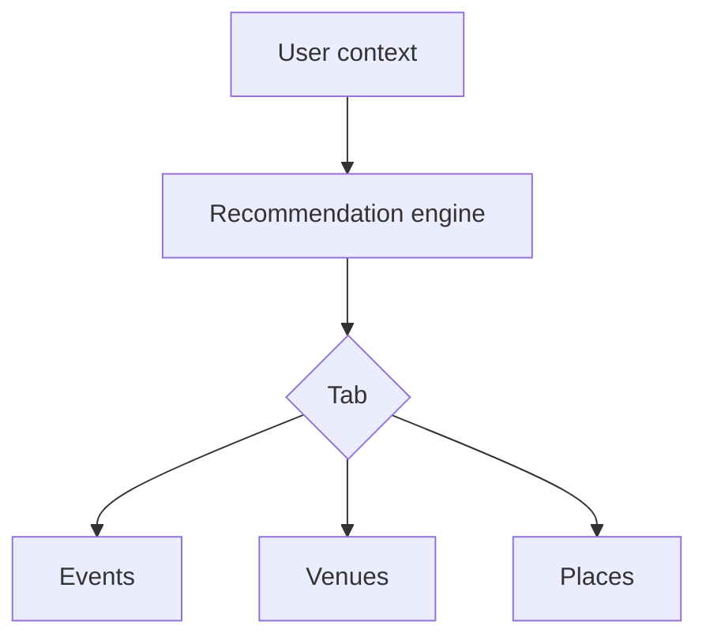

# Wireframe: Recommendations Hub

## Page goal

Standalone discovery surface — not only chat overlay ([028](./028-ai-recommendations.md)).

## Sections

| Tab | Content |
|-----|---------|
| Events | Personalized event cards |
| Venues | For upcoming saved events |
| Restaurants | After-party |
| Cafés | Morning before event |

## Data inputs

Saved items · ticket history · profile prefs · location · `hybrid_search_events`

## Three-panel

Center: recommendation feed with "Why this?" · Right: map

## Mermaid

